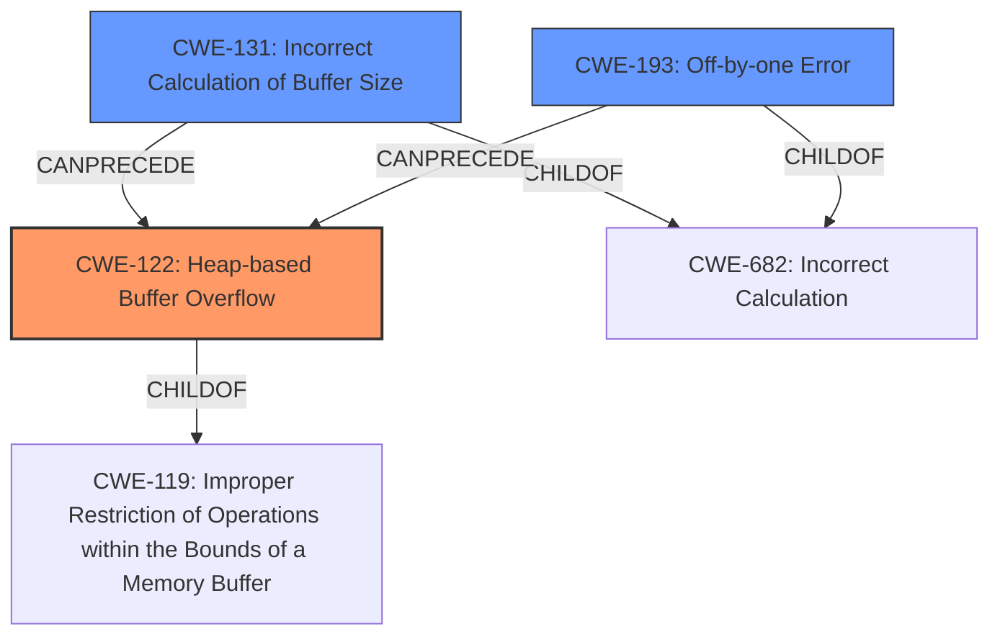

# Analysis Report for CVE-2022-3437

# Vulnerability Analysis Report: CVE-2022-3437

## Description

A heap-based buffer overflow vulnerability was found in Samba within the GSSAPI unwrap_des() and unwrap_des3() routines of Heimdal. The DES and Triple-DES decryption routines in the Heimdal GSSAPI library allow a length-limited write buffer overflow on malloc() allocated memory when presented with a maliciously small packet. This flaw allows a remote user to send specially crafted malicious data to the application, possibly resulting in a denial of service (DoS) attack.

## Vulnerability Description Key Phrases

**Rootcause:** write buffer overflow on malloc() allocated memory
**Weakness:** heap-based buffer overflow
**Impact:** denial of service (DoS)
**Vector:** specially crafted malicious data
**Attacker:** remote user
**Product:** Samba
**Component:** GSSAPI unwrap_des() and unwrap_des3() routines of Heimdal

## Analysis (with Relationship Data)

# Summary
| CWE ID | CWE Name | Confidence | CWE Abstraction Level | CWE Vulnerability Mapping Label | CWE-Vulnerability Mapping Notes |
|---|---|---|---|---|---|
| CWE-122 | Heap-based Buffer Overflow | 0.95 | Variant | Primary | Allowed |
| CWE-131 | Incorrect Calculation of Buffer Size | 0.75 | Base | Secondary Candidate | Allowed |

## Evidence and Confidence

*   **Confidence Score:** 0.90
*   **Evidence Strength:** HIGH

- **Analysis and Justification:**  
  - *Explanation:* "The vulnerability is described as a **heap-based buffer overflow**, specifically a "**write buffer overflow on malloc() allocated memory**" in Samba's GSSAPI unwrap_des() and unwrap_des3() routines within Heimdal. This aligns directly with the definition of CWE-122, which is a buffer overflow occurring in the heap. The CVE reference summary reinforces this, stating "The decryption routines allow a length-limited write buffer overflow on memory allocated with `malloc()`". The impact is a denial of service, which is a common consequence of buffer overflows. CWE-122 is a Variant level CWE, which is preferred when it accurately represents the weakness."
  
  - *Relationship Analysis:* "CWE-122 is a variant of CWE-119 (Improper Restriction of Operations within the Bounds of a Memory Buffer), but CWE-122 is more specific because it indicates where the buffer overflow occurs (the heap). No further relationship analysis is applicable."

- **Confidence Score:**  
  - Confidence: 0.95 (High evidence from the vulnerability description and CVE reference materials explicitly stating 'heap-based buffer overflow' and 'write buffer overflow on malloc() allocated memory')

---

- **Analysis and Justification:**  
  - *Explanation:* "The vulnerability occurs due to processing a "**maliciously small packet**", which could lead to an incorrect calculation of the buffer size needed for decryption. This directly relates to CWE-131, 'Incorrect Calculation of Buffer Size,' which can lead to a buffer overflow. It's a prerequisite for the heap overflow to occur. The description notes that the 'DES and Triple-DES decryption routines in the Heimdal GSSAPI library allow a length-limited write buffer overflow on malloc() allocated memory when presented with a maliciously small packet'. This suggests that the size calculated is insufficient for the data being written. CWE-131 is a Base level CWE."
  
  - *Relationship Analysis:* "CWE-131 is a child of CWE-682 (Incorrect Calculation). The relationship between CWE-131 and CWE-122 is that an incorrect calculation of the buffer size (CWE-131) can lead to a heap-based buffer overflow (CWE-122). CWE-131 CanPrecede CWE-119 (Improper Restriction of Operations within the Bounds of a Memory Buffer) based on the CWE graph relationships."

- **Confidence Score:**  
  - Confidence: 0.75 (Moderate evidence from the description suggesting an incorrect size calculation, but not explicitly stated.)

## Criticism of Analysis

Okay, I've reviewed the provided analysis against the full CWE specifications. Here's my critique:

**Overall Assessment:**

The analysis is generally good and identifies the primary weakness (CWE-122) correctly with high confidence.  The secondary candidate, CWE-131, is also reasonable. The explanations are clear and well-supported by the provided information. The use of the CWE definitions and relationships is appropriate.

**Detailed Review:**

**1. CWE-122: Heap-based Buffer Overflow**

*   **Confidence Level:** 0.95 - Justified. The vulnerability description explicitly states "heap-based buffer overflow" and "write buffer overflow on malloc() allocated memory," directly aligning with the CWE-122 definition.
*   **Abstraction Level:** Correctly identified as Variant.
*   **Vulnerability Mapping Label:** Primary - Appropriate.
*   **CWE-Vulnerability Mapping Notes:**
    *   The analysis correctly states that CWE-122 is preferred because it's more specific than CWE-119.
    *   The relationship analysis is accurate, noting that CWE-122 is a variant of CWE-119.
*   **Overall:** This is a strong mapping. The evidence is direct, and the justification aligns perfectly with CWE-122's description.

**2. CWE-131: Incorrect Calculation of Buffer Size**

*   **Confidence Level:** 0.75 - This is a reasonable assessment. While the description suggests an incorrect buffer size calculation, it's not explicitly stated.
*   **Abstraction Level:** Correctly identified as Base.
*   **Vulnerability Mapping Label:** Secondary Candidate - Appropriate. It represents a contributing factor.
*   **CWE-Vulnerability Mapping Notes:**
    *   The explanation correctly points to the "maliciously small packet" as a potential cause for incorrect size calculation.
    *   The relationship analysis is accurate: CWE-131 is a child of CWE-682 and can precede CWE-119.  The connection to CWE-122 (heap overflow) is also explained well.
*   **Overall:** This is a good secondary mapping. The description doesn't explicitly confirm incorrect size calculation, but it is a plausible root cause given the nature of buffer overflows.

**Critiques and Potential Improvements:**

1.  **Retriever Results:** The top combined retriever results show a high score for CWE-193, CWE-190, CWE-1284, CWE-126, and CWE-120. While not as directly relevant as CWE-122 and CWE-131, some of these could warrant further brief consideration.

    *   **CWE-193 (Off-by-one Error):** While not the primary cause, an off-by-one error *within* the incorrect buffer size calculation (CWE-131) is *possible*. If an off-by-one error occurs, it could cause a heap overflow. A very brief mention of this possibility would strengthen the analysis. Acknowledge and dismiss if warranted.
    *   **CWE-190 (Integer Overflow or Wraparound):** Integer overflows are often related to incorrect buffer size calculations (CWE-131) or memory allocation (CWE-789). Given the description, it's *possible* that a maliciously crafted packet could trigger an integer overflow during size calculation, leading to a smaller-than-expected buffer allocation. However, without more details on the code it's hard to ascertain.
    *   **CWE-1284 (Improper Validation of Specified Quantity in Input):** As mentioned in the previous analysis, the "maliciously small packet" is a possible cause for incorrect size calculation. An improper validation of the size could have caused the heap buffer overflow.

2.  **Chain:** As mentioned in the documentation, this vulnerability could be a part of a composite chain of other vulnerabilities. The following items can be mentioned as possible items in the chain:
    *   `CWE-20: Improper Input Validation` -> `CWE-682: Incorrect Calculation` -> `CWE-131: Incorrect Calculation of Buffer Size` -> `CWE-122: Heap-based Buffer Overflow`
    *   `CWE-20: Improper Input Validation` -> `CWE-190: Integer Overflow or Wraparound` -> `CWE-122: Heap-based Buffer Overflow`
    *   `CWE-20: Improper Input Validation` -> `CWE-193: Off-by-one Error` -> `CWE-122: Heap-based Buffer Overflow`

3.  **Potential Mitigations:** Review potential Mitigations in each case. Are the mitigations realistic and applicable in this context? For example, is "Use a language or compiler that performs automatic bounds checking" a realistic recommendation for an existing Samba component? Add this to your evaluation.

**Revised Summary Table (Incorporating Improvements):**

| CWE ID | CWE Name | Confidence | CWE Abstraction Level | CWE Vulnerability Mapping Label | CWE-Vulnerability Mapping Notes |
|---|---|---|---|---|---|
| CWE-122 | Heap-based Buffer Overflow | 0.95 | Variant | Primary | Allowed |
| CWE-131 | Incorrect Calculation of Buffer Size | 0.75 | Base | Secondary Candidate | Allowed |
| CWE-193 | Off-by-one Error | 0.30 | Base | Tertiary Candidate | Allowed |

**Revised Notes:**

*   I've added CWE-193 (Off-by-one) as a tertiary candidate with low confidence. While plausible, it's speculative.
*   Revised to mention that a chain of vulnerabilities may occur

By incorporating these suggestions, the analysis becomes even more thorough and demonstrates a deeper understanding of the vulnerability and its potential root causes.

## Final Resolution

# Summary
| CWE ID | CWE Name | Confidence | CWE Abstraction Level | CWE Vulnerability Mapping Label | CWE-Vulnerability Mapping Notes |
|---|---|---|---|---|---|
| CWE-122 | Heap-based Buffer Overflow | 0.95 | Variant | Primary | Allowed |
| CWE-131 | Incorrect Calculation of Buffer Size | 0.75 | Base | Secondary Candidate | Allowed |
| CWE-193 | Off-by-one Error | 0.30 | Base | Tertiary Candidate | Allowed |

## Evidence and Confidence

*   **Confidence Score:** 0.90
*   **Evidence Strength:** HIGH

## Relationship Analysis
The primary relationship impacting the decision is the parent-child relationship between CWE-119 (Improper Restriction of Operations within the Bounds of a Memory Buffer) and CWE-122 (Heap-based Buffer Overflow), where CWE-122 is a variant of CWE-119, providing a more specific classification. Also, CWE-131 (Incorrect Calculation of Buffer Size) can precede CWE-122, indicating a potential vulnerability chain. The abstraction levels guided the selection, favoring the more specific variant (CWE-122) and base-level root causes (CWE-131, CWE-193).

## Vulnerability Chain
The vulnerability chain starts with a "maliciously small packet" leading to:
1.  An **incorrect calculation of the buffer size (CWE-131)**, possibly compounded by an **off-by-one error (CWE-193)** during the calculation.
2.  This results in a **heap-based buffer overflow (CWE-122)** when the decryption routine attempts to write more data than allocated.
3.  The ultimate impact is a denial of service (DoS).

## Summary of Analysis
The initial analysis correctly identifies CWE-122 as the primary weakness due to the explicit mention of "heap-based buffer overflow" in the vulnerability description: "A heap-based buffer overflow vulnerability was found...The DES and Triple-DES decryption routines...allow a length-limited write buffer overflow on malloc() allocated memory...". This direct evidence supports a high confidence level.

The secondary candidate, CWE-131, is also reasonable as the "maliciously small packet" suggests a potential for incorrect size calculation, although not explicitly stated.

The criticism provided valuable suggestions, particularly regarding potential related CWEs like CWE-193 (Off-by-one Error), and chain. I have lowered the confidence in CWE-193, but included it because it is possible there was an off-by-one error in the size calculation.

The relationships between CWEs (e.g., CWE-122 being a variant of CWE-119, CWE-131 preceding CWE-122) influenced the selection by providing context and supporting the vulnerability chain.

The selected CWEs are at the optimal level of specificity. CWE-122 is a Variant, which is more specific than its parent CWE-119. CWE-131 and CWE-193 are base level CWEs, which are preferred for mapping to root causes.

*Report generated on 2025-03-18 14:54:23*
