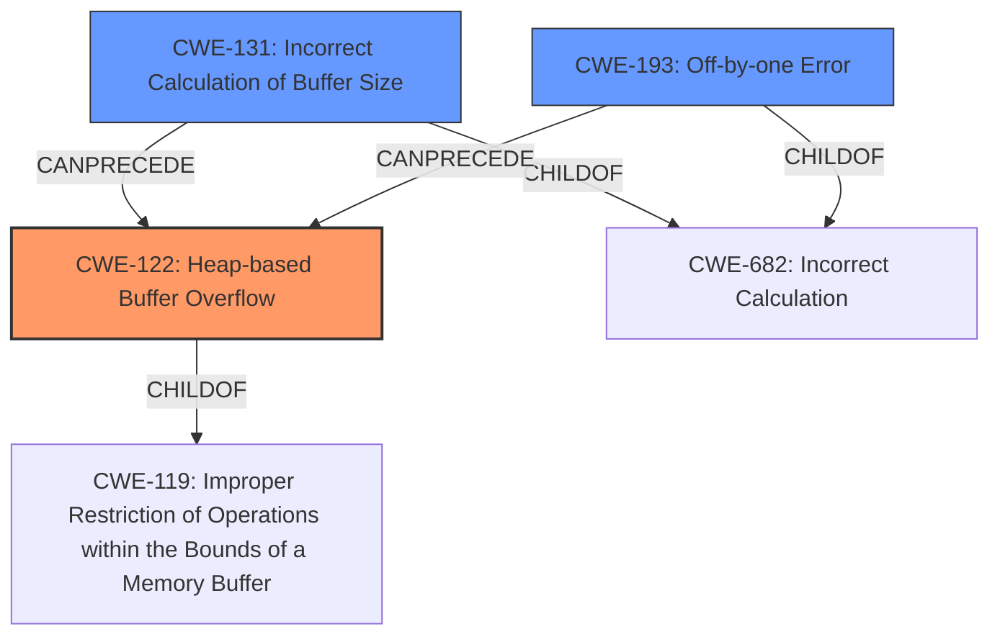

# Final Resolution for CVE-2022-3437

# Summary
| CWE ID | CWE Name | Confidence | CWE Abstraction Level | CWE Vulnerability Mapping Label | CWE-Vulnerability Mapping Notes |
|---|---|---|---|---|---|
| CWE-122 | Heap-based Buffer Overflow | 0.95 | Variant | Primary | Allowed |
| CWE-131 | Incorrect Calculation of Buffer Size | 0.75 | Base | Secondary Candidate | Allowed |
| CWE-193 | Off-by-one Error | 0.30 | Base | Tertiary Candidate | Allowed |

## Evidence and Confidence

*   **Confidence Score:** 0.90
*   **Evidence Strength:** HIGH

## Relationship Analysis
The primary relationship impacting the decision is the parent-child relationship between CWE-119 (Improper Restriction of Operations within the Bounds of a Memory Buffer) and CWE-122 (Heap-based Buffer Overflow), where CWE-122 is a variant of CWE-119, providing a more specific classification. Also, CWE-131 (Incorrect Calculation of Buffer Size) can precede CWE-122, indicating a potential vulnerability chain. The abstraction levels guided the selection, favoring the more specific variant (CWE-122) and base-level root causes (CWE-131, CWE-193).

## Vulnerability Chain
The vulnerability chain starts with a "maliciously small packet" leading to:
1.  An **incorrect calculation of the buffer size (CWE-131)**, possibly compounded by an **off-by-one error (CWE-193)** during the calculation.
2.  This results in a **heap-based buffer overflow (CWE-122)** when the decryption routine attempts to write more data than allocated.
3.  The ultimate impact is a denial of service (DoS).

## Summary of Analysis
The initial analysis correctly identifies CWE-122 as the primary weakness due to the explicit mention of "heap-based buffer overflow" in the vulnerability description: "A heap-based buffer overflow vulnerability was found...The DES and Triple-DES decryption routines...allow a length-limited write buffer overflow on malloc() allocated memory...". This direct evidence supports a high confidence level.

The secondary candidate, CWE-131, is also reasonable as the "maliciously small packet" suggests a potential for incorrect size calculation, although not explicitly stated.

The criticism provided valuable suggestions, particularly regarding potential related CWEs like CWE-193 (Off-by-one Error), and chain. I have lowered the confidence in CWE-193, but included it because it is possible there was an off-by-one error in the size calculation.

The relationships between CWEs (e.g., CWE-122 being a variant of CWE-119, CWE-131 preceding CWE-122) influenced the selection by providing context and supporting the vulnerability chain.

The selected CWEs are at the optimal level of specificity. CWE-122 is a Variant, which is more specific than its parent CWE-119. CWE-131 and CWE-193 are base level CWEs, which are preferred for mapping to root causes.