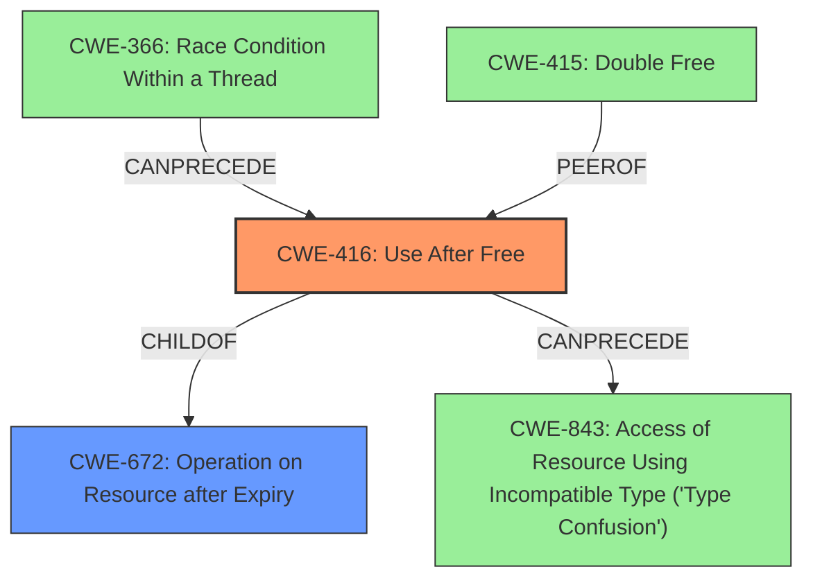

# Final Resolution for CVE-2022-3445

# Summary
| CWE ID | CWE Name | Confidence | CWE Abstraction Level | CWE Vulnerability Mapping Label | CWE-Vulnerability Mapping Notes |
|---|---|---|---|---|---|
| CWE-416 | Use After Free | 1.0 | Variant | Primary CWE | Allowed |

## Evidence and Confidence

*   **Confidence Score:** 1.0
*   **Evidence Strength:** HIGH

## Relationship Analysis
The primary relationship influencing the decision is that CWE-416 is a Variant of CWE-672 (Operation on Resource after Expiry). While other CWEs like CWE-843 (Type Confusion), CWE-366 (Race Condition) and CWE-415 (Double Free) were considered, they were deemed less relevant as they represent potential consequences or preconditions rather than the direct cause of the vulnerability described. The abstraction level of CWE-416 as a Variant provides sufficient specificity for this vulnerability.

## Vulnerability Chain
The vulnerability chain starts with a **use after free** (**CWE-416**) in Skia. The **root cause** is the improper management of memory, specifically reusing or referencing memory after it has been freed. This can lead to **heap corruption**, as the freed memory may be reallocated and the dangling pointer can then overwrite data belonging to the newly allocated object. The impact is that a remote attacker can potentially exploit this heap corruption via a crafted HTML page, leading to arbitrary code execution.

## Summary of Analysis
The initial analysis correctly identified **CWE-416 (Use After Free)** as the primary **weakness**. The criticism raised valid points about overemphasizing heap corruption and the need to explicitly address alternative CWEs. The revised analysis snippet incorporates these suggestions by clarifying that heap corruption is a consequence of the **use after free**, not the root cause, and by explaining why alternative CWEs such as CWE-843, CWE-366, and CWE-415 were not chosen. The vulnerability description clearly states "**use after free**", leading to potential **heap corruption**. This directly aligns with CWE-416, which describes the condition where memory is reused or referenced after it has been freed. The CVE Reference Links Content Summary reinforces this by stating that the **root cause** is a "**Use-after-free** in Skia" and identifies the presence of a "**use-after-free** vulnerability." The MITRE mapping guidance for CWE-416 indicates that this mapping is ALLOWED. The selected CWE is at the optimal level of specificity, as it directly describes the **weakness** and is a Variant-level CWE.