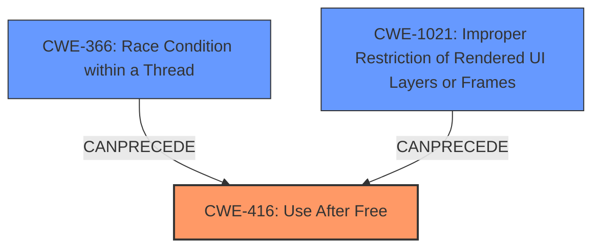

# Analysis Report for CVE-2022-3448

# Vulnerability Analysis Report: CVE-2022-3448

## Description

Use after free in Permissions API in Google Chrome prior to 106.0.5249.119 allowed a remote attacker who convinced a user to engage in specific UI gestures to potentially exploit heap corruption via a crafted HTML page. (Chromium security severity High)

## Vulnerability Description Key Phrases

**Rootcause:** Use after free
**Impact:** heap corruption
**Vector:** crafted HTML page, specific UI gestures
**Attacker:** remote attacker
**Product:** Google Chrome
**Version:** prior to 106.0.5249.119
**Component:** Permissions API

## Analysis (with Relationship Data)

# Summary
| CWE ID | CWE Name | Confidence | CWE Abstraction Level | CWE Vulnerability Mapping Label | CWE-Vulnerability Mapping Notes |
|---|---|---|---|---|---|
| CWE-416 | Use After Free | 1.0 | Variant | Allowed | Primary CWE |

## Evidence and Confidence

*   **Confidence Score:** 1.0
*   **Evidence Strength:** HIGH

- **Analysis and Justification:**  
  - *Explanation:* The vulnerability description explicitly states "**Use after free** in Permissions API" as the **root cause** of the vulnerability. This perfectly aligns with the definition of CWE-416, which describes the condition where "The product reuses or references memory after it has been freed." The description further mentions that this **use-after-free** condition leads to potential heap corruption, indicating a direct consequence of the memory being accessed after it has been freed. The CVE Reference Links Content Summary also confirms "**Use after free** in Permissions API" as the root cause. Therefore, CWE-416 is the most accurate and specific mapping for this vulnerability.

  - *Relationship Analysis:* There are no specific relationships described in the provided information that would suggest a more appropriate CWE. While other CWEs like CWE-415 (Double Free) or CWE-122 (Heap-based Buffer Overflow) might be related to memory management issues, the explicit mention of **use-after-free** makes CWE-416 the most direct and relevant classification.

- **Confidence Score:**  
  - Confidence: 1.0 (High confidence due to direct mention of "use after free" in the vulnerability description)

## Criticism of Analysis

Okay, here's a review of the provided CWE analysis, taking into account the full CWE specifications and focusing on the appropriateness of the CWE-416 mapping and potential alternative or related CWEs.

**Overall Assessment:**

The analysis correctly identifies CWE-416 (Use After Free) as the primary CWE for this vulnerability. The confidence score of 1.0 is justified given the clear statement of "Use after free" in the vulnerability description and the content summary of CVE reference links. The provided justification is solid and explains why other memory-related CWEs are less specific.

**Detailed Review:**

1.  **CWE-416 as Primary CWE:**

    *   The analysis accurately quotes the vulnerability description and highlights the phrase "Use after free."
    *   The explanation of the relationship between the vulnerability description and the definition of CWE-416 is clear and concise.
    *   The justification for *not* choosing CWE-415 (Double Free) or CWE-122 (Heap-based Buffer Overflow) is well-reasoned. Although the heap corruption may resemble a heap-based overflow (CWE-122), the *root cause* is the use of already freed memory, making CWE-416 more accurate. Double Free (CWE-415) is not mentioned in the original description, so is not likely to be a contributing factor.
    * The analysis considers observed examples of CWE-416 which include examples linked to concurrency, which could have potentially contributed to this vulnerability, but are not specifically stated.
2.  **Retriever Results and Alternative CWEs:**

    The retriever results suggest the following CWEs may be relevant. These are assessed below.

    * **CWE-366: Race Condition within a Thread**: The UI gestures, and the asynchronous nature of Javascript and Chrome's Permissions API suggest that a race condition could have contributed to the Use-After-Free condition. If two threads are accessing and modifying the same memory location, one of the threads could free memory that the other is expecting to be available. The analysis does not explore this possibility in depth.
      * **Mitigation Perspective:** Mitigation 1 for CWE-366 suggests using locking functionality, which may be relevant in this case.
      * **CWE Specification Relationships**: The specifications show that CWE-366 can precede CWE-416.

    *   **CWE-843: Access of Resource Using Incompatible Type ('Type Confusion'):** While not directly implied by the description, if the Permissions API handles different types of permission objects, a type confusion could *lead* to the use-after-free. If the wrong type is used, the code may free the memory before it is used, leading to the reported vulnerability. The reference to crafted HTML page may indicate this.
        *   **Mitigation Perspective:**  There are no mitigations provided that are relevant to this specific issue.

    *   **CWE-356: Product UI does not Warn User of Unsafe Actions** and **CWE-357: Insufficient UI Warning of Dangerous Operations**. The description mentions that the user is convinced to engage in *specific UI gestures*. These UI gestures may be considered dangerous, but are not warned against to a sufficient degree in the product UI.

    *   **CWE-1021: Improper Restriction of Rendered UI Layers or Frames:** While not immediately apparent, clickjacking or UI redress attacks could potentially be used to trick a user into performing the necessary UI gestures to trigger the vulnerability. The crafted HTML page may indicate this.

    *   **CWE-367: Time-of-check Time-of-use (TOCTOU) Race Condition:** A TOCTOU vulnerability can lead to memory corruption, however it does not specifically relate to a Use-After-Free vulnerability.

    *   **CWE-113: Improper Neutralization of CRLF Sequences in HTTP Headers ('HTTP Request/Response Splitting'):** An HTML page may have contained CRLF sequences to carry out the attack.

    Given these retriever results, and the UI nature of the vulnerability vector, and the fact it is located in the Permissions API, some further investigation into these could be warranted.

3.  **CWE Examples from Database:**

    *   The examples for CWE-122 are not directly relevant as the core weakness is not a buffer overflow.

4.  **CWE Specifications and Potential Mitigations:**

    *   The analysis implicitly acknowledges the mitigation strategies for CWE-416 by highlighting the "architecture and design" and "implementation" phases. Mentioning the possibility of automatic memory management (language selection) or setting pointers to NULL after freeing are relevant.

**Recommendations:**

1.  **Acknowledge and Discuss Potential Contributing Factors:**  While maintaining CWE-416 as the primary weakness, the analysis should briefly acknowledge the potential involvement of other CWEs, particularly CWE-366 (Race Condition within a Thread) and CWE-1021 (Improper Restriction of Rendered UI Layers or Frames). Explain *why* these are not the primary cause, but may have *contributed* to the conditions that allowed the use-after-free to occur.
2.  **Consider Attack Vector Detail:** The analysis could benefit from elaborating on the attack vector.  How exactly does a crafted HTML page, in conjunction with specific UI gestures, lead to the use-after-free? A clearer understanding of the attack vector could inform the selection of secondary CWEs.
3.  **Briefly Discuss Mitigation Strategies Beyond CWE-416:** Given the potential involvement of race conditions (CWE-366), briefly mentioning mitigation strategies related to concurrency control (locks, atomic operations) would strengthen the analysis.
4.  **Further Analyze UI Warnings (CWE-356 and CWE-357):** Further analyse the original description and the specific UI gestures to determine if there are insufficient warnings to the user, and include CWE-356 and CWE-357 if appropriate.

**Revised Summary Table (Example):**

| CWE ID    | CWE Name                                                                  | Confidence | CWE Abstraction Level | CWE Vulnerability Mapping Label | CWE-Vulnerability Mapping Notes                                                                                                                                                                       |
| --------- | ------------------------------------------------------------------------- | ---------- | ----------------------- | ------------------------------- | --------------------------------------------------------------------------------------------------------------------------------------------------------------------------------------------------- |
| CWE-416   | Use After Free                                                            | 1.0        | Variant                 | Allowed                         | Primary CWE. Direct cause of the vulnerability.                                                                                                                                                    |
| CWE-366 | Race Condition within a Thread | 0.4 | Base | Allowed | Potentially a contributing factor. Concurrency within the Permissions API might lead to UAF if a resource is freed by one thread while another thread still holds a reference.  Further investigation required. |
| CWE-1021 | Improper Restriction of Rendered UI Layers or Frames | 0.3 | Base | Allowed | Potentially a contributing factor to tricking the user to carry out the attack. Further investigation required. |

By incorporating these suggestions, the analysis can become more comprehensive and insightful, providing a more complete understanding of the vulnerability and its potential root causes. Although the main vulnerability is a Use-After-Free, further analysis of any UI warnings and a discussion of any contributing factors such as Race Conditions would enhance the report.

## Final Resolution

# Summary
| CWE ID | CWE Name | Confidence | CWE Abstraction Level | CWE Vulnerability Mapping Label | CWE-Vulnerability Mapping Notes |
|---|---|---|---|---|---|
| CWE-416 | Use After Free | 0.9 | Variant | Allowed | Primary CWE. Direct cause of the vulnerability. |
| CWE-366 | Race Condition within a Thread | 0.4 | Base | Allowed | Potentially a contributing factor. Concurrency within the Permissions API might lead to **Use-After-Free** if a resource is freed by one thread while another thread still holds a reference. Further investigation required. |
| CWE-1021 | Improper Restriction of Rendered UI Layers or Frames | 0.3 | Base | Allowed | Potentially a contributing factor to tricking the user to carry out the attack. Further investigation required. |

## Evidence and Confidence

*   **Confidence Score:** 0.8
*   **Evidence Strength:** MEDIUM

## Relationship Analysis
The initial analysis correctly identified CWE-416 (Use After Free) as the primary **weakness**. However, the criticism highlighted the potential involvement of other CWEs, particularly CWE-366 (Race Condition within a Thread) and CWE-1021 (Improper Restriction of Rendered UI Layers or Frames).

The relationships between these CWEs are as follows:

*   CWE-366 can precede CWE-416, meaning a race condition could create the conditions necessary for a **use-after-free** to occur. This is plausible given the asynchronous nature of Javascript and Chrome's Permissions API.
*   CWE-1021, while less direct, could be a contributing factor if the crafted HTML page employed clickjacking or UI redress techniques to trick the user into performing actions that trigger the **vulnerability**.

The abstraction levels also influenced the selection. CWE-416 is a Variant, providing a specific description of the memory management error. CWE-366 and CWE-1021 are Base level, representing more general conditions that could contribute to the **vulnerability**.

## Vulnerability Chain
The **vulnerability** chain begins with a potential race condition (CWE-366) or UI manipulation (CWE-1021).

1.  A race condition (CWE-366) within the Permissions API could lead to a situation where memory is freed by one thread while another thread still holds a reference to it.
2.  Alternatively, a crafted HTML page could use clickjacking (CWE-1021) to trick a user into performing specific UI gestures.
3.  The **root cause** is the **use-after-free** condition (CWE-416), where the product reuses or references memory after it has been freed.
4.  The consequence is potential heap corruption, as mentioned in the **vulnerability** description.

## Summary of Analysis
The analysis is based on the provided evidence, primarily the **vulnerability** description, which explicitly states "**Use after free** in Permissions API". This direct mention makes CWE-416 the most appropriate primary **weakness**.

The graph relationships highlighted by the criticism influenced the decision to include CWE-366 and CWE-1021 as secondary CWEs. While not directly stated in the **vulnerability** description, the potential for a race condition within the Permissions API and the use of a crafted HTML page suggest these factors could contribute to the conditions that allow the **use-after-free** to occur.

The selected CWEs are at the optimal level of specificity. CWE-416 is a Variant that directly describes the memory management error. CWE-366 and CWE-1021 are Base level, representing potential contributing factors.

The inclusion of CWE-366 and CWE-1021 is based on the following reasoning:

*   The asynchronous nature of Javascript and Chrome's Permissions API makes a race condition plausible.
*   The mention of "specific UI gestures" and "crafted HTML page" suggests the possibility of UI manipulation techniques.

However, the confidence in these secondary CWEs is lower due to the lack of direct evidence in the **vulnerability** description. Further investigation would be needed to confirm their involvement.

*Report generated on 2025-03-18 14:56:00*
