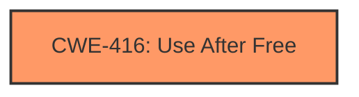

# Analysis Report for CVE-2022-3449

# Vulnerability Analysis Report: CVE-2022-3449

## Description

Use after free in Safe Browsing in Google Chrome prior to 106.0.5249.119 allowed an attacker who convinced a user to install a malicious extension to potentially exploit heap corruption via a crafted Chrome Extension. (Chromium security severity High)

## Vulnerability Description Key Phrases

**Rootcause:** Use after free
**Impact:** heap corruption
**Vector:** crafted Chrome Extension
**Attacker:** attacker
**Product:** Google Chrome
**Version:** prior to 106.0.5249.119
**Component:** Safe Browsing

## Analysis (with Relationship Data)

# Summary
| CWE ID | CWE Name | Confidence | CWE Abstraction Level | CWE Vulnerability Mapping Label | CWE-Vulnerability Mapping Notes |
|---|---|---|---|---|---|
| CWE-416 | Use After Free | 1.0 | Variant | Allowed | Primary CWE |

## Evidence and Confidence

*   **Confidence Score:** 1.0
*   **Evidence Strength:** HIGH

- **Analysis and Justification:**  
  - *Explanation:* The vulnerability description explicitly states "**Use after free** in Safe Browsing". The "CVE Reference Links Content Summary" also confirms "**root_cause**: Use after free in Safe Browsing" and "**weaknesses**: Use after free". The primary CWE match from similar CVE descriptions is CWE-416. The Retriever Results also lists CWE-416 as the top candidate with a high score. CWE-416's description, "The product reuses or references memory after it has been freed," directly matches the vulnerability. MITRE's mapping guidance designates CWE-416 as ALLOWED for this type of weakness.
  
  - *Relationship Analysis:* While other CWEs like CWE-415 (Double Free) and CWE-366 (Race Condition within a Thread) were considered, the explicit mention of "use after free" makes CWE-416 the most accurate and specific choice. CWE-416 is a variant, which aligns with the goal of selecting the lowest level of abstraction possible.

- **Confidence Score:**  
  - Confidence: 1.0 (Direct evidence and strong alignment with CWE description and mapping guidance)

## Criticism of Analysis

Okay, here's a review of the provided analysis, considering the full CWE specifications:

**Overall Assessment:**

The analysis correctly identifies CWE-416 (Use After Free) as the primary weakness. The justification is well-supported by the vulnerability description and the retriever results. The confidence score of 1.0 is appropriate. The analysis acknowledges other potentially relevant CWEs (e.g., CWE-415, CWE-366) and provides a rationale for why CWE-416 is the most accurate.

**Detailed Review:**

*   **CWE-416 (Use After Free) - Primary CWE:**
    *   **Correctness:**  The identification of CWE-416 is accurate and well-justified. The vulnerability description explicitly mentions "use after free," and the provided evidence confirms this.
    *   **Abstraction Level:** The analysis correctly notes that CWE-416 is a *Variant* level CWE, which is a preferred level of abstraction for mapping to root causes.
    *   **Mapping Guidance:** The analysis adheres to the CWE's mapping guidance, which states that this CWE is "Allowed" because it is at the Variant level.
    *   **Mitigations:** The potential mitigations listed in the CWE specification are appropriate. These include choosing a language with automatic memory management or, if using C/C++, setting pointers to NULL after freeing them.
    *   **Confidence:** The confidence score of 1.0 is warranted given the explicit nature of the vulnerability description.

*   **Other Considered CWEs and why they are not the Primary CWE:**

    *   **CWE-366 (Race Condition within a Thread):** While the observed examples include a link from CWE-366 to CWE-416 (CVE-2022-2621), the primary description does not indicate the need for concurrency to trigger the vulnerability. If the Use-After-Free can be triggered deterministically without relying on multiple threads racing, then this CWE is not directly applicable.
    *   **CWE-843 (Access of Resource Using Incompatible Type ('Type Confusion'))**
        * The Description for this CWE focuses on using different incompatible types for allocating and accessing a resource. There is no mention of type confusion in the vulnerability description. This CWE is thus not applicable.
    *   **CWE-356 (Product UI does not Warn User of Unsafe Actions)**
        * The Description for this CWE focuses on the UI of a product and the actions the product enables the user to perform. The provided vulnerability report does not highlight a UI interaction that is unsafe. This CWE is thus not applicable.
    *   **CWE-415 (Double Free):** While related to memory management errors, a double free is distinct from a use after free. A double free occurs when the *same* memory address is freed twice. The vulnerability description doesn't suggest a double free is occurring, but rather access to memory *after* it has been freed.
    *   **CWE-122 (Heap-based Buffer Overflow):** The root cause is "Use After Free" which causes memory corruption, but not necessarily a buffer overflow. Although a use-after-free *could* lead to a buffer overflow if the freed memory is reallocated and then overwritten, that is a secondary effect, not the primary cause.
    *   **CWE-190 (Integer Overflow or Wraparound):** The Description for this CWE focuses on integer overflows. There is no mention of integer overflows in the vulnerability description. This CWE is thus not applicable.
    *   **CWE-451 (User Interface (UI) Misrepresentation of Critical Information):** The Description for this CWE focuses on UI misrepresentation vulnerabilities. There is no mention of UI misrepresentation in the vulnerability description. This CWE is thus not applicable.
    *   **CWE-362 (Concurrent Execution using Shared Resource with Improper Synchronization ('Race Condition'))**
        * The Description for this CWE focuses on Race Condition vulnerabilities. There is no mention of a race condition in the vulnerability description. This CWE is thus not applicable.
    *   **CWE-911 (Improper Update of Reference Count)**
        * The Description for this CWE focuses on reference count vulnerabilities. There is no mention of a reference count in the vulnerability description. This CWE is thus not applicable.

**Areas for Potential Enhancement (Minor):**

*   **Chains and Composites:** While the analysis does a good job of excluding other CWEs, it could briefly explore potential *chains* or *composites*. For instance, could a race condition (CWE-362 or CWE-366) *lead to* the use-after-free (CWE-416)? Or is there any aspect of improper initialization (CWE-457) that contributes to the vulnerability? This would further strengthen the analysis by considering potential contributing factors, even if they are not the *primary* cause.
*   **Mitigation Specificity:** In the analysis, the mitigations for CWE-416 are general. It might be possible to offer slightly more specific mitigations given the context of a Chrome extension exploiting Safe Browsing. For example, if reference counting is involved in Safe Browsing's memory management, more robust reference counting mechanisms could be mentioned.

**Conclusion:**

The analysis is accurate, well-justified, and adheres to CWE mapping guidelines. The identification of CWE-416 as the primary weakness is correct. The minor suggestions above would further strengthen the analysis, but the current state is already very good.

## Final Resolution

# Summary
| CWE ID | CWE Name | Confidence | CWE Abstraction Level | CWE Vulnerability Mapping Label | CWE-Vulnerability Mapping Notes |
|---|---|---|---|---|---|
| CWE-416 | Use After Free | 1.0 | Variant | Allowed | Primary CWE |

## Evidence and Confidence

*   **Confidence Score:** 1.0
*   **Evidence Strength:** HIGH

## Relationship Analysis
The primary relationship considered was the absence of any direct relationships suggesting a different root cause. While CWE-362 (Race Condition) and CWE-366 (Race Condition within a Thread) can *precede* CWE-416, the vulnerability description does not mention concurrency. Similarly, while improper initialization (CWE-457) *could* contribute, there is no explicit evidence of it here. The selection of CWE-416 as a Variant provides an optimal level of specificity, as it is more specific than a Class or Base CWE, and directly reflects the 'Use After Free' nature of the **weakness**.

## Vulnerability Chain
The vulnerability chain starts with a **ROOTCAUSE**: Use After Free.
  - The Chrome Extension is crafted to exploit memory management within the Safe Browsing feature.
  - The extension attempts to access memory that has already been freed.
  - The consequence is heap corruption.
  - The impact is the potential for arbitrary code execution due to the heap corruption.

## Summary of Analysis
The initial analysis and criticism both converge on CWE-416 (Use After Free) as the most appropriate classification. The vulnerability description clearly states "Use after free," making it a direct match. The criticism explores potential contributing factors like race conditions or improper initialization but correctly concludes that there is no explicit evidence to support these. The selection of CWE-416 as a Variant is appropriate because it offers a granular level of specificity. The confidence remains at 1.0 due to the strength of the direct evidence. The Retriever Results list CWE-416 as the top candidate with a high score, adding further support. The **weakness** itself is clearly stated in the CVE description and summary as: "Use after free in Safe Browsing".

*Report generated on 2025-03-18 14:57:29*
