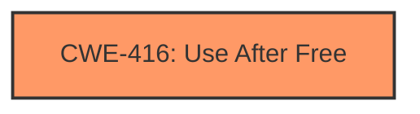

# Final Resolution for CVE-2022-3449

# Summary
| CWE ID | CWE Name | Confidence | CWE Abstraction Level | CWE Vulnerability Mapping Label | CWE-Vulnerability Mapping Notes |
|---|---|---|---|---|---|
| CWE-416 | Use After Free | 1.0 | Variant | Allowed | Primary CWE |

## Evidence and Confidence

*   **Confidence Score:** 1.0
*   **Evidence Strength:** HIGH

## Relationship Analysis
The primary relationship considered was the absence of any direct relationships suggesting a different root cause. While CWE-362 (Race Condition) and CWE-366 (Race Condition within a Thread) can *precede* CWE-416, the vulnerability description does not mention concurrency. Similarly, while improper initialization (CWE-457) *could* contribute, there is no explicit evidence of it here. The selection of CWE-416 as a Variant provides an optimal level of specificity, as it is more specific than a Class or Base CWE, and directly reflects the 'Use After Free' nature of the **weakness**.

## Vulnerability Chain
The vulnerability chain starts with a **ROOTCAUSE**: Use After Free.
  - The Chrome Extension is crafted to exploit memory management within the Safe Browsing feature.
  - The extension attempts to access memory that has already been freed.
  - The consequence is heap corruption.
  - The impact is the potential for arbitrary code execution due to the heap corruption.

## Summary of Analysis
The initial analysis and criticism both converge on CWE-416 (Use After Free) as the most appropriate classification. The vulnerability description clearly states "Use after free," making it a direct match. The criticism explores potential contributing factors like race conditions or improper initialization but correctly concludes that there is no explicit evidence to support these. The selection of CWE-416 as a Variant is appropriate because it offers a granular level of specificity. The confidence remains at 1.0 due to the strength of the direct evidence. The Retriever Results list CWE-416 as the top candidate with a high score, adding further support. The **weakness** itself is clearly stated in the CVE description and summary as: "Use after free in Safe Browsing".