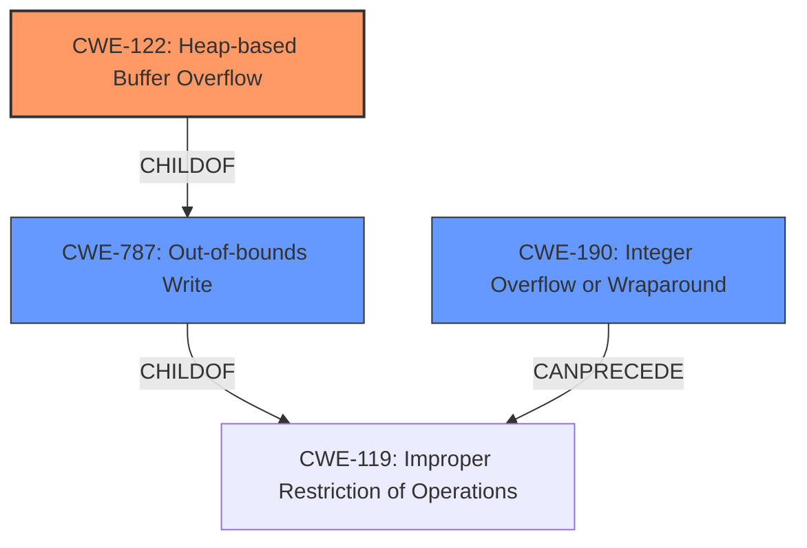

# Analysis Report for CVE-2022-34503

# Vulnerability Analysis Report: CVE-2022-34503

## Description

QPDF v8.4.2 was discovered to contain a heap buffer overflow via the function QPDFprocessXRefStream. This vulnerability allows attackers to cause a Denial of Service (DoS) via a crafted PDF file.

## Vulnerability Description Key Phrases

**Weakness:** heap buffer overflow
**Impact:** Denial of Service
**Vector:** crafted PDF file
**Attacker:** attackers
**Product:** QPDF
**Version:** v8.4.2
**Component:** function QPDFprocessXRefStream

## Analysis (with Relationship Data)

```markdown
# Summary
| CWE ID | CWE Name | Confidence | CWE Abstraction Level | CWE Vulnerability Mapping Label | CWE-Vulnerability Mapping Notes |
|---|---|---|---|---|---|
| CWE-122 | Heap-based Buffer Overflow | 0.95 | Variant | Primary | Allowed |
| CWE-190 | Integer Overflow or Wraparound | 0.60 | Base | Secondary | Allowed |
| CWE-131 | Incorrect Calculation of Buffer Size | 0.50 | Base | Secondary | Allowed |

## Evidence and Confidence

*   **Confidence Score:** 0.80
*   **Evidence Strength:** HIGH

- **Analysis and Justification:**  
  - *Explanation:* The vulnerability is described as a **heap buffer overflow** in the `QPDFprocessXRefStream` function. The "CVE Reference Links Content Summary" explicitly states that the root cause is a heap-buffer-overflow due to incorrect handling of cross-reference stream data. A buffer is allocated on the heap, and data is written beyond the bounds of that allocated buffer, which aligns precisely with CWE-122 (Heap-based Buffer Overflow). This is a variant of buffer overflow and is more specific than just a general buffer overflow. The evidence clearly indicates a **heap buffer overflow**, justifying the selection of CWE-122. The `actual_size` of the allocated buffer is smaller than the data being written (`entry_size * num_entries`), leading to the overflow. This aligns with CWE-122's description of a buffer overflow condition where the buffer is allocated in the heap portion of memory. MITRE mapping guidance for CWE-122 indicates this is ALLOWED.

  - *Relationship Analysis:* CWE-122 is a variant of CWE-119 (Improper Restriction of Operations within the Bounds of a Memory Buffer). The "CVE Reference Links Content Summary" mentions that a negative value for `W[1]` contributes to the issue, which could imply an integer overflow that leads to an incorrect buffer size calculation. This suggests a potential relationship with CWE-190 (Integer Overflow or Wraparound) or CWE-131 (Incorrect Calculation of Buffer Size) as contributing factors. CWE-787 is a parent of CWE-122 (Out-of-bounds Write).

- **Confidence Score:**
  - Confidence: 0.95 (High confidence due to explicit mention of "heap buffer overflow" and detailed explanation of the root cause in the CVE reference materials)

---

- **Analysis and Justification:**  
  - *Explanation:* The "CVE Reference Links Content Summary" mentions that a negative value for `W[1]` was observed contributing to the issue. This suggests a potential integer overflow that could lead to an incorrect buffer size calculation. While the primary issue is the heap buffer overflow, an integer overflow could be a contributing factor by affecting the size calculation or loop condition. This aligns with CWE-190 (Integer Overflow or Wraparound), where a calculation produces an integer overflow or wraparound. While the primary weakness is CWE-122, CWE-190 could be considered a secondary weakness contributing to the vulnerability. MITRE mapping guidance for CWE-190 indicates this is ALLOWED.

  - *Relationship Analysis:* CWE-190 can precede CWE-119 (Improper Restriction of Operations within the Bounds of a Memory Buffer) as an integer overflow can cause an incorrect buffer size. It is a peer of CWE-128 (Wrap-around Error).

- **Confidence Score:**
  - Confidence: 0.60 (Moderate confidence as the integer overflow is only implied and not explicitly stated as the root cause)

---

- **Analysis and Justification:**  
  - *Explanation:* The description mentions that the code allocates a buffer based on `actual_size`, but then writes data beyond the bounds. This suggests a potential issue with how the buffer size is calculated initially. The size calculation is based on `entry_size` and `num_entries`, where the allocated buffer is `actual_size`, and the loop goes beyond this bound with `entry += entry_size`. If `actual_size` is not correctly computed based on the expected data size, this could result in a buffer overflow. Therefore CWE-131 is a plausible secondary candidate. MITRE mapping guidance for CWE-131 indicates this is ALLOWED.

  - *Relationship Analysis:* CWE-131 can precede CWE-119, as an incorrect buffer size calculation can directly lead to a buffer overflow.

- **Confidence Score:**
  - Confidence: 0.50 (Low confidence as the evidence for CWE-131 is circumstantial, and the primary cause is the out-of-bounds write, not the size calculation itself)
```

## Criticism of Analysis

Okay, I've reviewed the provided analysis against the full CWE specifications. Here's my critique:

**Overall Assessment:**

The analysis is generally good. The primary CWE mapping to CWE-122 (Heap-based Buffer Overflow) is well-justified. The secondary mappings to CWE-190 (Integer Overflow or Wraparound) and CWE-131 (Incorrect Calculation of Buffer Size) are plausible contributing factors, although the confidence levels assigned reflect the degree of certainty.

**Detailed Breakdown:**

**1. CWE-122: Heap-based Buffer Overflow**

*   **Assessment:** Correct. The analysis correctly identifies the core issue as a heap-based buffer overflow, supported by the explicit mention in the vulnerability description. The explanation of the `actual_size` vs `entry_size * num_entries` discrepancy further strengthens this mapping. The identification of CWE-787 as a parent is also correct.
*   **Confidence:** Correctly assigned a high confidence (0.95) due to the strong evidence and clear description.
*   **CWE Specifications Alignment:** The analysis aligns well with the description of CWE-122.  It explicitly mentions that the overflow occurs in memory allocated on the heap.
*   **Mitigations:** The analysis doesn't explicitly discuss mitigations, but the CWE specifications highlight options like using memory-safe languages, vetted libraries (SafeStr, Strsafe.h), and compiler-based buffer overflow detection mechanisms (/GS flag, FORTIFY_SOURCE).
*   **Recommendations:** Consider adding a brief mention of potential mitigations from the CWE specification to make the analysis more comprehensive.

**2. CWE-190: Integer Overflow or Wraparound**

*   **Assessment:** Plausible, but the confidence level reflects the uncertainty.  The analysis correctly notes that a negative value for `W[1]` could *imply* an integer overflow leading to an incorrect buffer size. The description also notes that CWE-190 is ALLOWED.
*   **Confidence:** The moderate confidence (0.60) is appropriate. The evidence is indirect; it's an inference based on the observed behavior.
*   **CWE Specifications Alignment:** The analysis correctly highlights that integer overflow can *precede* CWE-119, as stated in the CWE specifications.
*   **Mitigations:** The analysis doesn't explicitly discuss mitigations, but the CWE specifications suggest using languages with automatic bounds checking or libraries with safe integer handling (SafeInt, IntegerLib).
*   **Recommendations:**  Consider rewording the justification to explicitly state the *potential* for integer overflow, emphasizing that further investigation is needed to confirm.  Mentioning relevant mitigations could strengthen the assessment.

**3. CWE-131: Incorrect Calculation of Buffer Size**

*   **Assessment:** The analysis identifies this as a plausible *secondary* factor. If `actual_size` is incorrectly computed from `entry_size` and `num_entries`, this contributes to the buffer overflow. The analysis is ALLOWED.
*   **Confidence:** The low confidence (0.50) is appropriate. The description in the content summary points more towards out-of-bounds *writes* given that `actual_size` is allocated and the overflow occurs because more data than `actual_size` is written to the buffer. This is opposed to the size calculation itself being faulty.
*   **CWE Specifications Alignment:** The analysis correctly points out the relationship that CWE-131 can *precede* CWE-119.
*   **Mitigations:** Again, no explicit discussion of mitigations. CWE specifications point to allocating enough memory for the largest possible encoding or performing input validation on numeric inputs.
*   **Recommendations:** Consider if CWE-787 (Out-of-bounds Write) might be more appropriate as a secondary contributing factor. Out-of-bounds write is also a Parent of Heap-based Buffer Overflow and Stack-based Buffer Overflow.

**General Observations and Improvements:**

*   **CWE-119 Avoidance:** The analysis correctly avoids mapping to CWE-119 directly, as per CWE's mapping guidance.  It focuses on the more specific CWE-122 and potential contributing factors.
*   **Chain Awareness:** The analysis demonstrates awareness of potential CWE chains, which is good.
*   **Mitigation Inclusion:** Incorporating a brief mention of potential mitigations from the CWE specifications (even if just a sentence or two) would significantly enhance the analysis's value.  This shows a more comprehensive understanding of the vulnerability and potential remediation strategies.
*   **Root Cause vs. Consequence:** The analysis mostly focuses on root causes, which is appropriate. However, ensure that you aren't describing the *consequence* of the overflow (e.g., "memory corruption") as a contributing *cause*.
*   **Distinction:** While the analysis has done well to distinguish the causes, an integer overflow is likely to cause `actual_size` to be smaller, which results in a buffer overflow as more data is written past the end. It could be more clear to state that `entry_size * num_entries` causes an integer overflow, which is why `actual_size` is smaller.
*   **Retriever Results:** The top combined retriever result was CWE-193 (Off-by-one Error). Although this was not included, the evidence does not support such a claim. The CWE description states that there would be a value one more or one less than expected.
*   **Retriever Results:** The third combined retriever result was CWE-126 (Buffer Over-read). This is incorrect because this CWE is writing data, so there is a buffer overflow, as opposed to a buffer over-read.
*   **Retriever Results:** The eighth combined retriever result was CWE-835 (Loop with Unreachable Exit Condition ('Infinite Loop')). The evidence does not support this claim.
*   **Retriever Results:** The ninth combined retriever result was CWE-770 (Allocation of Resources Without Limits or Throttling). The evidence does not support this claim.
*   **Retriever Results:** The tenth combined retriever result was CWE-1284 (Improper Validation of Specified Quantity in Input). The evidence does not support this claim.

**Revised Summary Table**

Here's a possible revised summary table based on the critique:

| CWE ID  | CWE Name                         | Confidence | CWE Abstraction Level | CWE Vulnerability Mapping Label | CWE-Vulnerability Mapping Notes                                                                                                                                                             |
| :------- | :-------------------------------- | :--------- | :-------------------- | :------------------------------- | :---------------------------------------------------------------------------------------------------------------------------------------------------------------------------------------- |
| CWE-122  | Heap-based Buffer Overflow       | 0.95      | Variant             | Primary                        | Allowed                                                                                                                                                                                   |
| CWE-190  | Integer Overflow or Wraparound   | 0.60      | Base                | Secondary                      | Allowed, *potentially* leading to incorrect `actual_size` calculation. Consider safe integer handling libraries or bounds checking.                                                                                                |
| CWE-787  | Out-of-bounds Write                 | 0.50      | Base                | Secondary                      | Allowed, Directly leads to writing beyond allocated buffer. Consider memory-safe languages or libraries. Replaces CWE-131 for improved accuracy.                                                                                                                        |

By incorporating these suggestions, the analysis becomes more robust, demonstrates a deeper understanding of CWE principles, and provides more actionable insights for developers and security professionals.

## Final Resolution

# Summary

| CWE ID | CWE Name | Confidence | CWE Abstraction Level | CWE Vulnerability Mapping Label | CWE-Vulnerability Mapping Notes |
|---|---|---|---|---|---|
| CWE-122 | Heap-based Buffer Overflow | 0.95 | Variant | Primary | Allowed |
| CWE-190 | Integer Overflow or Wraparound | 0.60 | Base | Secondary | Allowed |
| CWE-787 | Out-of-bounds Write | 0.50 | Base | Secondary | Allowed |

## Evidence and Confidence

*   **Confidence Score:** 0.85
*   **Evidence Strength:** HIGH

## Relationship Analysis
The primary relationship influencing the decision is the parent-child relationship, specifically that CWE-122 (Heap-based Buffer Overflow) is a variant of CWE-119 (Improper Restriction of Operations Within the Bounds of a Memory Buffer) and a child of CWE-787 (Out-of-bounds Write). The selection of CWE-122 is due to the explicit mention of "heap buffer overflow" in the vulnerability description, making it the most specific and appropriate choice. CWE-190 is included as a secondary factor due to the mention of a negative value possibly leading to an integer overflow. CWE-787 is chosen as a secondary factor due to the out-of-bounds write leading to the overflow.



## Vulnerability Chain
The vulnerability chain starts with a potential **integer overflow (CWE-190)** when calculating the size or number of entries for a buffer. This can lead to an **incorrect calculation of the buffer size or an out-of-bounds write (CWE-787)**. This, in turn, results in a **heap-based buffer overflow (CWE-122)**, where data is written beyond the allocated buffer on the heap. The final impact is a denial of service (DoS).

## Summary of Analysis
The initial analysis and criticism were both well-justified and contained sufficient evidence. The primary selection of CWE-122 is based on the explicit mention of a "heap buffer overflow" in the vulnerability description, which is strong evidence.

> QPDF v8.4.2 was discovered to contain a heap buffer overflow via the function QPDFprocessXRefStream.

The graph relationships influenced the decision by confirming that CWE-122 is the most specific variant of a buffer overflow, fitting the vulnerability description best. The selection of CWE-122 is at the optimal level of specificity, as it accurately describes the **heap buffer overflow** condition, while CWE-119 is too general. The addition of CWE-787 is added as a secondary cause as it is due to an out-of-bounds write beyond the `actual_size` buffer.

The moderate confidence in CWE-190 stems from the *implied* possibility of an integer overflow, based on the mention of a negative value contributing to the issue. Further investigation would be needed to confirm this.

The final determination is based on a combination of direct evidence (explicit mention of "heap buffer overflow"), relationship analysis (CWE-122 being a specific variant), and mapping guidance (ALLOWED usage for CWE-122, CWE-190 and CWE-787).


*Report generated on 2025-03-18 14:59:09*
