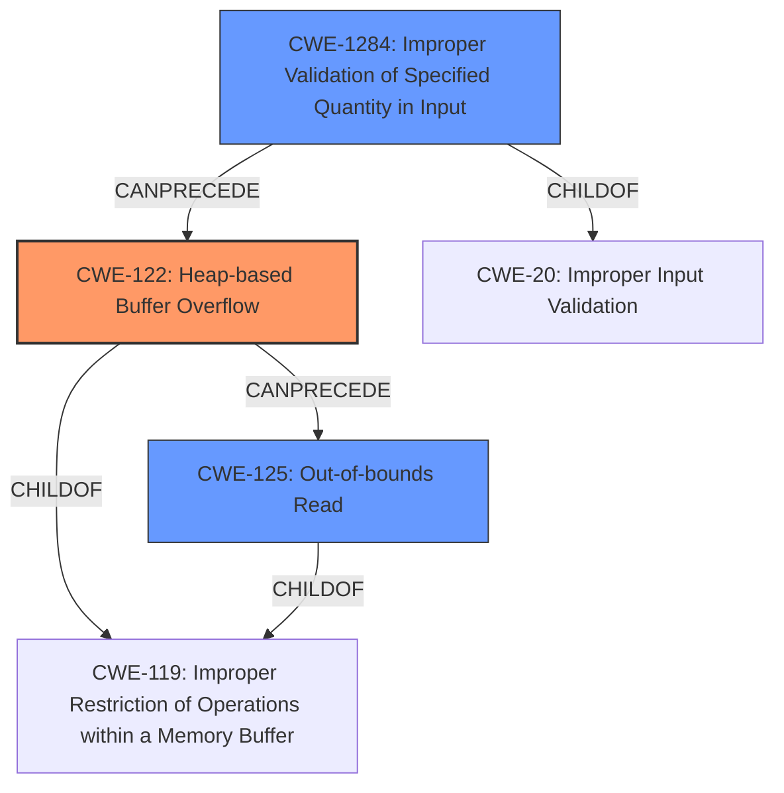

# Final Resolution for CVE-2022-35105

# Summary
| CWE ID | CWE Name | Confidence | CWE Abstraction Level | CWE Vulnerability Mapping Label | CWE-Vulnerability Mapping Notes |
|---|---|---|---|---|---|
| CWE-122 | Heap-based Buffer Overflow | 0.95 | Variant | Allowed | Primary CWE |
| CWE-125 | Out-of-bounds Read | 0.8 | Base | Allowed | Secondary Candidate |
| CWE-1284 | Improper Validation of Specified Quantity in Input | 0.6 | Base | Allowed | Secondary Candidate |
  - The Primary CWE should be first and noted as the Primary CWEs
  - The secondary candidate CWEs should be next and noted as secondary candidates.
  - The confidence is a confidence score 0 to 1 to rate your confidence in your assessment for that CWE.
  - The CWE Abstraction Level as one of these values: Base, Variant, Pillar, Class, Compound
  - The Mapping Notes Usage as one of these values: Allowed, Allowed-with-Review, Prohibited, Discouraged

## Evidence and Confidence

*   **Confidence Score:** 0.9
*   **Evidence Strength:** HIGH

## Relationship Analysis
The primary relationship influencing the decision is the hierarchical connection between buffer overflows, heap allocation, and out-of-bounds reads. **CWE-122 (Heap-based Buffer Overflow)** is a specific type of buffer overflow, making it a child of more general buffer overflow classes. The analysis also considers how a lack of input validation (**CWE-1284 (Improper Validation of Specified Quantity in Input)**) can precede a **heap overflow**, leading to out-of-bounds reads (**CWE-125 (Out-of-bounds Read)**). The abstraction levels (Variant for CWE-122 and Base for CWE-125 and CWE-1284) are appropriate for pinpointing the root cause and contributing factors.

## Vulnerability Chain
The vulnerability chain starts with the lack of proper input validation (**CWE-1284 (Improper Validation of Specified Quantity in Input)**), where the size of the PNG image or its chunks isn't correctly checked. This leads to a **heap-based buffer overflow (CWE-122)** when the program allocates memory on the heap based on this untrusted size. As a result of the overflow, the program attempts to read data beyond the allocated buffer, resulting in **out-of-bounds read (CWE-125)**. The initial flaw is the missing or inadequate input validation, and the ultimate impact is a heap-based buffer overflow that manifests as out-of-bounds reads, potentially leading to a crash or arbitrary code execution.

## Summary of Analysis
The initial analysis correctly identified **CWE-122 (Heap-based Buffer Overflow)** as the primary **WEAKNESS**, based on the explicit mention of "heap-buffer overflow" in the vulnerability description and CVE reference materials. The initial selection of **CWE-125 (Out-of-bounds Read)** is also valid, as the overflow manifests as out-of-bounds reads during PNG data processing.

The analysis is based heavily on the provided evidence, which states, "SWFTools commit 772e55a2 was discovered to contain a heap-buffer overflow via /bin/png2swf+0x552cea" and "multiple instances of heap-based buffer overflows are reported in `png_read_header` and `png_load` functions due to incorrect handling of image data."

The graph relationships influenced the final selection by highlighting how input validation can influence a heap overflow.

The analysis now also includes **CWE-1284 (Improper Validation of Specified Quantity in Input)** to represent the lack of validation of the input size.

The selected CWEs are at the optimal level of specificity because **CWE-122 (Heap-based Buffer Overflow)** accurately describes the type of buffer overflow, **CWE-125 (Out-of-bounds Read)** captures the consequence of the overflow, and **CWE-1284 (Improper Validation of Specified Quantity in Input)** highlights the root cause of the vulnerability. Adding **CWE-1284 (Improper Validation of Specified Quantity in Input)** strengthens the chain of weaknesses.