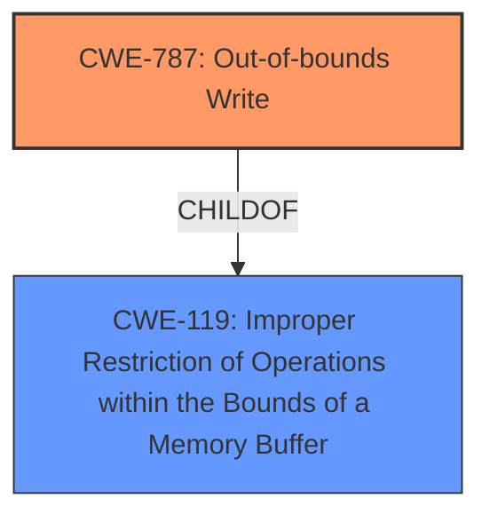

# Final Resolution for CVE-2022-35109

# Summary
| CWE ID | CWE Name | Confidence | CWE Abstraction Level | CWE Vulnerability Mapping Label | CWE-Vulnerability Mapping Notes |
|---|---|---|---|---|---|
| CWE-787 | Out-of-bounds Write | 1.0 | Base | Allowed | Primary CWE |

## Evidence and Confidence

*   **Confidence Score:** 1.0
*   **Evidence Strength:** HIGH

## Relationship Analysis
The primary relationship considered was the parent-child relationship between CWE-787 (**Out-of-bounds Write**) and CWE-119 (Improper Restriction of Operations within the Bounds of a Memory Buffer). CWE-787 is a child of CWE-119, offering a more specific description of the buffer overflow. The base level of abstraction for CWE-787 is optimal, as it directly addresses the **rootcause** without being overly general (like its parent, CWE-119) or excessively specific (like a variant).

## Vulnerability Chain
The vulnerability chain begins with the `draw_stroke` function attempting to write data beyond the allocated buffer's boundaries, directly resulting in a **CWE-787 (Out-of-bounds Write)**. This leads to a heap-based buffer overflow, potentially causing corruption of other data structures on the heap. The final impact can range from application crashes to arbitrary code execution if the overwritten memory contains executable code or function pointers.

## Summary of Analysis
The initial analysis correctly identified **CWE-787 (Out-of-bounds Write)** as the primary CWE. The vulnerability description explicitly mentions a "**heap-buffer overflow**" in the `draw_stroke` function, with confirmation from CVE reference links that the function attempts to write 8 bytes outside the allocated buffer. This aligns perfectly with the definition of **CWE-787**.

The criticism was valuable in suggesting that other CWEs, such as CWE-125 (Out-of-bounds Read) and CWE-122 (Heap-based Buffer Overflow), be explicitly ruled out. While CWE-122 is more specific (Heap-based), it's a Variant, and the base class CWE-787 is therefore the preferred choice. The suggestion to discuss potential mitigations from the CWE specifications was also a good point. Mitigations for **CWE-787** could include using safer languages or libraries with built-in buffer overflow protection, or refactoring the `draw_stroke` function to use safer memory handling techniques.

The final decision to classify this vulnerability as **CWE-787 (Out-of-bounds Write)** is well-justified and at the optimal level of specificity. The evidence from the vulnerability description, combined with the understanding of CWE relationships and mitigations, provides a high level of confidence in this assessment. The analysis takes into account the retriever results, considering similar CWEs such as `CWE-193`, `CWE-125`, `CWE-190`, and `CWE-122`, and appropriately rules them out or explains their relationship to the primary CWE.