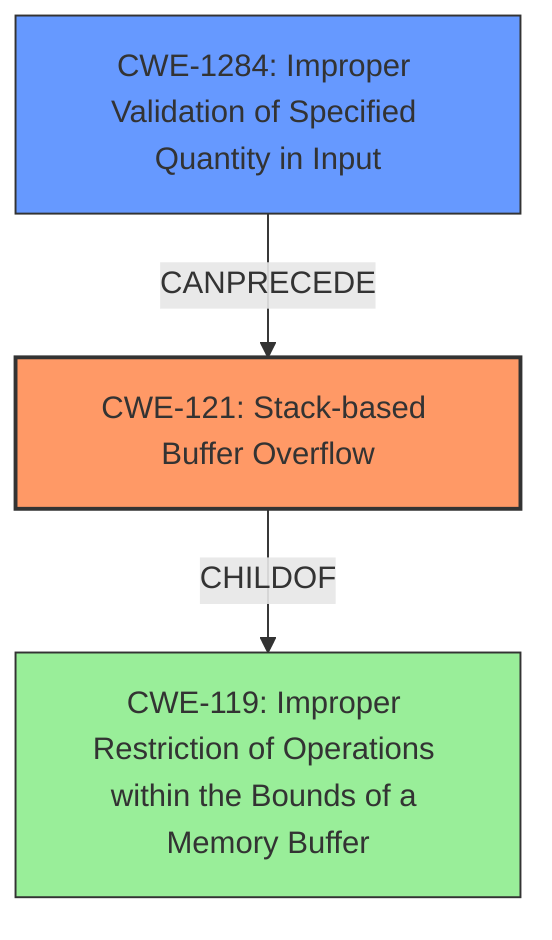

# Analysis Report for CVE-2022-35111

# Vulnerability Analysis Report: CVE-2022-35111

## Description

SWFTools commit 772e55a2 was discovered to contain a stack overflow via __sanitizerStackDepotNodehash(__sanitizerStackTrace const&) at /sanitizer_common/sanitizer_stackdepot.cpp.

## Vulnerability Description Key Phrases

**Weakness:** stack overflow
**Product:** SWFTools
**Version:** commit 772e55a2
**Component:** __sanitizerStackDepotNodehash

## Analysis (with Relationship Data)

# Summary
| CWE ID | CWE Name | Confidence | CWE Abstraction Level | CWE Vulnerability Mapping Label | CWE-Vulnerability Mapping Notes |
|---|---|---|---|---|---|
| CWE-121 | Stack-based Buffer Overflow | 0.9 | Variant | Allowed | Primary CWE |

## Evidence and Confidence

*   **Confidence Score:** 0.9
*   **Evidence Strength:** HIGH

- **Analysis and Justification:**  
  - *Explanation:* The vulnerability description explicitly states a "**stack overflow**" in SWFTools. The CVE reference links content summary further confirms this, stating "Stack overflow during the processing of a crafted PDF file. There are multiple instances, one in `sanitizer_stackdepot.cpp`". CWE-121 (Stack-based Buffer Overflow) directly addresses this type of vulnerability, where a buffer on the stack is overwritten. This is further supported by the vulnerability report mentioning `sanitizer_stackdepot.cpp`. Other CWEs, such as CWE-122 (Heap-based Buffer Overflow), CWE-125 (Out-of-bounds Read), and CWE-787 (Out-of-bounds Write) are not applicable, as the vulnerability is explicitly described as a stack overflow.
  
  - *Relationship Analysis:* CWE-121 is a variant of CWE-120 (Classic Buffer Overflow) and is related to other memory corruption issues. The overflow on the stack can potentially lead to control-flow hijacking or other exploitable conditions.

- **Confidence Score:**  
  - Confidence: 0.9 (High confidence due to explicit mention of "stack overflow" in the description and CVE details)
---

## Criticism of Analysis

Okay, let's review the provided analysis and critique the CWE mapping, considering the full CWE specifications.

**Overall Assessment:**

The primary CWE mapping to CWE-121 (Stack-based Buffer Overflow) appears to be correct and well-justified, given the explicit mention of "stack overflow" in both the vulnerability description and the CVE reference content. The confidence score of 0.9 is appropriate. However, let's examine the analysis in more detail to see if any other CWEs are relevant, perhaps as contributing factors or related weaknesses, and to verify the justifications provided.

**Detailed Critique:**

1.  **CWE-121 (Stack-based Buffer Overflow): Correctness and Justification:**

    *   The analysis correctly identifies CWE-121 as the primary weakness. The explanation clearly states why this CWE is appropriate, directly linking it to the "stack overflow" description.
    *   The reasoning for excluding other CWEs like CWE-122 (Heap-based Buffer Overflow) and CWE-787 (Out-of-bounds Write) is sound, as the vulnerability is explicitly identified as a stack overflow, not a heap overflow or a general out-of-bounds write.
    *   The "Relationship Analysis" section is helpful, noting that CWE-121 is a variant of CWE-120 (Classic Buffer Overflow) and highlighting the potential for control-flow hijacking.
    *   **Suggestion:** While the analysis is strong, it could briefly mention common root causes of stack-based buffer overflows (e.g., unchecked input length, use of unsafe string functions like `strcpy`, missing bounds checks in array access). Even though these are *potential* causes and might not be directly evident from the provided information, they're valuable for understanding the context.

2. **Retriever Results Analysis:**
    Let's analyse the retriever results to see if any of them could be related:
    *   **CWE-125 (Out-of-bounds Read) and CWE-126 (Buffer Over-read):** While the primary issue is a *write* (overflow), a related *read* could occur as part of the exploit process or due to incorrect handling of the buffer before the overflow occurs. However, based on the given information, these are secondary and not the primary cause. They should not be selected as the main CWE, but a brief mention of their potential relevance is welcome.
    *   **CWE-770 (Allocation of Resources Without Limits or Throttling):** If the stack overflow is triggered by allocating an excessively large buffer on the stack (e.g., via a very long string or deeply nested function calls), CWE-770 *might* be relevant. However, without more information about the specific allocation process, this is speculative. The description must say the resource allocation is unlimited. It is also more related to DoS.
    *   **CWE-170 (Improper Null Termination):** This is plausible in the context of string handling, and could be a contributing factor to a buffer overflow. If a string isn't properly null-terminated, functions might read beyond the allocated buffer, potentially leading to a stack overflow when copying the data into a fixed-size buffer. But again, without more information, this is speculative. If there is a possibility that the buffer has no end and this lead to the overflow, this could be a relevant weakness.
    *   **CWE-190 (Integer Overflow or Wraparound):** This could play a role in calculating the size of the buffer to be allocated on the stack. If an integer overflow leads to allocating a smaller buffer than required, a subsequent copy operation could cause a stack overflow.
    *   **CWE-122 (Heap-based Buffer Overflow):** It was correctly dismissed.
    *   **CWE-476 (NULL Pointer Dereference):** Unlikely to be directly related.
    *   **CWE-191 (Integer Underflow (Wrap or Wraparound)):** Similar to CWE-190, this could affect buffer size calculations.
    *   **CWE-1284 (Improper Validation of Specified Quantity in Input):** If the size of the buffer to be copied *onto* the stack is determined by an input value that is not properly validated, this CWE could be a contributing factor.

3.  **CWE Examples from Database:**

    *   The examples provided are relevant to buffer overflows in general, offering a useful context.

4.  **Relevant CWE Specifications (CWE-120, CWE-787, CWE-122, CWE-121, CWE-125, CWE-770, CWE-170, CWE-190, CWE-191, CWE-1284):**

    *   The inclusion of these specifications is helpful for understanding the nuances of each CWE and for making informed decisions about mapping.
    *   **Mitigation:** The mitigations described in each CWE are valuable for developers to consider when addressing these vulnerabilities. The analysis could benefit from briefly mentioning some relevant mitigations for CWE-121, such as:
        *   Using safe string functions (e.g., `strncpy`, `snprintf`).
        *   Implementing bounds checking on input lengths.
        *   Using compiler extensions for buffer overflow detection (e.g., /GS flag in Visual Studio, `-fstack-protector` in GCC).
        *   Using languages with automatic memory management (although this might not be feasible for existing codebases).

**Revised Summary Table (Optional):**

If you want to be extra thorough, you could add a secondary table listing *potential* contributing CWEs with lower confidence scores (e.g., 0.3-0.5):

| CWE ID  | CWE Name                                         | Confidence | CWE Abstraction Level | CWE Vulnerability Mapping Label | CWE-Vulnerability Mapping Notes                                                                                                                                                                                                                                                          |
| :------ | :----------------------------------------------- | :--------- | :---------------------- | :------------------------------ | :-------------------------------------------------------------------------------------------------------------------------------------------------------------------------------------------------------------------------------------------------------------------------------------- |
| CWE-1284 | Improper Validation of Specified Quantity in Input | 0.4        | Base                    | Supported                       | Potentially related if the size of the data copied to the stack is determined by an unvalidated input.                                                                                                                                                                                |
| CWE-170   | Improper Null Termination                         | 0.3       | Base                   | Supported                    | If the data copied onto the stack is not null terminated.                                                                                                                                      |
| CWE-190 | Integer Overflow or Wraparound                         | 0.3        | Base                    | Supported                       | Could be a contributing factor if the size of the buffer is determined by an integer calculation that overflows, leading to a smaller-than-expected buffer allocation on the stack.                                                                                                                                                                              |

**Conclusion:**

The analysis is generally strong and correctly identifies the primary weakness as CWE-121. The confidence level is appropriate. The analysis could be slightly improved by:

*   Briefly mentioning potential root causes of stack-based buffer overflows.
*   Highlighting relevant mitigations for CWE-121.
*   Acknowledging the *potential* relevance of other CWEs (CWE-1284, CWE-170, CWE-190) as contributing factors, even if the confidence level for these is lower. This shows a more comprehensive understanding of the possible underlying causes.

By incorporating these suggestions, the analysis would be even more robust and informative.

## Final Resolution

# Summary
| CWE ID | CWE Name | Confidence | CWE Abstraction Level | CWE Vulnerability Mapping Label | CWE-Vulnerability Mapping Notes |
|---|---|---|---|---|---|
| CWE-121 | Stack-based Buffer Overflow | 0.9 | Variant | Allowed | Primary CWE |
| CWE-1284 | Improper Validation of Specified Quantity in Input | 0.4 | Base | Allowed | Secondary Candidate |

## Evidence and Confidence

*   **Confidence Score:** 0.9
*   **Evidence Strength:** MEDIUM

## Relationship Analysis
The primary relationship impacting the decision is the hierarchical relationship between CWE-121 (**Stack-based Buffer Overflow**) and its parent, CWE-119 (**Improper Restriction of Operations within the Bounds of a Memory Buffer**). CWE-121 is a variant of CWE-119, providing a more specific classification for stack-based overflows. The potential for CWE-1284 (**Improper Validation of Specified Quantity in Input**) to precede CWE-121 indicates a possible vulnerability chain. If input is not validated and used to determine the size of data copied onto the stack, it can lead to the **buffer overflow**.

## Vulnerability Chain
The vulnerability chain starts with a potential lack of input validation (**CWE-1284**), where the size of the data to be copied is not properly checked. This leads to a **stack-based buffer overflow (CWE-121)** when copying data to a buffer on the stack, resulting in the possibility of overwriting adjacent memory locations and potentially leading to arbitrary code execution.

## Summary of Analysis
The initial analysis correctly identified CWE-121 (**Stack-based Buffer Overflow**) as the primary weakness, with strong evidence from the vulnerability description explicitly stating "stack overflow." The criticism suggested considering potential contributing factors. Based on the retriever results and the potential for unvalidated input to influence the size of the data copied to the stack, CWE-1284 (**Improper Validation of Specified Quantity in Input**) is added as a secondary candidate. The confidence in CWE-121 remains high (0.9) due to the direct evidence. The confidence in CWE-1284 is lower (0.4) as it is based on a possible scenario.

The decision is based on the provided evidence and the relationships between CWEs. CWE-121 is at the optimal level of specificity, as it directly describes the stack overflow. CWE-1284 is included to highlight a potential contributing factor in the vulnerability chain.

*Report generated on 2025-03-18 15:05:19*
