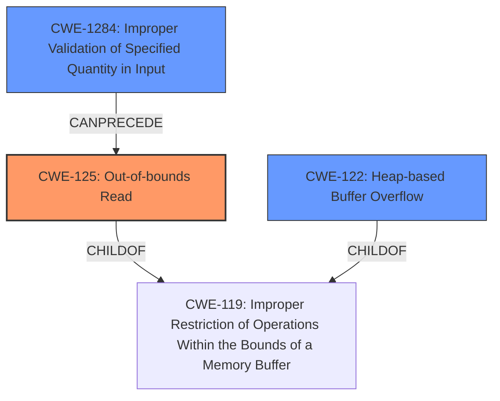

# Final Resolution for CVE-2022-35113

# Summary
| CWE ID | CWE Name | Confidence | CWE Abstraction Level | CWE Vulnerability Mapping Label | CWE-Vulnerability Mapping Notes |
|---|---|---|---|---|---|
| CWE-125 | Out-of-bounds Read | 0.9 | Base | Primary | Allowed |
| CWE-1284 | Improper Validation of Specified Quantity in Input | 0.7 | Base | Secondary Candidate | Allowed |
| CWE-122 | Heap-based Buffer Overflow | 0.6 | Variant | Secondary Candidate | Allowed |

*   **Confidence Score:** 0.8
*   **Evidence Strength:** MEDIUM

## Relationship Analysis
The primary relationship considered was the parent-child relationship. CWE-125 **Out-of-bounds Read** is the more specific root cause, while CWE-122 **Heap-based Buffer Overflow** is a more general consequence. CWE-1284 **Improper Validation of Specified Quantity in Input** can precede CWE-125 if an unvalidated size is used to read data. The abstraction levels influenced the choice; Base level CWEs (CWE-125, CWE-1284) are preferred over Variant level CWEs (CWE-122) when they accurately describe the root cause.

## Vulnerability Chain
The vulnerability chain starts with **CWE-1284 Improper Validation of Specified Quantity in Input**, where a size or length is not validated. This leads to **CWE-125 Out-of-bounds Read**, where data is read past the end of the allocated buffer, triggering **CWE-122 Heap-based Buffer Overflow**. The final impact is a heap buffer overflow.

## Summary of Analysis
The initial analysis and criticism both correctly identified **CWE-125 Out-of-bounds Read** as the primary weakness. The description of "**heap-buffer overflow**" in `swf_DefineLosslessBitsTagToImage` at `/modules/swfbits.c` strongly suggests this. The analysis and criticism are based on the provided evidence and the CWE specifications.

The addition of **CWE-1284 Improper Validation of Specified Quantity in Input** as a secondary candidate is based on the possibility that an unvalidated size from the SWF file is being used. The criticism suggested this addition, and it makes sense given that the heap overflow is happening because of the out-of-bounds read. If there wasn't an unvalidated size, the overflow may not have occurred. The CWE-1284 description matches this case: "The product receives input that is expected to specify a quantity (such as size or length), but it does not validate or incorrectly validates that the quantity has the required properties."

The selected CWEs are at the optimal level of specificity. **CWE-125** directly describes the **rootcause** of the vulnerability (reading past the buffer). **CWE-1284** identifies a potential contributing factor. **CWE-122**, while related, is a broader category (heap overflow) and more of an impact than a **rootcause**.