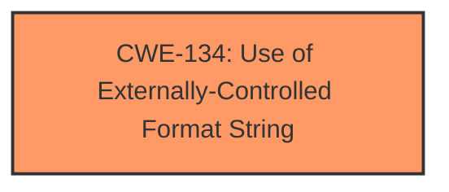

# Final Resolution for CVE-2022-35244

# Summary
| CWE ID  | CWE Name                                                       | Confidence | CWE Abstraction Level | CWE Vulnerability Mapping Label | CWE-Vulnerability Mapping Notes |
| :-------- | :------------------------------------------------------------- | :--------- | :-------------------- | :------------------------------ | :------------------------------ |
| CWE-134 | Use of Externally-Controlled Format String                  | 1.0       | Base                  | Primary CWE                    | Allowed                       |

## Evidence and Confidence

*   **Confidence Score:** 1.0
*   **Evidence Strength:** HIGH

## Relationship Analysis
The analysis correctly identifies CWE-134 as a Base level CWE which is the preferred level for vulnerability mapping. The analysis considers the relationship with improper input validation but correctly concludes that CWE-134 is the more specific and accurate choice. No direct relationships are apparent that affect the mapping decision. While CWE-134 is related to improper input validation, the specific nature of the format string injection makes CWE-134 the most appropriate and specific choice.

## Vulnerability Chain
The **ROOTCAUSE** is the use of an externally controlled format string (CWE-134). This leads to memory corruption, information disclosure, and denial of service.
  - Initial Flaw: Unsanitized input used as a format string
  - Weakness: Format string vulnerability
  - Impact: Memory corruption, information disclosure, DoS

## Summary of Analysis
The initial analysis and criticism both agree that CWE-134 (Use of Externally-Controlled Format String) is the correct primary CWE. The vulnerability description explicitly mentions a "format string injection" vulnerability, and the CVE reference confirms that the `getVarHA` XCMD handler uses an attacker-controlled string as the format string in `xvsprintfcat`. This provides strong evidence for CWE-134.

The graph relationships confirm that CWE-134 is the most specific and appropriate choice. It is a Base level CWE, which is preferred for vulnerability mapping. The analysis considered other related CWEs, such as improper input validation, but correctly determined that CWE-134 is the most accurate representation of the **ROOTCAUSE**.

The confidence score of 1.0 is justified based on the direct evidence from the vulnerability description and CVE reference materials. The selected CWE is at the optimal level of specificity because it directly addresses the format string injection vulnerability, rather than a more general weakness like improper input validation.