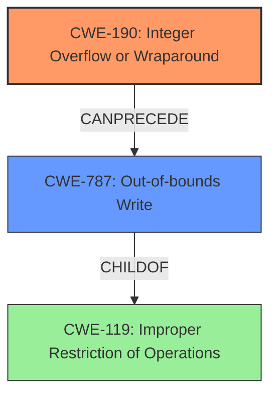

# Final Resolution for CVE-2022-35289

# Summary
| CWE ID | CWE Name | Confidence | CWE Abstraction Level | CWE Vulnerability Mapping Label | CWE-Vulnerability Mapping Notes |
|---|---|---|---|---|---|
| CWE-190 | Integer Overflow or Wraparound | 0.9 | Base | Primary | Allowed |
| CWE-787 | Out-of-bounds Write | 0.7 | Base | Secondary | Allowed |

## Evidence and Confidence

*   **Confidence Score:** 0.85
*   **Evidence Strength:** HIGH

## Relationship Analysis
The primary relationship impacting the decision is that CWE-787 is a potential consequence of CWE-190. The **integer overflow** (**CWE-190**) can lead to an **out-of-bounds write** (**CWE-787**). CWE-787 is a child of CWE-119 (Improper Restriction of Operations Within the Bounds of a Memory Buffer). The analysis did not go for CWE-123 (Write-what-where Condition) due to the better fit of CWE-787, and the guidance in the criticism.

## Vulnerability Chain
The vulnerability chain starts with an **integer overflow** (**CWE-190**). This allows an attacker to manipulate memory addresses and write data out of bounds (**CWE-787**), leading to potential arbitrary code execution. There are no apparent missing links, but a key condition for exploitation is the application's use of untrusted JavaScript.

## Summary of Analysis
The analysis of both the initial assessment and criticism led to a refined conclusion. The primary **weakness** remains **CWE-190 (Integer Overflow or Wraparound)** because the vulnerability description explicitly states "integer overflow." The criticism's suggestion to consider **CWE-787 (Out-of-bounds Write)** was adopted because it offers a more specific description of the memory corruption than CWE-123.

The decision is based on the evidence from the vulnerability description: "A write-what-where condition in hermes caused by an integer overflow... allows attackers to potentially execute arbitrary code."

The graph relationships influenced the decision by highlighting the potential chain of events. The **integer overflow (CWE-190)** *precedes* the **out-of-bounds write (CWE-787)**.

The selected CWEs are at the optimal level of specificity. **CWE-190** is a base CWE, which is preferred for root causes. **CWE-787** is also a base CWE and provides a more accurate description of the memory corruption than **CWE-123**. The analysis omitted CWE-20 due to the weakness being the integer overflow itself rather than the lack of input validation.

The note about the exploitation conditions (untrusted JavaScript evaluation) is important context, but doesn't directly map to a specific CWE.