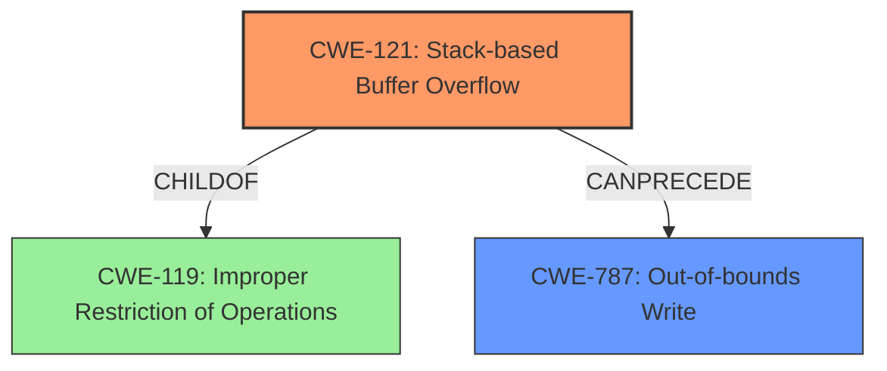

# Final Resolution for CVE-2022-35407

# Summary
| CWE ID | CWE Name | Confidence | CWE Abstraction Level | CWE Vulnerability Mapping Label | CWE-Vulnerability Mapping Notes |
|---|---|---|---|---|---|
| **CWE-121** | **Stack-based Buffer Overflow** | 0.95 | Variant | Allowed | Primary CWE |
| **CWE-787** | **Out-of-bounds Write** | 0.75 | Base | Allowed | Secondary candidate. |

## Evidence and Confidence

*   **Confidence Score:** 0.95
*   **Evidence Strength:** HIGH

## Relationship Analysis
The primary relationship is that CWE-121 (**Stack-based Buffer Overflow**) is a variant of CWE-119 (**Improper Restriction of Operations within the Bounds of a Memory Buffer**), indicating a hierarchical parent-child relationship. Additionally, CWE-121 involves CWE-787 (**Out-of-bounds Write**) because a stack buffer overflow is a specific instance of writing outside the intended buffer boundaries. The analysis correctly favored CWE-121 due to its specificity over the more general CWE-119 and CWE-787. The Variant level of CWE-121 provides more targeted context than the Base level of CWE-787 or the Class level of CWE-119.

## Vulnerability Chain
The vulnerability chain starts with the **ROOTCAUSE** being a flaw in the `SetupUtility` driver of InsydeH2O. This leads to **CWE-121** (**Stack-based Buffer Overflow**) due to insufficient bounds checking when handling UEFI variables. An attacker can then overwrite the stack, resulting in **CWE-787** (**Out-of-bounds Write**), and ultimately gain arbitrary code execution. The chain highlights how a lack of input validation leads to memory corruption and control-flow hijacking.

## Summary of Analysis
The initial analysis correctly identified **CWE-121** (**Stack-based Buffer Overflow**) as the primary weakness due to the explicit mention of "stack buffer overflow" in the vulnerability description: "A stack buffer overflow leads to arbitrary code execution in the SetupUtility driver on Intel platforms." The criticism correctly notes the importance of elaborating on how arbitrary code execution is achieved by overwriting critical data structures on the stack, like the return address or function pointers. The selection of **CWE-121** is at the optimal level of specificity because it provides more context than **CWE-787** (**Out-of-bounds Write**), specifying that the overflow occurs on the stack. The analysis is based on strong evidence and aligned with MITRE's mapping guidance, which allows for Variant-level CWEs like **CWE-121**.