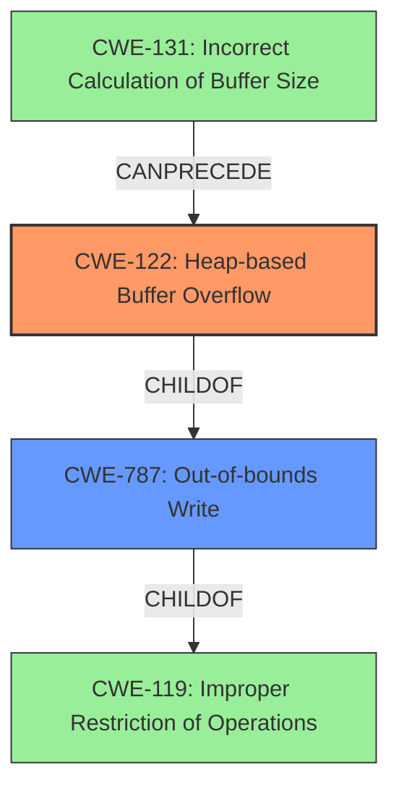

# Final Resolution for CVE-2022-35448

# Summary

| CWE ID | CWE Name | Confidence | CWE Abstraction Level | CWE Vulnerability Mapping Label | CWE-Vulnerability Mapping Notes |
|---|---|---|---|---|---|
| CWE-122 | Heap-based Buffer Overflow | 0.8 | Variant | Allowed | Primary CWE |
| CWE-787 | Out-of-bounds Write | 0.6 | Base | Allowed | Secondary Candidate |
| CWE-131 | Incorrect Calculation of Buffer Size | 0.4 | Base | Allowed | Contributing Factor (if applicable) |

## Evidence and Confidence

*   **Confidence Score:** 0.7
*   **Evidence Strength:** MEDIUM

## Relationship Analysis
The primary relationship is that CWE-122 (Heap-based Buffer Overflow) is a variant of CWE-119 (Improper Restriction of Operations within the Bounds of a Memory Buffer) and a child of CWE-787 (Out-of-bounds Write). This hierarchical relationship supports the selection of CWE-122 as the primary CWE because it is the most specific. CWE-131 (Incorrect Calculation of Buffer Size) can precede CWE-122, contributing to the vulnerability by causing an undersized buffer to be allocated on the heap. This chain relationship justifies the inclusion of CWE-131 as a contributing factor.

## Vulnerability Chain
The vulnerability chain starts with a potential **ROOTCAUSE** such as CWE-131 (Incorrect Calculation of Buffer Size), which leads to allocating an improperly sized buffer on the heap. This is followed by CWE-122 (Heap-based Buffer Overflow), where data is written beyond the boundaries of the allocated buffer. CWE-787 (Out-of-bounds Write) describes the general case of writing outside of the allocated memory. The impact is a heap-based buffer overflow, which can lead to arbitrary code execution or denial of service.

## Summary of Analysis
The initial analysis correctly identified CWE-122 as the primary **WEAKNESS** due to the explicit mention of a "**heap-buffer overflow**" in the vulnerability description. The criticism suggested considering CWE-131 as a contributing factor if the root cause involves an incorrect calculation of the buffer size.

The graph relationships influenced the decision to include CWE-131 as a contributing factor because it can precede CWE-122 in the vulnerability chain.

The selected CWEs are at the optimal level of specificity because CWE-122 directly describes the type of buffer overflow (heap-based), while CWE-787 is a more general description of an out-of-bounds write. CWE-131 describes a specific **ROOTCAUSE** that could lead to the heap-based buffer overflow, making it a valuable addition as a contributing factor.