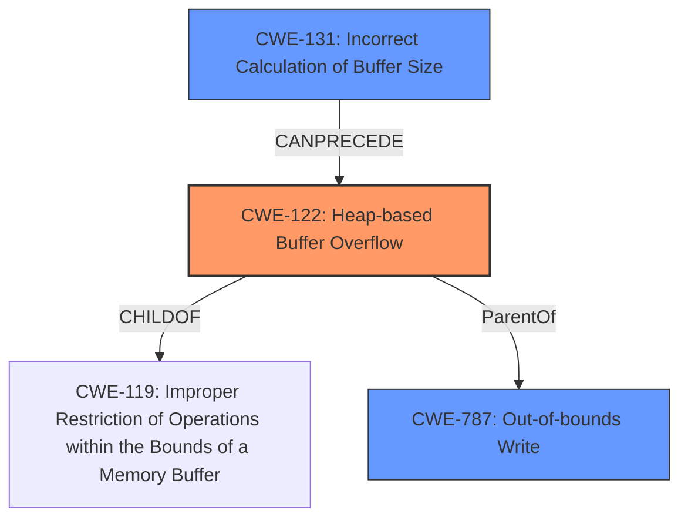

# Final Resolution for CVE-2022-35449

# Summary
| CWE ID | CWE Name | Confidence | CWE Abstraction Level | CWE Vulnerability Mapping Label | CWE-Vulnerability Mapping Notes |
|---|---|---|---|---|---|
| CWE-122 | Heap-based Buffer Overflow | 0.9 | Variant | Allowed | Primary CWE |
| CWE-131 | Incorrect Calculation of Buffer Size | 0.6 | Base | Allowed | Secondary Candidate |
| CWE-787 | Out-of-bounds Write | 0.5 | Base | Allowed | Secondary Candidate |

## Evidence and Confidence

*   **Confidence Score:** 0.85
*   **Evidence Strength:** MEDIUM

## Relationship Analysis
The primary CWE is CWE-122 (Heap-based Buffer Overflow), which is a variant of the more general CWE-787 (Out-of-bounds Write) and a child of CWE-119 (Improper Restriction of Operations within the Bounds of a Memory Buffer). The selection of CWE-122 is based on the explicit mention of "heap-buffer overflow" in the vulnerability description, providing a specific classification. The retriever results and criticism suggested considering CWE-131 (Incorrect Calculation of Buffer Size) as a potential root cause, which can lead to CWE-122. This highlights a vulnerability chain where an incorrect size calculation results in a heap overflow. The abstraction levels influenced the decision by favoring the most specific variant (CWE-122) while acknowledging the broader base class (CWE-787) and a potential root cause (CWE-131).

## Vulnerability Chain
The vulnerability chain starts with a potential **ROOTCAUSE** in the form of **CWE-131 (Incorrect Calculation of Buffer Size)**. This leads to the primary **WEAKNESS**, **CWE-122 (Heap-based Buffer Overflow)**, where a buffer allocated on the heap is overwritten due to insufficient size. This out-of-bounds write is also represented by **CWE-787 (Out-of-bounds Write)**. The impact is memory corruption, potentially leading to arbitrary code execution.

## Summary of Analysis
The initial analysis correctly identified **CWE-122 (Heap-based Buffer Overflow)** as the primary weakness based on the explicit mention of "heap-buffer overflow" in the vulnerability description: "OTFCC v0.10.4 was discovered to contain a heap-buffer overflow via /release-x64/otfccdump+0x6b0466." The criticism suggested exploring potential root causes, particularly related to size calculations. Based on the retriever results and the nature of buffer overflows, **CWE-131 (Incorrect Calculation of Buffer Size)** has been added as a secondary candidate to represent a potential root cause. **CWE-787 (Out-of-bounds Write)** remains as a secondary candidate to acknowledge the general nature of the out-of-bounds write.

The graph relationships influenced the selection by highlighting the hierarchical relationship between **CWE-122 (Heap-based Buffer Overflow)** and **CWE-787 (Out-of-bounds Write)**, as well as the potential chain relationship with **CWE-131 (Incorrect Calculation of Buffer Size)**. The selected CWEs are at the optimal level of specificity, with **CWE-122 (Heap-based Buffer Overflow)** providing the most precise description of the vulnerability type, while **CWE-131 (Incorrect Calculation of Buffer Size)** points to a possible root cause related to buffer size calculation errors.