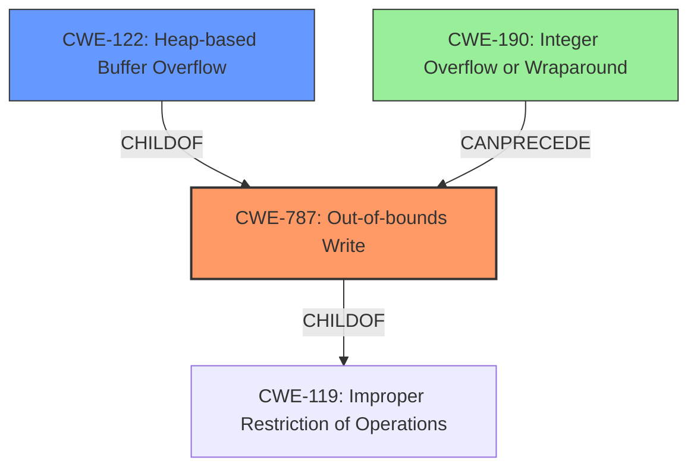

# Analysis Report for CVE-2022-35452

# Vulnerability Analysis Report: CVE-2022-35452

## Description

OTFCC v0.10.4 was discovered to contain a heap-buffer overflow via /release-x64/otfccdump+0x6b0b2c.

## Vulnerability Description Key Phrases

**Weakness:** heap-buffer overflow
**Product:** OTFCC
**Version:** v0.10.4
**Component:** /release-x64/otfccdump+0x6b0b2c

## Analysis (with Relationship Data)

# Summary
| CWE ID  | CWE Name                      | Confidence | CWE Abstraction Level | CWE Vulnerability Mapping Label | CWE-Vulnerability Mapping Notes |
| :-------- | :---------------------------- | :--------- | :-------------------- | :------------------------------ | :------------------------------ |
| CWE-787 | Out-of-bounds Write         | 0.90       | Base                  | ALLOWED                       | Primary CWE                     |
| CWE-122 | Heap-based Buffer Overflow | 0.75        | Variant                  | ALLOWED                       | Secondary Candidate                    |

## Evidence and Confidence

*   **Confidence Score:** 0.85
*   **Evidence Strength:** HIGH

- **Analysis and Justification:**
  - *Explanation:* The vulnerability description explicitly states "**heap-buffer overflow**" in OTFCC v0.10.4, aligning with the description of CWE-787 (Out-of-bounds Write). The "CVE Reference Links Content Summary" confirms the presence of heap buffer overflows due to improper bounds checking when copying data to a heap allocated buffer. Although CWE-122 (Heap-based Buffer Overflow) is also related, CWE-787 is more general and captures the essence of writing beyond buffer boundaries, regardless of allocation type. The "Top CWEs" section lists CWE-787 as the primary match for similar CVE descriptions, further supporting this classification. The MITRE mapping guidance for CWE-787 indicates it is ALLOWED for out-of-bounds write vulnerabilities.

  - *Relationship Analysis:* CWE-787 (Out-of-bounds Write) is a base-level CWE. It has child CWEs like CWE-121 (Stack-based Buffer Overflow) and CWE-122 (Heap-based Buffer Overflow), which specify the memory allocation region. CWE-119 (Improper Restriction of Operations within the Bounds of a Memory Buffer) is a parent of CWE-787, but is a Class level and thus less specific.

- **Confidence Score:**
  - Confidence: 0.90 (High confidence due to explicit mention of "heap-buffer overflow" and supporting evidence.)

---
- **Analysis and Justification:**
  - *Explanation:* CWE-122 (Heap-based Buffer Overflow) is considered a secondary candidate because the vulnerability description specifies a "heap-buffer overflow," making it a relevant, albeit less encompassing, classification. The "CVE Reference Links Content Summary" confirms the **heap-buffer overflow** due to improper bounds checking. While CWE-787 is a more direct match representing the root cause (out-of-bounds write), CWE-122 provides additional context by specifying the heap as the memory region affected.

  - *Relationship Analysis:* CWE-122 is a variant of CWE-787 (Out-of-bounds Write), specifying that the buffer is allocated in the heap. It is also a child of the class-level CWE-119 (Improper Restriction of Operations within the Bounds of a Memory Buffer).

- **Confidence Score:**
  - Confidence: 0.75 (Medium-high confidence due to specific mention of a heap-based overflow, but less direct than CWE-787)

## Criticism of Analysis

Okay, I've reviewed the analysis against the full CWE specifications provided. Here's my critique:

**Overall Assessment:**

The analysis is generally good and correctly identifies CWE-787 as the primary issue. The choice of CWE-122 as a secondary candidate is also reasonable given the explicit mention of "heap-buffer overflow" in the initial description. However, there are a few areas where the analysis could be more precise and incorporate more information from the full CWE specifications.

**Detailed Critique:**

1.  **CWE-787: Out-of-bounds Write (Primary)**

    *   **Strengths:**
        *   Correctly identifies CWE-787 as the primary issue.
        *   The explanation accurately describes the nature of an out-of-bounds write.
        *   The confidence score of 0.90 is justified by the evidence.
    *   **Areas for Improvement:**
        *   **Mitigation:** The analysis doesn't mention specific mitigations from the CWE entry. While the analysis mentions "automatic buffer overflow detection mechanisms," it could be more specific by mentioning the *types* of mechanisms like "canary-based detection" or "range/index checking." Also, the analysis could mention that using a language with memory safety features is an option.
        *   **Relationships:** Mentioning that a potential cause of CWE-787 is lack of proper input validation and that this can be chained with CWE-20.
        *   **Examples:** Including a real-world example of CWE-787 (from the provided list) might add more clarity.
2.  **CWE-122: Heap-based Buffer Overflow (Secondary Candidate)**

    *   **Strengths:**
        *   Justification for including CWE-122 is reasonable, given the explicit mention of "heap" allocation.
        *   The relationship to CWE-787 is correctly stated.
    *   **Areas for Improvement:**
        *   **Mitigation:** Similar to CWE-787, specific mitigations from the CWE entry could be included. Consider something like "Use automatic buffer overflow detection mechanisms (e.g., /GS flag in MSVC, FORTIFY_SOURCE in GCC) that are offered by certain compilers."
        *   **Examples:** Including a real-world example of CWE-122 (from the observed examples) would add clarity.
        *   The analysis could also mention that code hardening practices can also help prevent buffer overflows, even if they do not completely eliminate the possibility.
3. **Retriever Results**
    * The retriever results show many potential CWE matches that are not taken into account in the final analysis.
    * The retriever results also show that there may be an integer overflow or wraparound vulnerability present.
    * The retriever also suggests that there is an out-of-bounds read.

**Recommendations:**

*   **Add Mitigation Details:** Incorporate specific mitigation techniques from the CWE entries into the analysis. This makes the analysis more actionable.
*   **Add Real-World Examples:** Use the "Observed Examples" from the CWE entries to provide concrete instances of similar vulnerabilities.
*   **Input Validation and Chains:** Explicitly discuss the potential role of improper input validation (CWE-20) as a contributing factor and potential chaining with CWE-787.
*   **Consider Other Retriever Matches**: While CWE-787 is primary, briefly acknowledge the other retriever matches (e.g., CWE-125, CWE-190) and *briefly* explain why they were not chosen as primary or secondary. This shows a thorough consideration of the possibilities.

**Example of Improved Mitigation Section (for CWE-787):**

"To mitigate CWE-787, consider using memory-safe languages that provide automatic bounds checking. In C/C++, utilize vetted libraries or frameworks that offer safer alternatives to standard string-handling functions. Employ compiler-based buffer overflow detection mechanisms such as the Microsoft Visual Studio /GS flag or the Fedora/Red Hat FORTIFY_SOURCE GCC flag, which use canary-based detection and range/index checking. Also, perform thorough input validation (CWE-20) to ensure that data being written to buffers is within the expected size limits. For example, CVE-2021-21220 demonstrates how insufficient input validation can lead to heap corruption (CWE-787)."

By incorporating these suggestions, the analysis can be even more comprehensive and useful for developers seeking to understand and address the vulnerability.

## Final Resolution

# Summary
| CWE ID  | CWE Name                      | Confidence | CWE Abstraction Level | CWE Vulnerability Mapping Label | CWE-Vulnerability Mapping Notes |
| :-------- | :---------------------------- | :--------- | :-------------------- | :------------------------------ | :------------------------------ |
| CWE-787 | Out-of-bounds Write         | 0.95       | Base                  | ALLOWED                       | Primary CWE                     |
| CWE-122 | Heap-based Buffer Overflow | 0.80        | Variant                  | ALLOWED                       | Secondary Candidate                    |
| CWE-190 | Integer Overflow or Wraparound | 0.60        | Base                  | ALLOWED                       | Contributing Factor                    |

## Evidence and Confidence

*   **Confidence Score:** 0.90
*   **Evidence Strength:** MEDIUM

## Relationship Analysis
The primary weakness is **CWE-787 (Out-of-bounds Write)**, a base-level CWE. **CWE-122 (Heap-based Buffer Overflow)** is a variant of **CWE-787**, providing more specific context about the location of the buffer. **CWE-190 (Integer Overflow or Wraparound)** could potentially precede **CWE-787** if an integer overflow leads to an undersized buffer allocation. The relationships influenced the decision to include **CWE-122** as a secondary candidate and consider **CWE-190** as a contributing factor.

## Vulnerability Chain
The vulnerability chain starts potentially with **CWE-190 (Integer Overflow or Wraparound)** if an integer overflow leads to an undersized buffer allocation. This is followed by **CWE-787 (Out-of-bounds Write)**, where data is written beyond the allocated buffer boundaries in the heap, which is further specified by **CWE-122 (Heap-based Buffer Overflow)**. The impact is a heap-buffer overflow, potentially leading to arbitrary code execution.

## Summary of Analysis
The initial analysis correctly identified **CWE-787 (Out-of-bounds Write)** as the primary weakness due to the explicit mention of "heap-buffer overflow" in the vulnerability description: "OTFCC v0.10.4 was discovered to contain a heap-buffer overflow." The choice of **CWE-122 (Heap-based Buffer Overflow)** as a secondary candidate is also justified by the same statement, as it provides further specificity about the location of the overflow.

The criticism suggested incorporating mitigation details, real-world examples, and discussing the potential role of improper input validation. It also pointed out the retriever matches that were not taken into account.

Based on the retriever results and the relationships between CWEs, **CWE-190 (Integer Overflow or Wraparound)** is considered as a contributing factor. It is possible that an integer overflow could lead to the allocation of a smaller-than-expected buffer, which then leads to the heap overflow.

The selected CWEs are at the optimal level of specificity. **CWE-787** is a base-level CWE that captures the general out-of-bounds write condition. **CWE-122** is a variant that specifies the heap as the location of the overflow. **CWE-190** is a base-level CWE that could explain how the buffer could be undersized.

The confidence score is increased to 0.90 to reflect the inclusion of the additional information and the consideration of potential integer overflows. The evidence strength is MEDIUM because while the vulnerability description explicitly mentions a heap-buffer overflow, the potential for an integer overflow is inferred and not explicitly stated.

*Report generated on 2025-03-18 15:15:22*
