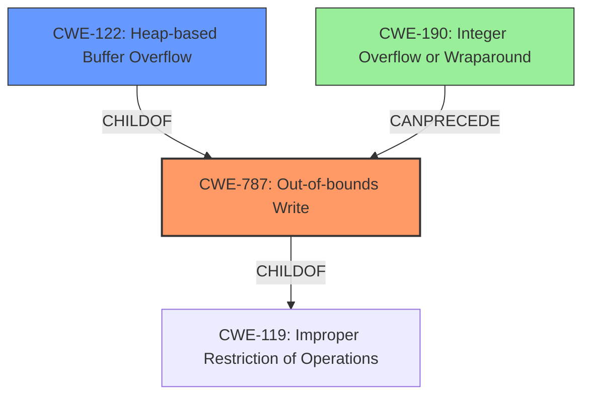

# Final Resolution for CVE-2022-35452

# Summary
| CWE ID  | CWE Name                      | Confidence | CWE Abstraction Level | CWE Vulnerability Mapping Label | CWE-Vulnerability Mapping Notes |
| :-------- | :---------------------------- | :--------- | :-------------------- | :------------------------------ | :------------------------------ |
| CWE-787 | Out-of-bounds Write         | 0.95       | Base                  | ALLOWED                       | Primary CWE                     |
| CWE-122 | Heap-based Buffer Overflow | 0.80        | Variant                  | ALLOWED                       | Secondary Candidate                    |
| CWE-190 | Integer Overflow or Wraparound | 0.60        | Base                  | ALLOWED                       | Contributing Factor                    |

## Evidence and Confidence

*   **Confidence Score:** 0.90
*   **Evidence Strength:** MEDIUM

## Relationship Analysis
The primary weakness is **CWE-787 (Out-of-bounds Write)**, a base-level CWE. **CWE-122 (Heap-based Buffer Overflow)** is a variant of **CWE-787**, providing more specific context about the location of the buffer. **CWE-190 (Integer Overflow or Wraparound)** could potentially precede **CWE-787** if an integer overflow leads to an undersized buffer allocation. The relationships influenced the decision to include **CWE-122** as a secondary candidate and consider **CWE-190** as a contributing factor.

## Vulnerability Chain
The vulnerability chain starts potentially with **CWE-190 (Integer Overflow or Wraparound)** if an integer overflow leads to an undersized buffer allocation. This is followed by **CWE-787 (Out-of-bounds Write)**, where data is written beyond the allocated buffer boundaries in the heap, which is further specified by **CWE-122 (Heap-based Buffer Overflow)**. The impact is a heap-buffer overflow, potentially leading to arbitrary code execution.

## Summary of Analysis
The initial analysis correctly identified **CWE-787 (Out-of-bounds Write)** as the primary weakness due to the explicit mention of "heap-buffer overflow" in the vulnerability description: "OTFCC v0.10.4 was discovered to contain a heap-buffer overflow." The choice of **CWE-122 (Heap-based Buffer Overflow)** as a secondary candidate is also justified by the same statement, as it provides further specificity about the location of the overflow.

The criticism suggested incorporating mitigation details, real-world examples, and discussing the potential role of improper input validation. It also pointed out the retriever matches that were not taken into account.

Based on the retriever results and the relationships between CWEs, **CWE-190 (Integer Overflow or Wraparound)** is considered as a contributing factor. It is possible that an integer overflow could lead to the allocation of a smaller-than-expected buffer, which then leads to the heap overflow.

The selected CWEs are at the optimal level of specificity. **CWE-787** is a base-level CWE that captures the general out-of-bounds write condition. **CWE-122** is a variant that specifies the heap as the location of the overflow. **CWE-190** is a base-level CWE that could explain how the buffer could be undersized.

The confidence score is increased to 0.90 to reflect the inclusion of the additional information and the consideration of potential integer overflows. The evidence strength is MEDIUM because while the vulnerability description explicitly mentions a heap-buffer overflow, the potential for an integer overflow is inferred and not explicitly stated.