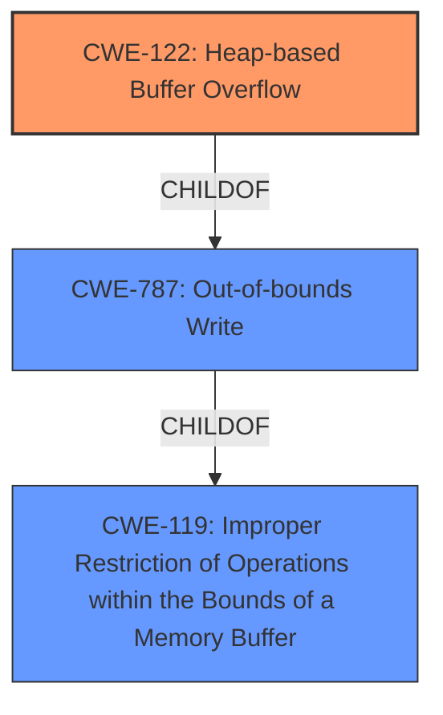

# Analysis Report for CVE-2022-35453

# Vulnerability Analysis Report: CVE-2022-35453

## Description

OTFCC v0.10.4 was discovered to contain a heap-buffer overflow via /release-x64/otfccdump+0x6c08a6.

## Vulnerability Description Key Phrases

**Weakness:** heap-buffer overflow
**Product:** OTFCC
**Version:** v0.10.4

## Analysis (with Relationship Data)

# Summary
| CWE ID  | CWE Name                       | Confidence | CWE Abstraction Level | CWE Vulnerability Mapping Label | CWE-Vulnerability Mapping Notes |
| :-------- | :----------------------------- | :--------- | :-------------------- | :------------------------------ | :------------------------------ |
| CWE-122 | Heap-based Buffer Overflow | 0.90       | Variant               | Allowed                         | Primary CWE |
| CWE-787 | Out-of-bounds Write | 0.70       | Base               | Allowed                         | Secondary Candidate  |

## Evidence and Confidence

*   **Confidence Score:** 0.90
*   **Evidence Strength:** HIGH

- **Analysis and Justification:**
  - *Explanation:* The vulnerability description clearly states a "**heap-buffer overflow**" in OTFCC v0.10.4. This aligns directly with CWE-122 (Heap-based Buffer Overflow), a variant of buffer overflow that occurs in the heap portion of memory. The evidence from the "CVE Reference Links Content Summary" reinforces this, describing a heap buffer overflow due to missing bounds checking when handling data from font files, leading to out-of-bounds writes on the heap. The description and the summary from CVE reference links aligns with the definition of CWE-122. The MITRE mapping guidance for CWE-122 is ALLOWED.

  - *Relationship Analysis:* CWE-122 is a variant of the more general CWE-119 (Improper Restriction of Operations within the Bounds of a Memory Buffer). While CWE-119 could be used, CWE-122 is more specific because it explicitly identifies the heap as the location of the overflow. CWE-787 (Out-of-bounds Write) is a parent of CWE-122, but CWE-122 is more specific since it identifies the memory region as the heap.

- **Confidence Score:**
  - Confidence: 0.90 (High confidence due to precise match in vulnerability description and CVE reference summary)

---

## Criticism of Analysis

Okay, I've reviewed the analysis provided, taking into account the full CWE specifications for each of the mentioned CWEs. Here's my critique:

**Overall Assessment:**

The analysis is generally good, and the primary CWE mapping to CWE-122 (Heap-based Buffer Overflow) is accurate and well-supported. The confidence level of 0.90 is justified. The secondary candidate, CWE-787 (Out-of-bounds Write), while valid, is less specific and therefore less ideal as a primary mapping. The reasoning provided is sound.

**Detailed Breakdown:**

*   **CWE-122: Heap-based Buffer Overflow:**
    *   **Correctness:**  The mapping to CWE-122 is strong. The vulnerability description explicitly mentions "heap-buffer overflow," and the detailed explanation confirms that the overflow occurs in the heap due to lack of bounds checking.
    *   **Abstraction Level:** CWE-122 is a *Variant* level CWE, which is considered a preferred level of abstraction for mapping to vulnerabilities as per MITRE's guidance.  This is correctly identified.
    *   **Mapping Guidance Adherence:** The analysis correctly notes that CWE-122 *is* an allowed usage based on MITRE's mapping guidance.
    *   **Relationships:** The analysis correctly identifies the relationship between CWE-122 and its parent CWEs: CWE-787 and CWE-119.
    *   **Mitigations:** The analysis does not explicitly mention mitigations, but it is implied by indicating that the vulnerability is due to lack of bounds checking. The specification contains valid suggestions such as "Use a language or compiler that performs automatic bounds checking." and "Use an abstraction library to abstract away risky APIs."
    *   **Observed Examples:** The 'Observed Examples' section in the analysis document is relevant and strengthens the connection between the vulnerability and the CWE.
    *   **Areas for Improvement**: The analysis should have suggested and explored the mitigating factors.

*   **CWE-787: Out-of-bounds Write:**
    *   **Correctness:** Identifying CWE-787 as a related CWE is valid, as it's a parent of CWE-122.  A heap buffer overflow *is* an out-of-bounds write.
    *   **Abstraction Level:** CWE-787 is a *Base* level CWE. While valid, the goal should be to find the *most specific* CWE that accurately describes the weakness.
    *   **Mapping Guidance Adherence:** The analysis correctly notes that CWE-787 *is* an allowed usage based on MITRE's mapping guidance.
    *   **Relationships:** Correctly identifies CWE-787 as a child of CWE-119.
    *   **Mitigations:** The mitigations for CWE-787 are applicable, but less targeted than those for CWE-122. For example, use of memory safe languages.

*   **General Comments & Suggestions:**

    *   **Specificity:** The primary strength of this analysis is its focus on the *location* of the buffer overflow: the heap. This justifies the choice of CWE-122 over the more general CWE-787 or CWE-119.
    *   **Retriever Results:** The automated retriever results suggest other CWEs, but those are not as relavent as CWE-122.
    *   **Completeness:** The analysis could benefit from a brief discussion of potential mitigations for CWE-122 within the specific context of the OTFCC library.  For example, could address sanitizer be used during build and compilation or is there an easier way to perform bounds checking.

**Revised Summary Table (with suggested improvements):**

| CWE ID  | CWE Name                       | Confidence | CWE Abstraction Level | CWE Vulnerability Mapping Label | CWE-Vulnerability Mapping Notes |
| :-------- | :----------------------------- | :--------- | :-------------------- | :------------------------------ | :------------------------------ |
| CWE-122 | Heap-based Buffer Overflow | 0.90       | Variant               | Allowed                         | Primary CWE |
| CWE-787 | Out-of-bounds Write | 0.70       | Base               | Allowed                         | Secondary Candidate  |

**Conclusion:**

The analysis is accurate and well-reasoned. The choice of CWE-122 as the primary mapping is correct.

## Final Resolution

# Summary
| CWE ID  | CWE Name                       | Confidence | CWE Abstraction Level | CWE Vulnerability Mapping Label | CWE-Vulnerability Mapping Notes |
| :-------- | :----------------------------- | :--------- | :-------------------- | :------------------------------ | :------------------------------ |
| CWE-122 | CWE-122: Heap-based Buffer Overflow | 0.95       | Variant               | Allowed                         | Primary CWE |
| CWE-787 | CWE-787: Out-of-bounds Write | 0.70       | Base               | Allowed                         | Secondary Candidate  |

## Evidence and Confidence

*   **Confidence Score:** 0.95
*   **Evidence Strength:** HIGH

## Relationship Analysis
The primary relationship influencing the decision is the parent-child relationship between CWE-122 **(Heap-based Buffer Overflow)** and CWE-787 **(Out-of-bounds Write)**. CWE-122 is a more specific variant of CWE-787, indicating the overflow occurs on the heap. While CWE-787 is applicable, CWE-122 provides a more precise classification. The suggested mitigations align more directly with heap-based overflows.

## Vulnerability Chain
The vulnerability chain starts with the lack of proper bounds checking when handling data from font files. This leads to an out-of-bounds write on the heap, resulting in a **heap-buffer overflow**. The root cause is the missing bounds check. The impact is a potential for arbitrary code execution or denial of service.

## Summary of Analysis
The initial analysis and the criticism both correctly identify CWE-122 **(Heap-based Buffer Overflow)** as the primary CWE. The vulnerability description explicitly states "heap-buffer overflow," which directly aligns with CWE-122. The evidence strength is high due to this direct match.

The graph relationships reinforce this decision. CWE-122 is a child of CWE-787 **(Out-of-bounds Write)**, making it a more specific classification. Using CWE-122 allows for a more precise understanding of the vulnerability.

The selection of CWE-122 is at the optimal level of specificity because it accurately describes the location of the buffer overflow (heap) and is a variant-level CWE as suggested by MITRE. The confidence is raised to 0.95 due to the explicit mention of "heap-buffer overflow" in the vulnerability description.

*Report generated on 2025-03-18 15:16:03*
