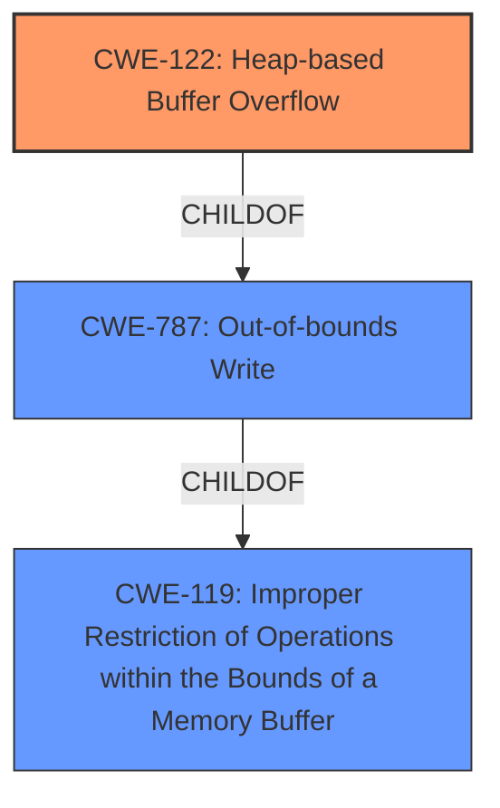

# Final Resolution for CVE-2022-35453

# Summary
| CWE ID  | CWE Name                       | Confidence | CWE Abstraction Level | CWE Vulnerability Mapping Label | CWE-Vulnerability Mapping Notes |
| :-------- | :----------------------------- | :--------- | :-------------------- | :------------------------------ | :------------------------------ |
| CWE-122 | CWE-122: Heap-based Buffer Overflow | 0.95       | Variant               | Allowed                         | Primary CWE |
| CWE-787 | CWE-787: Out-of-bounds Write | 0.70       | Base               | Allowed                         | Secondary Candidate  |

## Evidence and Confidence

*   **Confidence Score:** 0.95
*   **Evidence Strength:** HIGH

## Relationship Analysis
The primary relationship influencing the decision is the parent-child relationship between CWE-122 **(Heap-based Buffer Overflow)** and CWE-787 **(Out-of-bounds Write)**. CWE-122 is a more specific variant of CWE-787, indicating the overflow occurs on the heap. While CWE-787 is applicable, CWE-122 provides a more precise classification. The suggested mitigations align more directly with heap-based overflows.

## Vulnerability Chain
The vulnerability chain starts with the lack of proper bounds checking when handling data from font files. This leads to an out-of-bounds write on the heap, resulting in a **heap-buffer overflow**. The root cause is the missing bounds check. The impact is a potential for arbitrary code execution or denial of service.

## Summary of Analysis
The initial analysis and the criticism both correctly identify CWE-122 **(Heap-based Buffer Overflow)** as the primary CWE. The vulnerability description explicitly states "heap-buffer overflow," which directly aligns with CWE-122. The evidence strength is high due to this direct match.

The graph relationships reinforce this decision. CWE-122 is a child of CWE-787 **(Out-of-bounds Write)**, making it a more specific classification. Using CWE-122 allows for a more precise understanding of the vulnerability.

The selection of CWE-122 is at the optimal level of specificity because it accurately describes the location of the buffer overflow (heap) and is a variant-level CWE as suggested by MITRE. The confidence is raised to 0.95 due to the explicit mention of "heap-buffer overflow" in the vulnerability description.