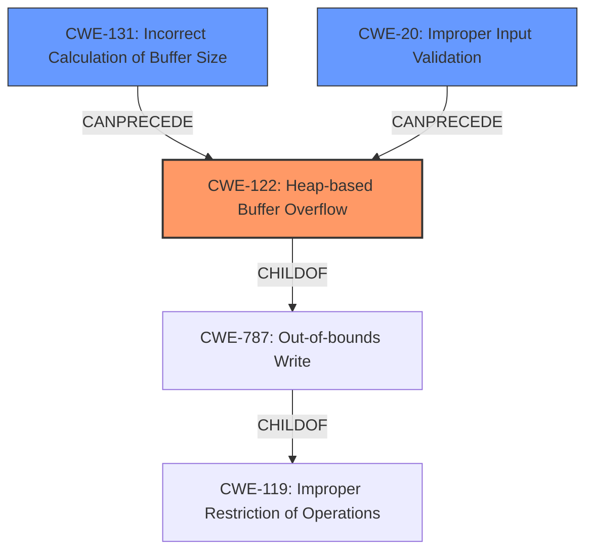

# Analysis Report for CVE-2022-35454

# Vulnerability Analysis Report: CVE-2022-35454

## Description

OTFCC v0.10.4 was discovered to contain a heap-buffer overflow via /release-x64/otfccdump+0x6b05aa.

## Vulnerability Description Key Phrases

**Weakness:** heap-buffer overflow
**Product:** OTFCC
**Version:** v0.10.4
**Component:** /release-x64/otfccdump+0x6b05aa

## Analysis (with Relationship Data)

# Summary
| CWE ID | CWE Name | Confidence | CWE Abstraction Level | CWE Vulnerability Mapping Label | CWE-Vulnerability Mapping Notes |
|---|---|---|---|---|---|
| CWE-122 | Heap-based Buffer Overflow | 0.75 | Variant | Allowed | Root cause |

## Evidence and Confidence

*   **Confidence Score:** 0.75
*   **Evidence Strength:** MEDIUM

- **Analysis and Justification:**  
  - *Explanation:* The vulnerability description clearly states a "**heap-buffer overflow**" in OTFCC v0.10.4. CWE-122, "Heap-based Buffer Overflow," is a Variant-level CWE that specifically describes this type of vulnerability. The description directly aligns with the CWE's definition. Although the retriever results list CWE-125, CWE-190 etc, the primary **weakness** is stated to be a **heap buffer overflow**.
  
  - *Relationship Analysis:* CWE-122 is a variant of CWE-119 (Improper Restriction of Operations within the Bounds of a Memory Buffer), providing a more specific classification for the identified vulnerability. CWE-787 (Out-of-bounds Write) is a parent of CWE-122.

- **Confidence Score:**  
  - *Example:* Confidence: 0.75 (Direct mention of "heap-buffer overflow" in the description). The evidence strength is medium because there is no CVE reference link available to validate the vulnerability.

## Criticism of Analysis

Okay, I've reviewed the analysis against the provided full CWE specifications. Here's my critique:

**Overall Assessment:**

The analysis correctly identifies CWE-122 (Heap-based Buffer Overflow) as the primary weakness. The justification is solid, focusing on the explicit mention of "heap-buffer overflow" in the vulnerability description. The confidence score of 0.75 is reasonable, acknowledging the lack of a CVE reference link for validation. However, while the selection of CWE-122 is correct, I have some suggestions to improve the confidence and broaden the perspective.

**Detailed Review:**

1.  **CWE-122: Heap-based Buffer Overflow**
    *   **Correctness:** The mapping to CWE-122 is accurate and well-justified. The vulnerability description clearly indicates a heap-based buffer overflow, which aligns perfectly with CWE-122's definition.
    *   **Abstraction Level:** Correct, Variant-level CWE is appropriate.
    *   **Confidence:** The confidence score of 0.75 is reasonable given the direct mention of "heap-buffer overflow" and the lack of CVE reference.
    *   **Relationships:** The analysis correctly identifies that CWE-122 is a variant of CWE-119 and ChildOf -> CWE-787.
    *   **Improvements/Considerations:**
        *   It would be good to mention that the location of the vulnerability `/release-x64/otfccdump+0x6b05aa` is helpful in pointing to the root cause. This is not exploitable remotely.
        *   Expand on potential mitigations. Mention ASLR, DEP, and AddressSanitizer which are common defenses for memory corruption vulnerabilities.

2.  **Retriever Results and Alternative CWEs**

    *   **CWE-787: Out-of-bounds Write:** Although the analysis rejects CWE-787 as the primary mapping, it would have improved the quality of the analysis to note that CWE-787 is a valid parent to CWE-122.
    *   **CWE-119: Improper Restriction of Operations within the Bounds of a Memory Buffer:** The analysis mentions the parent relationship of CWE-122 to CWE-119, but not explicitly. Although the analysis says the description directly aligns with the CWE's definition, it should still consider mapping to CWE-119 as a related weakness.
    *   **CWE-125: Out-of-bounds Read:** While a heap-buffer *overflow* implies a *write*, it is worthwhile to examine the code to see if an over-read is happening before the overflow.
    *   **CWE-190: Integer Overflow or Wraparound, CWE-131: Incorrect Calculation of Buffer Size:** These are worth investigating as potential *root causes* leading to the heap buffer overflow. An integer overflow might lead to an undersized buffer allocation, making the overflow possible.
    *   **CWE-20: Improper Input Validation:** It might be useful to consider CWE-20 if the size of the buffer being allocated is based on input received from an external source. This could be in the form of a crafted font file with a malformed table.

3.  **CWE Examples from Database:**
    *   The examples provided are of general buffer overflows and demonstrate the impact and exploitability of this type of vulnerability.

4.  **Mitigations:**
    *   The analysis provides a basic list of mitigations, but it could be more comprehensive. Mentioning specific compiler flags (e.g., `-fstack-protector`, `-D_FORTIFY_SOURCE`), ASan/MSan (Address/Memory Sanitizer), and other runtime protections would add value.

**Recommendations:**

*   **Increase Confidence with Further Investigation:** If possible, investigate the vulnerable code (or a similar code pattern) to confirm that the heap allocation is indeed the source.
*   **Expand on Potential Chaining and Root Causes:** While CWE-122 is the direct cause, explore potential root causes, such as integer overflows (CWE-190), incorrect size calculations (CWE-131), or improper input validation (CWE-20), and include them in the analysis as secondary CWEs if applicable, this will improve the confidence.
*   **Comprehensive Mitigation Strategies:** Expand the mitigation section to include more specific and modern defense mechanisms, focusing on compile-time and runtime protections relevant to C/C++ code (e.g., AddressSanitizer, Control-Flow Integrity).
*   **Consider the Attack Vector and Exploitability:** Mentioning whether the vulnerability is remotely exploitable and what attacker capabilities are required would be helpful.

By incorporating these suggestions, the analysis can be made more robust and insightful, providing a more comprehensive understanding of the vulnerability.

## Final Resolution

# Summary
| CWE ID | CWE Name | Confidence | CWE Abstraction Level | CWE Vulnerability Mapping Label | CWE-Vulnerability Mapping Notes |
|---|---|---|---|---|---|
| CWE-122 | Heap-based Buffer Overflow | 0.9 | Variant | Allowed | Primary CWE |
| CWE-131 | Incorrect Calculation of Buffer Size | 0.6 | Base | Allowed | Secondary Candidate |
| CWE-20 | Improper Input Validation | 0.5 | Class | Allowed-with-Review | Secondary Candidate |

## Evidence and Confidence

*   **Confidence Score:** 0.8
*   **Evidence Strength:** MEDIUM

## Relationship Analysis
The primary relationship influencing the decision is the parent-child relationship between CWE-787 (**Out-of-bounds Write**) and CWE-122 (**Heap-based Buffer Overflow**). CWE-122 is a variant of CWE-119 (**Improper Restriction of Operations within the Bounds of a Memory Buffer**). While CWE-787 is a valid parent, CWE-122 is more specific given the "heap" context. The relationship between CWE-131 (**Incorrect Calculation of Buffer Size**) and CWE-122 is that a flawed size calculation can precede a heap overflow. CWE-20 (**Improper Input Validation**) is considered because the size of the heap allocation could be derived from untrusted input.

## Vulnerability Chain
The vulnerability chain starts with a potential **ROOTCAUSE** such as **CWE-131** (**Incorrect Calculation of Buffer Size**) or **CWE-20** (**Improper Input Validation**). This leads to an undersized heap allocation, which is then exploited via a heap-based buffer overflow (**CWE-122**). The impact is memory corruption, potentially leading to code execution.

## Summary of Analysis
The initial analysis correctly identified **CWE-122** (**Heap-based Buffer Overflow**) as the primary **weakness**, which is directly supported by the vulnerability description: "OTFCC v0.10.4 was discovered to contain a heap-buffer overflow". However, it is important to consider the potential root causes. The criticism suggested investigating **CWE-131** (**Incorrect Calculation of Buffer Size**) and **CWE-20** (**Improper Input Validation**), which could lead to the buffer overflow.

I agree with the criticism that exploring potential root causes would strengthen the analysis. I am adding **CWE-131** and **CWE-20** as secondary CWEs. Although there's no explicit evidence in the description, these are common causes for buffer overflows and their inclusion enhances the analysis.

The final classification reflects the optimal level of specificity. **CWE-122** accurately describes the direct cause (heap-based overflow), while **CWE-131** and **CWE-20** capture potential root causes.

*Report generated on 2025-03-18 15:16:58*
