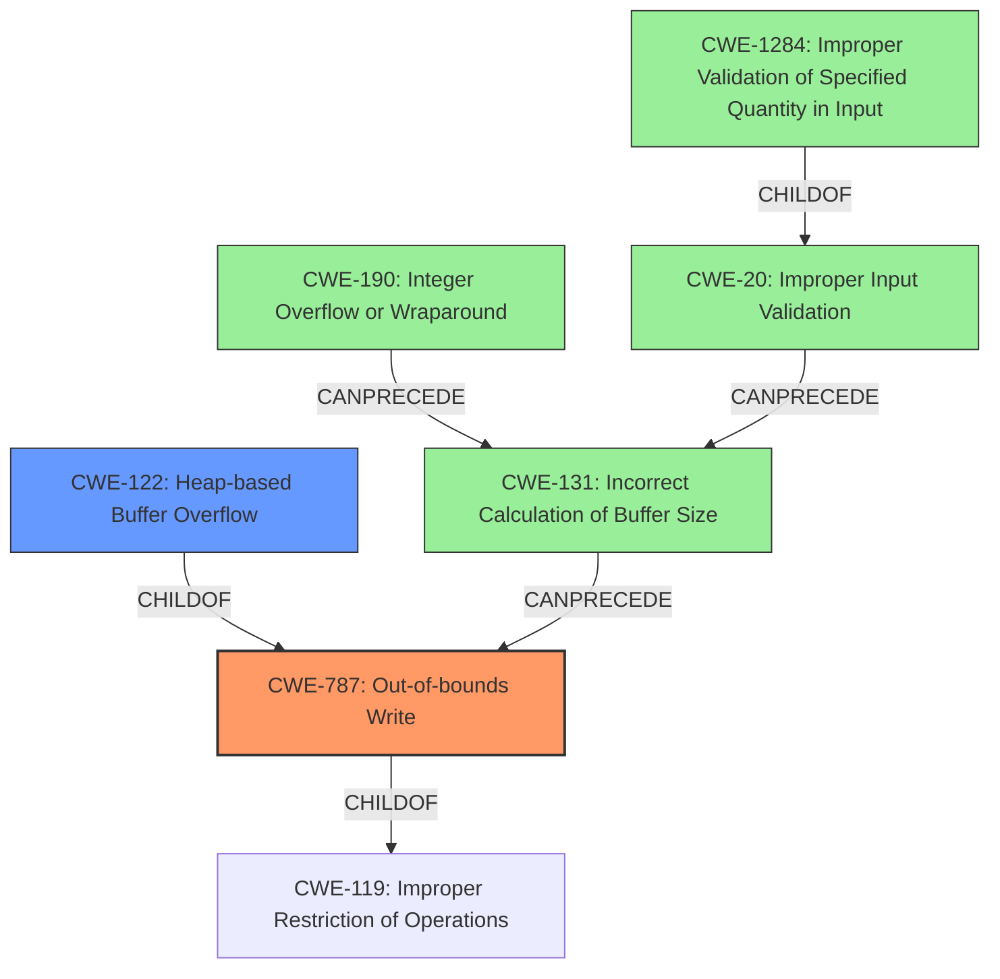

# Final Resolution for CVE-2022-35455

# Summary
| CWE ID | CWE Name | Confidence | CWE Abstraction Level | CWE Vulnerability Mapping Label | CWE-Vulnerability Mapping Notes |
|---|---|---|---|---|---|
| **CWE-787** | **Out-of-bounds Write** | 0.95 | Base | Allowed | Primary **CWE** |
| CWE-122 | Heap-based Buffer Overflow | 0.75 | Variant | Allowed | Secondary Candidate |
| CWE-1284 | Improper Validation of Specified Quantity in Input | 0.40 | Base | Allowed | Contributing factor to not properly validating input size |
| CWE-131 | Incorrect Calculation of Buffer Size | 0.30 | Base | Allowed | Chain analysis factor if the buffer size calculation is incorrect |
| CWE-190 | Integer Overflow or Wraparound | 0.30 | Base | Allowed | Chain analysis factor if there are integer operations involved |

## Evidence and Confidence

*   **Confidence Score:** 0.90
*   **Evidence Strength:** MEDIUM

## Relationship Analysis
The selection of **CWE-787 (Out-of-bounds Write)** as the primary weakness is appropriate because the vulnerability description explicitly mentions "heap-buffer overflow". **CWE-787** is a base level **CWE** and a child of **CWE-119 (Improper Restriction of Operations within the Bounds of a Memory Buffer)**. It is also a parent of **CWE-122 (Heap-based Buffer Overflow)**.

The relationships between **CWE-20 (Improper Input Validation)** and its children such as **CWE-1284 (Improper Validation of Specified Quantity in Input)** are important to consider. If the size or length of the font file is not properly validated, the allocated buffer might be insufficient.

If the buffer size calculation involves integer operations on input values, an integer overflow (**CWE-190**) could lead to a smaller-than-expected buffer allocation. **CWE-131 (Incorrect Calculation of Buffer Size)** is also relevant in such a scenario.

## Vulnerability Chain
The vulnerability chain starts with a crafted font file leading to insufficient input validation (**CWE-20** or **CWE-1284**). This could result in an incorrect buffer size calculation (**CWE-131**) or an integer overflow (**CWE-190**), ultimately leading to a heap buffer overflow (**CWE-122**, **CWE-787**).

Crafted font file -> insufficient input validation (**CWE-20** or **CWE-1284**) -> incorrect buffer size calculation (**CWE-131**) or Integer Overflow (**CWE-190**) -> heap buffer overflow (**CWE-122**, **CWE-787**).

## Summary of Analysis
The initial analysis correctly identifies **CWE-787 (Out-of-bounds Write)** as the primary **WEAKNESS** due to the explicit mention of "heap-buffer overflow" in the vulnerability description. The analysis also rightly considers **CWE-122 (Heap-based Buffer Overflow)** as a secondary candidate because it specifies the location of the overflow.

The criticism highlights the importance of addressing the **ROOTCAUSE** more deeply, such as the lack of bounds checking on input data or the incorrect calculation of buffer size. The analysis also emphasizes the role of input validation (**CWE-20**) and the potential involvement of integer overflows (**CWE-190**) in calculating the buffer size. The relationships between these **CWEs** are crucial for understanding the vulnerability chain.

The final decision is based on the provided evidence and the relationship analysis. While **CWE-787** remains the primary **WEAKNESS**, **CWE-1284** (Improper Validation of Specified Quantity in Input) is added as a contributing factor due to the crafted nature of the font files. **CWE-131** (Incorrect Calculation of Buffer Size) and **CWE-190** (Integer Overflow or Wraparound) are considered as potential factors in the vulnerability chain, but their confidence is lower due to the lack of explicit evidence in the vulnerability description.

The selected **CWEs** are at the optimal level of specificity, with **CWE-787** representing the **ROOTCAUSE** and **CWE-122** specifying the type of buffer overflow. The additional **CWEs** contribute to a more complete understanding of the vulnerability chain.