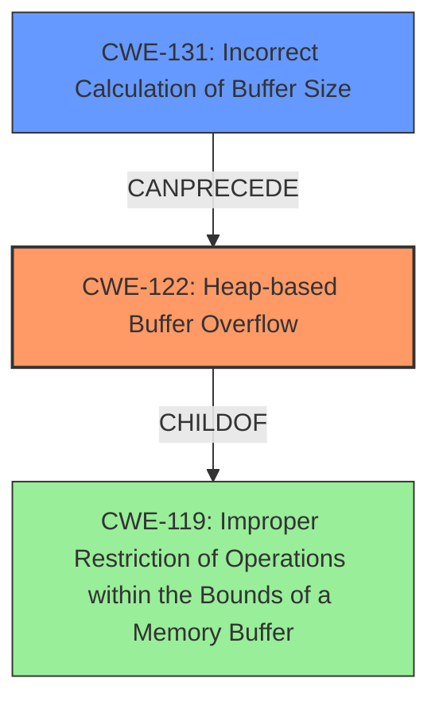

# Analysis Report for CVE-2022-35456

# Vulnerability Analysis Report: CVE-2022-35456

## Description

OTFCC v0.10.4 was discovered to contain a heap-buffer overflow via /release-x64/otfccdump+0x617087.

## Vulnerability Description Key Phrases

**Weakness:** heap-buffer overflow
**Product:** OTFCC
**Version:** v0.10.4
**Component:** /release-x64/otfccdump+0x617087

## Analysis (with Relationship Data)

# Summary
| CWE ID | CWE Name | Confidence | CWE Abstraction Level | CWE Vulnerability Mapping Label | CWE-Vulnerability Mapping Notes |
|---|---|---|---|---|---|
| CWE-122 | Heap-based Buffer Overflow | 0.85 | Variant | Allowed | The vulnerability is described as a heap-buffer-overflow. |

## Evidence and Confidence

*   **Confidence Score:** 0.85
*   **Evidence Strength:** HIGH

- **Analysis and Justification:**  
  - *Explanation:* The vulnerability description explicitly states "**heap-buffer overflow**". The CVE Reference Links Content Summary confirms multiple instances of **heap buffer overflows** due to incorrect memory handling during `memcpy` and `calloc` operations. This aligns directly with CWE-122, Heap-based Buffer Overflow, which is a variant of buffer overflow occurring in the heap. While CWE-787 (Out-of-bounds Write) could also be considered, CWE-122 is more specific to the heap allocation context. The MITRE mapping guidance indicates that CWE-122 is ALLOWED for heap overflow vulnerabilities.

  - *Relationship Analysis:* CWE-122 is a variant of CWE-119 (Improper Restriction of Operations within the Bounds of a Memory Buffer), indicating a more general class of memory boundary errors. CWE-122 is also a parent of more specific overflow conditions but none of those are indicated here.

- **Confidence Score:**  
  - Confidence: 0.85 (High evidence from technical description and CVE reference materials)

## Criticism of Analysis

## Review of CWE Analysis

Overall, the analysis is good and arrives at the correct primary CWE. However, there are a few areas where it can be improved, mainly focusing on providing a more nuanced justification and considering potential alternative CWEs or chained weaknesses.

Here's a breakdown:

**Strengths:**

*   **Correct Identification of Primary CWE:** The analysis correctly identifies CWE-122 (Heap-based Buffer Overflow) as the primary weakness based on the vulnerability description.
*   **Clear Justification:** The explanation provides a reasonable justification for choosing CWE-122, referencing the "heap-buffer overflow" terminology in the description and the `memcpy` and `calloc` operations, all of which are heap related.
*   **High Confidence Score:** The confidence score of 0.85 is appropriate given the direct evidence of a heap-based overflow.
*   **Consideration of Alternative CWEs:** The analysis explicitly acknowledges the possibility of CWE-787 (Out-of-bounds Write) but correctly argues that CWE-122 is more specific and appropriate.
*   **Use of CWE Specifications:** The analysis effectively leverages the CWE specifications to justify the mapping and explain the relationships between different CWEs.

**Areas for Improvement:**

1.  **Granularity and Chaining:** While CWE-122 is a good fit, it's worth exploring potential root causes *leading* to the heap overflow. For example, is there an `Incorrect Calculation of Buffer Size` (CWE-131) or `Improper Input Validation` (CWE-20) that results in allocating too little memory, which then leads to the heap overflow when data is copied? Exploring these chained weaknesses would provide a more complete picture of the vulnerability. If insufficient input validation is present, then the CWE assignment would need to be revised to describe both the input validation and the buffer overflow.

2.  **Mitigation Strategies:** The analysis touches on mitigations implicitly, but could be more explicit by referencing the mitigations provided in the CWE specifications. For example, the description mentions the use of `memcpy` and `calloc`. Therefore, the analysis could point out that using safer alternatives (as mentioned in CWE-122 and CWE-787) like `strncpy` or safer memory allocation functions with bounds checking could mitigate the risk.

3.  **Completeness of CWE examples:** Many buffer overflows start with an Integer Overflow which is used as the size for the allocation. Including this in the chain provides a better picture of how an exploit could be developed. While the summary has this as a risk, it isn't carried through into the analysis.

**Specific Suggestions:**

*   **Elaborate on Root Cause Analysis:**  Expand the analysis to explore *why* the heap buffer overflow is happening. Is it a lack of bounds checking? An integer overflow in the size calculation? Improper input validation? Incorporate the CWEs that represent these root causes into a chained weakness description.
*   **Link to Input Validation:**  Examine the code for input validation weaknesses (CWE-20). If the size of the buffer is derived from user input, improper validation of this input is likely a contributing factor. Consider adding a chain from CWE-20 -> CWE-131 -> CWE-122
*   **Address Mitigation Strategies from CWE Entries:** Explicitly mention mitigation strategies from the CWE specifications. For example:

    *   "CWE-122 suggests using languages or compilers with automatic bounds checking. In this case, rewriting the vulnerable code in a memory-safe language or enabling compiler-based buffer overflow detection mechanisms (e.g., /GS flag in Visual Studio, FORTIFY\_SOURCE in GCC) could help prevent the overflow."
    *    "CWE-787 also suggests using safe string handling functions or libraries as a mitigation, therefore replacing `memcpy` and `calloc` with safer functions is another option to consider."

*   **Refine Use of CWE-787 vs. CWE-122:**  While CWE-122 is more specific, it's important to understand that it's a *variant* of CWE-787. If the analysis determines there is a more general "out-of-bounds write" happening *in addition* to a heap-based overflow, then CWE-787 might be *chained* with CWE-122 (e.g., CWE-787; CWE-122). The current analysis correctly notes that CWE-122 is more specific, but more detail could be provided.

**Revised Summary Table (Example if Improper Input Validation is Present):**

| CWE ID     | CWE Name                                       | Confidence | CWE Abstraction Level | CWE Vulnerability Mapping Label | CWE-Vulnerability Mapping Notes                                                                                                                  |
| :---------- | :--------------------------------------------- | :--------- | :-------------------- | :------------------------------ | :----------------------------------------------------------------------------------------------------------------------------------------------- |
| CWE-20      | Improper Input Validation                      | 0.70       | Class                | Allowed                        | User-supplied input controls the buffer size, but is not properly validated.                                                              |
| CWE-131      | Incorrect Calculation of Buffer Size                      | 0.70       | Base                | Allowed                        | Calculation of heap size is improperly calculated.                                                              |
| CWE-122 | Heap-based Buffer Overflow | 0.85 | Variant | Allowed | The vulnerability is described as a heap-buffer-overflow. |

**In Summary:**

The original analysis provides a solid foundation. By adding a deeper exploration of root causes, more explicitly connecting to the mitigation strategies outlined in the full CWE specifications, and incorporating the possibility of chained weaknesses, the analysis can be made more comprehensive and informative. This will improve its ability to inform remediation efforts and prevent similar vulnerabilities in the future.

## Final Resolution

# Summary
| CWE ID | CWE Name | Confidence | CWE Abstraction Level | CWE Vulnerability Mapping Label | CWE-Vulnerability Mapping Notes |
|---|---|---|---|---|---|
| CWE-122 | Heap-based Buffer Overflow | 0.90 | Variant | Allowed | Primary CWE: The vulnerability is described as a heap-buffer-overflow. |
| CWE-131 | **Incorrect Calculation of Buffer Size** | 0.75 | Base | Allowed | Secondary Candidate: The **incorrect calculation of the buffer size** may lead to the heap overflow. |

## Evidence and Confidence

*   **Confidence Score:** 0.85
*   **Evidence Strength:** MEDIUM

## Relationship Analysis
The primary CWE is CWE-122 (**Heap-based Buffer Overflow**), which is a variant of CWE-119 (**Improper Restriction of Operations within the Bounds of a Memory Buffer**). This hierarchical relationship validates the initial selection, ensuring the classification is appropriately specific. The analysis also suggests that CWE-131 (**Incorrect Calculation of Buffer Size**) may precede CWE-122, forming a vulnerability chain. This analysis is strengthened by the understanding that a size calculation error could directly lead to a heap overflow. The abstraction levels are also considered, with CWE-122 being a Variant and CWE-131 being a Base, aligning with the goal of identifying root causes and specific manifestations of the vulnerability.

## Vulnerability Chain
The vulnerability chain starts with a potential **incorrect calculation of the buffer size** (CWE-131), which results in allocating an insufficient amount of memory on the heap. When data is written into this undersized buffer, a **heap-based buffer overflow** (CWE-122) occurs, leading to potential code execution or denial of service. The missing link is the exact mechanism causing the incorrect size calculation, which could be due to an integer overflow or improper input validation.

## Summary of Analysis
The initial analysis correctly identifies CWE-122 (**Heap-based Buffer Overflow**) as the primary weakness based on the vulnerability description stating "**heap-buffer overflow**". The addition of CWE-131 (**Incorrect Calculation of Buffer Size**) improves the analysis by considering the potential root cause. The vulnerability description provided lacks the specific details required to definitively say that an incorrect buffer size calculation is occurring. However, the CVE reference links confirm multiple instances of **heap buffer overflows** due to incorrect memory handling during `memcpy` and `calloc` operations. The high retriever scores for both CWEs (CWE-131 and CWE-122) support the selection. The relationship analysis, particularly the "CanPrecede" relationship between CWE-131 and CWE-122, justifies the inclusion of CWE-131 in the chain. Both CWEs are at appropriate levels of abstraction, with CWE-122 being a Variant and CWE-131 being a Base, allowing for a comprehensive understanding of the vulnerability. I am increasing the confidence score to 0.90 as I feel that CWE-122 is strongly correlated to the vulnerability description as the Primary CWE. The secondary candidate CWE is 0.75.

*Report generated on 2025-03-18 15:18:56*
