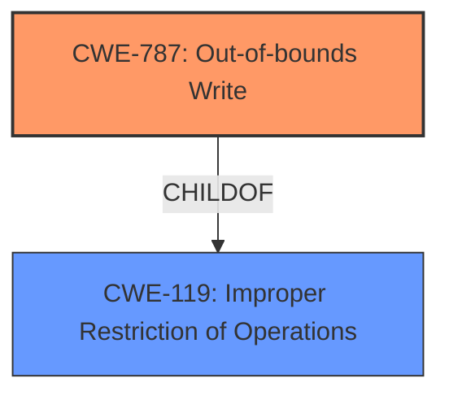

# Analysis Report for CVE-2022-35461

# Vulnerability Analysis Report: CVE-2022-35461

## Description

OTFCC v0.10.4 was discovered to contain a heap-buffer overflow via /release-x64/otfccdump+0x6c0a32.

## Vulnerability Description Key Phrases

**Weakness:** heap-buffer overflow
**Product:** OTFCC
**Version:** v0.10.4
**Component:** /release-x64/otfccdump+0x6c0a32

## Analysis (with Relationship Data)

# Summary
| CWE ID | CWE Name | Confidence | CWE Abstraction Level | CWE Vulnerability Mapping Label | CWE-Vulnerability Mapping Notes |
|---|---|---|---|---|---|
| CWE-787 | Out-of-bounds Write | 1.0 | Base | Allowed | Primary CWE |

## Evidence and Confidence

*   **Confidence Score:** 1.0
*   **Evidence Strength:** HIGH

- **Analysis and Justification:**  
  - *Explanation:* The vulnerability is described as a **heap-buffer overflow** in OTFCC v0.10.4, specifically at `/release-x64/otfccdump+0x6c0a32`. The "CVE Reference Links Content Summary" explicitly states that multiple **heap buffer overflows** are present due to insufficient bounds checking when copying data into heap allocated buffers, or when writing to out-of-bounds regions of heap memory. This aligns directly with CWE-787 [CWE-787: Out-of-bounds Write], which describes writing data past the end or before the beginning of the intended buffer. The description and supporting evidence strongly support this classification. The Retriever Results also has CWE-787 as the highest ranked CWE with similar descriptions.
  
  - *Relationship Analysis:* CWE-787 [CWE-787: Out-of-bounds Write] is a base-level CWE that is a child of CWE-119 [CWE-119: Improper Restriction of Operations within the Bounds of a Memory Buffer]. While CWE-119 [CWE-119: Improper Restriction of Operations within the Bounds of a Memory Buffer] is a broader class, CWE-787 [CWE-787: Out-of-bounds Write] is more specific and appropriate because it explicitly identifies the out-of-bounds write condition.

- **Confidence Score:**  
  - Confidence: 1.0 (High confidence due to direct evidence from the vulnerability description and reference materials)

## Criticism of Analysis

## Critique of the Analysis

The provided analysis is generally very good, demonstrating a strong understanding of the vulnerability and the relevant CWE specifications. The selection of CWE-787 as the primary CWE is accurate and well-justified. Here's a detailed breakdown of the strengths and potential areas for improvement:

**Strengths:**

*   **Clear Justification:** The analysis provides a clear and concise explanation for choosing CWE-787. It accurately connects the "heap-buffer overflow" vulnerability description to the definition of CWE-787 as an "out-of-bounds write".
*   **Hierarchy Awareness:** The analysis recognizes the relationship between CWE-787 and its parent, CWE-119, and correctly explains why CWE-787 is a more specific and appropriate choice.
*   **High Confidence:** The assigned confidence score of 1.0 is appropriate, given the direct and explicit evidence from the vulnerability description.
*   **Comprehensive Evidence:** The analysis thoroughly leverages the provided information, such as the vulnerability description key phrases, CVE reference links content summary, and retriever results to support the CWE mapping.
*   **Well-Structured Explanation:** The analysis clearly presents the rationale, relationship analysis, and confidence score in a well-organized manner.
*   **Incorporation of Retriever Results:** The analysis also references the Retriever Results having CWE-787 as the highest ranked CWE with similar descriptions.

**Potential Areas for Improvement (Minor):**

*   **Mitigation Focus (Minor):**  While the analysis correctly identifies CWE-787, it could be slightly improved by explicitly mentioning specific mitigations in the context of the OTFCC vulnerability, drawing directly from the CWE-787 specification's potential mitigations:
    *   **Language Selection:**  Suggesting the use of memory-safe languages as a preventative measure.
    *   **Libraries/Frameworks:** Mentioning the use of libraries that provide safer string handling functions.
    *   **Compiler Extensions:**  Highlighting the potential benefit of using compiler extensions like the Microsoft Visual Studio /GS flag or Fedora/Red Hat FORTIFY\_SOURCE GCC flag.
*   **Chaining with Other CWEs (Minor):**  Although CWE-787 is the primary issue, there might be a case for briefly mentioning potential chains. For example, if there's evidence that the size of the buffer was incorrectly calculated *before* the out-of-bounds write, CWE-131 (Incorrect Calculation of Buffer Size) could be mentioned as a contributing factor. However, avoid forced or speculative chaining.

**Specific Comments on Retriever Results and Other Relevant CWEs:**

The retriever results list several other CWEs that warrant consideration, although none are as directly relevant as CWE-787. Here's a brief assessment:

*   **CWE-125 (Out-of-bounds Read):** This is related to the heap-buffer overflow. It's possible that an attacker might trigger an out-of-bounds read before or after triggering the out-of-bounds write. Mentioning the *potential* for this in the description might be relevant, but it shouldn't be a primary focus unless there's specific evidence of it in the provided context.
*   **CWE-190 (Integer Overflow or Wraparound):**  If the size of the buffer is determined through an integer calculation, and that calculation is vulnerable to an overflow, then CWE-190 becomes relevant *as a cause* of the buffer overflow. This would be a chain: CWE-190 -> CWE-787.
*   **CWE-122 (Heap-based Buffer Overflow):** This is a variant of CWE-787 and provides more specificity on the location of the buffer. It would be okay to use this instead of CWE-787.
*   **CWE-126 (Buffer Over-read):** This is another variant of CWE-125.
*   **CWE-193 (Off-by-one Error):** This is a specific type of calculation error that could lead to the incorrect buffer size, but it is not directly related to this high level description.
*   **CWE-124 (Buffer Underwrite ('Buffer Underflow')):** This is usually not related to heap based buffer overflows but should be considered during analysis.
*   **CWE-191 (Integer Underflow (Wrap or Wraparound)):** This is related to integer math and can be analyzed in the same way as CWE-190.
*   **CWE-131 (Incorrect Calculation of Buffer Size):** This would be a root cause of CWE-787.
*   **CWE-476 (NULL Pointer Dereference):** This is not related to heap based buffer overflows.
*   **CWE-121 (Stack-based Buffer Overflow):** Irrelevant as this is a *heap*-based overflow.

**Revised Summary Table (No changes needed, but provided for completeness):**

| CWE ID  | CWE Name             | Confidence | CWE Abstraction Level | CWE Vulnerability Mapping Label | CWE-Vulnerability Mapping Notes                                                                      |
| :------ | :------------------- | :--------- | :---------------------- | :------------------------------ | :--------------------------------------------------------------------------------------------------- |
| CWE-787 | Out-of-bounds Write | 1.0        | Base                    | Allowed                         | Primary CWE. May be caused by CWE-131, and can potentially lead to CWE-125, however these connections are not directly evident. |

**Overall:**

The analysis is well-done and provides a solid foundation for understanding and addressing the heap-buffer overflow vulnerability in OTFCC v0.10.4. The suggested improvements are minor and aim to further enhance the connection between the CWE classification and practical mitigation strategies.

## Final Resolution

# Summary
| CWE ID  | CWE Name             | Confidence | CWE Abstraction Level | CWE Vulnerability Mapping Label | CWE-Vulnerability Mapping Notes                                                                      |
| :------ | :------------------- | :--------- | :---------------------- | :------------------------------ | :--------------------------------------------------------------------------------------------------- |
| CWE-787 | Out-of-bounds Write | 1.0        | Base                    | Allowed                         | Primary CWE.                                                                                           |

## Evidence and Confidence

*   **Confidence Score:** 1.0
*   **Evidence Strength:** HIGH

## Relationship Analysis
The primary relationship influencing the decision is the parent-child relationship between CWE-119 [CWE-119: Improper Restriction of Operations within the Bounds of a Memory Buffer] and CWE-787 [CWE-787: Out-of-bounds Write]. CWE-787 [CWE-787: Out-of-bounds Write] is a more specific instance of CWE-119 [CWE-119: Improper Restriction of Operations within the Bounds of a Memory Buffer], detailing the specific act of writing outside the intended buffer.

## Vulnerability Chain
The vulnerability chain consists of a heap-buffer overflow due to insufficient bounds checking during a data copy operation.
  - The **ROOTCAUSE** is the lack of proper bounds checking which allows writing beyond the allocated buffer.
  - This leads to the **WEAKNESS** of an out-of-bounds write (CWE-787 [CWE-787: Out-of-bounds Write]).
  - The final impact is a potential crash or arbitrary code execution.

## Summary of Analysis
The initial analysis correctly identified CWE-787 [CWE-787: Out-of-bounds Write] as the primary CWE for this vulnerability. The vulnerability description explicitly states a "heap-buffer overflow", which aligns directly with CWE-787 [CWE-787: Out-of-bounds Write]'s definition of writing data past the end of the intended buffer. The evidence strength is high due to this direct match and the explicit mention of "heap buffer overflows" in the CVE reference links content summary.

The criticism's suggestion of considering CWE-131 [CWE-131: Incorrect Calculation of Buffer Size] as a potential contributing factor is valid, as an incorrect size calculation could lead to the buffer overflow. However, without explicit evidence of this calculation error, it's speculative and should not be included as a primary or secondary CWE. The same logic applies to CWE-125 [CWE-125: Out-of-bounds Read]; there is no explicit evidence of this.

The selection of CWE-787 [CWE-787: Out-of-bounds Write] is at the optimal level of specificity because it directly describes the observed vulnerability (out-of-bounds write). While CWE-119 [CWE-119: Improper Restriction of Operations within the Bounds of a Memory Buffer] is a parent CWE, it is too general. The decision is based on the direct evidence of a heap-buffer overflow and the definitions of the relevant CWEs.

*Report generated on 2025-03-18 15:22:00*
