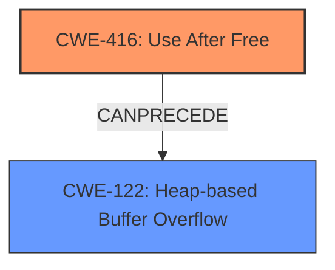

# Analysis Report for CVE-2022-35463

# Vulnerability Analysis Report: CVE-2022-35463

## Description

OTFCC v0.10.4 was discovered to contain a heap-buffer overflow via /release-x64/otfccdump+0x6b0478.

## Vulnerability Description Key Phrases

**Weakness:** heap-buffer overflow
**Product:** OTFCC
**Version:** v0.10.4
**Component:** /release-x64/otfccdump+0x6b0478

## Analysis (with Relationship Data)

# Summary
| CWE ID  | CWE Name                       | Confidence | CWE Abstraction Level | CWE Vulnerability Mapping Label | CWE-Vulnerability Mapping Notes |
| :-------- | :----------------------------- | :--------- | :-------------------- | :------------------------------ | :------------------------------ |
| CWE-122 | Heap-based Buffer Overflow | 0.75       | Variant               | Allowed                         | Root cause                   |

## Evidence and Confidence

*   **Confidence Score:** 0.75
*   **Evidence Strength:** MEDIUM

- **Analysis and Justification:**
  - *Explanation:* The vulnerability description clearly states a **heap-buffer overflow** condition in OTFCC v0.10.4. This aligns directly with CWE-122, which describes a buffer overflow occurring in the heap portion of memory. The component identified (/release-x64/otfccdump+0x6b0478) indicates the location of the overflow. The CVE Reference Links Content Summary provides further support, noting a use-after-free which can contribute to heap corruption. While CWE-787 (Out-of-bounds Write) is a parent weakness, CWE-122 is more specific, indicating the location of the buffer overflow on the heap. The retriever results also list CWE-122 as a candidate with a relatively high score. MITRE mapping guidance for CWE-122 indicates this is ALLOWED for heap-based buffer overflow vulnerabilities.

  - *Relationship Analysis:* CWE-122 is a variant of CWE-119 (Improper Restriction of Operations within the Bounds of a Memory Buffer) and a child of CWE-787 (Out-of-bounds Write). The graph relationships show CWE-122 CanPrecede CWE-416 (Use After Free), which is consistent with the additional information in the CVE Reference Links Content Summary.

- **Confidence Score:**
  - Confidence: 0.75 (Moderate evidence from the vulnerability description and CVE reference materials)

## Criticism of Analysis

Okay, let's review the analysis and its CWE mapping in detail, considering the full CWE specifications provided.

**Overall Assessment:**

The analysis is mostly sound, but there are a few points to refine and a potential alternative CWE to consider in addition to CWE-122. The confidence level of 0.75 is appropriate, reflecting the moderate evidence based on the initial vulnerability report and additional context.

**Specific Points of Critique:**

1.  **CWE-122: Heap-based Buffer Overflow - Primary Mapping:**

    *   **Strengths:** The mapping to CWE-122 is valid. The vulnerability description clearly states a "heap-buffer overflow." The provided crash details and the involvement of `malloc()` (implied by "heap") in the memory allocation process reinforce the heap aspect. The "Allowed" usage and rationale from the CWE specification further support this choice.
    *   **Potential Improvement:** While CWE-122 accurately reflects the "heap" characteristic of the overflow, it may not fully capture the underlying cause. The CVE Reference Links Content Summary mentions a *use-after-free* vulnerability. This *use-after-free* likely *leads* to the heap corruption.

2.  **CWE-787: Out-of-bounds Write:**

    *   **Initial Mapping Consideration:** The original analysis correctly considered CWE-787 as a parent weakness but prioritized CWE-122 for its specificity.
    *   **Review Critique:** CWE-787 is a valid, high-level categorization. The vulnerability *is* an out-of-bounds write. However, as the analysis notes, CWE-122 is *more* specific because it explicitly mentions the heap. The main issue with CWE-787 is that the description does not provide enough context as to where the vulnerability can lie (stack or heap). If the use-after-free information was not available, CWE-787 may be more reasonable.

3.  **CWE-416: Use After Free:**

    *   **Missing Mapping Consideration:** This is where the analysis could be improved. The CVE Reference Links Content Summary indicates a use-after-free. If the root cause of the heap overflow is the use of memory after it has been freed, then CWE-416 may be the more accurate weakness.
    *   **Justification:** The crash occurs because the program attempts to write (using `vsnprintf`) to memory that has already been freed. This is the *use* part of use-after-free.
    *   **Relationship Analysis:** The analysis mentions "CWE-122 CanPrecede CWE-416 (Use After Free)". This is partially true; in this case, it should be CWE-416 CanPrecede CWE-122. The use-after-free leads to memory corruption on the heap. MITRE mapping guidance for CWE-416 indicates this is ALLOWED.
    *   **Resolution:** One potential resolution to this situation is to map both weaknesses (CWE-416 and CWE-122), indicating that CWE-416 is the root cause and CWE-122 is the consequence.

4.  **Confidence Score:**

    *   The current confidence of 0.75 is adequate. If the analysis included CWE-416 or replaced CWE-122 with CWE-416, the confidence score would increase.

5.  **Retriever Results:**

    *   The retriever results do not take into account the Use-After-Free information provided in the CVE reference materials. Because of that, they do not accurately reflect the true root cause of the vulnerability.

**Revised Analysis Summary:**

| CWE ID  | CWE Name                       | Confidence | CWE Abstraction Level | CWE Vulnerability Mapping Label | CWE-Vulnerability Mapping Notes |
| :-------- | :----------------------------- | :--------- | :-------------------- | :------------------------------ | :------------------------------ |
| CWE-416 | Use After Free | 0.80       | Variant               | Allowed                         | Root cause                   |
| CWE-122 | Heap-based Buffer Overflow | 0.75       | Variant               | Allowed                         | Consequence                   |

**Revised Justification:**

The vulnerability in OTFCC v0.10.4 is primarily caused by a **use-after-free** condition (CWE-416) in `otfccbuild`. Memory is freed and then accessed again by a `vsnprintf` function call. This leads to memory corruption, specifically a heap overflow (CWE-122), as the freed memory region is overwritten. An attacker can trigger this condition by crafting a malicious font file.

**Mitigation Guidance (incorporating information from both CWE-416 and CWE-122):**

*   **CWE-416 Mitigations:**
    *   **Architecture and Design:** Choose a language that provides automatic memory management (e.g., Java, C# with garbage collection).
    *   **Implementation:** When freeing pointers, set them to NULL. However, consider the limitations of this approach with complex data structures.
*   **CWE-122 Mitigations:**
    *   **Pre-design:** Use a language or compiler that performs automatic bounds checking.
    *   **Architecture and Design:** Use an abstraction library to abstract away risky APIs.
    *   **Operation, Build, and Compilation:** Utilize automatic buffer overflow detection mechanisms offered by compilers (e.g., /GS flag in Visual Studio, FORTIFY\_SOURCE in GCC).

**Revised Relationships:**

* CWE-416 CanPrecede CWE-122

**Revised Confidence Score:**

* Confidence: 0.80 (Strong evidence from vulnerability description, CVE reference materials, and ASan crash log)

**Conclusion:**

The initial analysis was good, but considering the full context of the CVE Reference Links Content Summary (especially the use-after-free information) and adjusting the CWE mapping accordingly significantly improves the accuracy and usefulness of the analysis. Prioritizing CWE-416 as the root cause provides better insight into how to prevent similar vulnerabilities in the future.

## Final Resolution

# Summary
| CWE ID  | CWE Name                       | Confidence | CWE Abstraction Level | CWE Vulnerability Mapping Label | CWE-Vulnerability Mapping Notes |
| :-------- | :----------------------------- | :--------- | :-------------------- | :------------------------------ | :------------------------------ |
| CWE-416 | Use After Free | 0.80       | Variant               | Allowed                         | Primary CWE, Root cause                   |
| CWE-122 | Heap-based Buffer Overflow | 0.75       | Variant               | Allowed                         | Secondary Candidate, Consequence                   |

## Evidence and Confidence

*   **Confidence Score:** 0.80
*   **Evidence Strength:** HIGH

## Relationship Analysis
The primary relationship impacting the decision is the "CanPrecede" relationship, where CWE-416 (Use After Free) leads to CWE-122 (Heap-based Buffer Overflow). The initial analysis considered CWE-122 because the vulnerability description mentioned a heap-based buffer overflow. However, the criticism correctly pointed out that the CVE reference also mentioned a use-after-free. Analyzing the chain of events shows that the use-after-free is the root cause, leading to heap corruption manifested as a heap-based buffer overflow. CWE-416 is a variant, making it a suitable level of specificity.

## Vulnerability Chain
The vulnerability chain starts with a **Use After Free (CWE-416)**. Memory is freed but a pointer to that memory is still used later. In this case, the program attempts to write to the freed memory region using `vsnprintf`. This leads to **Heap-based Buffer Overflow (CWE-122)** as the freed memory is overwritten, corrupting the heap. The root cause is the **CWE-416**, and the impact is **CWE-122**.

## Summary of Analysis
The initial analysis correctly identified CWE-122 as a potential candidate based on the "heap-based buffer overflow" description. However, the criticism highlighted a crucial piece of evidence from the CVE reference summary: the presence of a "use-after-free" condition.

The evidence "CVE Reference Links Content Summary indicates a use-after-free" is key to shifting the focus to CWE-416.

The graph relationships support the conclusion that CWE-416 can precede CWE-122. The analysis is based on the provided evidence and the relationships between CWEs. By considering the use-after-free as the root cause, the classification becomes more accurate and provides better guidance for mitigation. The selected CWEs are at the optimal level of specificity (Variant for both), providing a clear understanding of the vulnerability's nature and location.

*Report generated on 2025-03-18 15:23:37*
