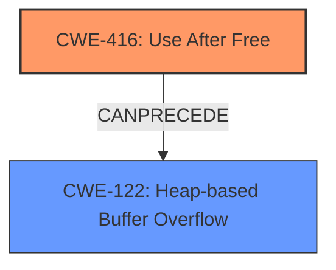

# Final Resolution for CVE-2022-35463

# Summary
| CWE ID  | CWE Name                       | Confidence | CWE Abstraction Level | CWE Vulnerability Mapping Label | CWE-Vulnerability Mapping Notes |
| :-------- | :----------------------------- | :--------- | :-------------------- | :------------------------------ | :------------------------------ |
| CWE-416 | Use After Free | 0.80       | Variant               | Allowed                         | Primary CWE, Root cause                   |
| CWE-122 | Heap-based Buffer Overflow | 0.75       | Variant               | Allowed                         | Secondary Candidate, Consequence                   |

## Evidence and Confidence

*   **Confidence Score:** 0.80
*   **Evidence Strength:** HIGH

## Relationship Analysis
The primary relationship impacting the decision is the "CanPrecede" relationship, where CWE-416 (Use After Free) leads to CWE-122 (Heap-based Buffer Overflow). The initial analysis considered CWE-122 because the vulnerability description mentioned a heap-based buffer overflow. However, the criticism correctly pointed out that the CVE reference also mentioned a use-after-free. Analyzing the chain of events shows that the use-after-free is the root cause, leading to heap corruption manifested as a heap-based buffer overflow. CWE-416 is a variant, making it a suitable level of specificity.

## Vulnerability Chain
The vulnerability chain starts with a **Use After Free (CWE-416)**. Memory is freed but a pointer to that memory is still used later. In this case, the program attempts to write to the freed memory region using `vsnprintf`. This leads to **Heap-based Buffer Overflow (CWE-122)** as the freed memory is overwritten, corrupting the heap. The root cause is the **CWE-416**, and the impact is **CWE-122**.

## Summary of Analysis
The initial analysis correctly identified CWE-122 as a potential candidate based on the "heap-based buffer overflow" description. However, the criticism highlighted a crucial piece of evidence from the CVE reference summary: the presence of a "use-after-free" condition.

The evidence "CVE Reference Links Content Summary indicates a use-after-free" is key to shifting the focus to CWE-416.

The graph relationships support the conclusion that CWE-416 can precede CWE-122. The analysis is based on the provided evidence and the relationships between CWEs. By considering the use-after-free as the root cause, the classification becomes more accurate and provides better guidance for mitigation. The selected CWEs are at the optimal level of specificity (Variant for both), providing a clear understanding of the vulnerability's nature and location.