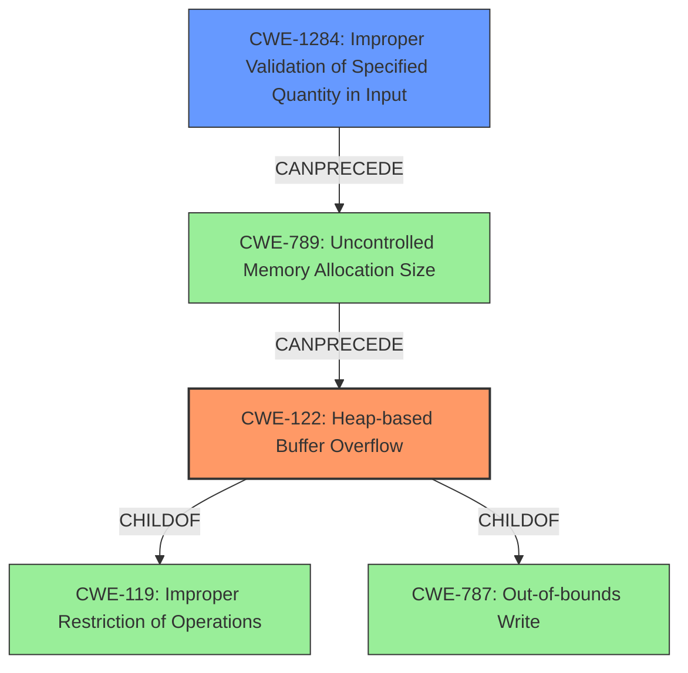

# Analysis Report for CVE-2022-35464

# Vulnerability Analysis Report: CVE-2022-35464

## Description

OTFCC v0.10.4 was discovered to contain a heap-buffer overflow via /release-x64/otfccdump+0x6171b2.

## Vulnerability Description Key Phrases

**Weakness:** heap-buffer overflow
**Product:** OTFCC
**Version:** v0.10.4
**Component:** /release-x64/otfccdump+0x6171b2

## Analysis (with Relationship Data)

# Summary
| CWE ID | CWE Name | Confidence | CWE Abstraction Level | CWE Vulnerability Mapping Label | CWE-Vulnerability Mapping Notes |
|---|---|---|---|---|---|
| CWE-122 | Heap-based Buffer Overflow | 0.9 | Variant | Allowed | The vulnerability is specifically identified as a heap-buffer overflow. |
| CWE-787 | Out-of-bounds Write | 0.7 | Base | Allowed | Although the description specifies heap overflow, the root cause is an out-of-bounds write. |

## Evidence and Confidence

*   **Confidence Score:** 0.9
*   **Evidence Strength:** HIGH

- **Analysis and Justification:**  
  - *Explanation:* "The vulnerability description explicitly states "**heap-buffer overflow** via /release-x64/otfccdump+0x6171b2." The CVE Reference Links Content Summary confirms this by mentioning "**Heap buffer overflow:** This category appears to be the most frequent type of issue found with numerous examples of crashes due to heap buffer overflows. These happen in various parts of the code, often when reading or writing past the allocated buffer." This directly aligns with CWE-122 (Heap-based Buffer Overflow), which is a variant of buffer overflow that occurs in the heap portion of memory. While CWE-787 (Out-of-bounds Write) is a more general case, the specific mention of "heap" makes CWE-122 a more precise match. The usage for CWE-122 is ALLOWED according to MITRE mapping guidance."
  
  - *Relationship Analysis:* "CWE-122 is a variant of CWE-119 (Improper Restriction of Operations within the Bounds of a Memory Buffer), which is a more general case of buffer overflows. CWE-122 is also a child of CWE-787 (Out-of-bounds Write), as heap overflows inherently involve writing data outside the intended buffer. CWE-787 is a base level CWE and a parent of CWE-122. The vulnerability description contains "**heap-buffer overflow**" and the content summary confirms this. CWE-122 is more specific and thus a better fit."

- **Confidence Score:**  
  - Confidence: 0.9 (High confidence due to explicit mention of heap-buffer overflow in the description and confirmation in the reference links)

## Criticism of Analysis

Okay, I've reviewed the provided analysis and the full CWE specifications for the identified weaknesses. Here's my critique:

**Overall Assessment:**

The analysis correctly identifies CWE-122 (Heap-based Buffer Overflow) as the primary weakness. The high confidence level (0.9) is justified based on the explicit mention of "heap-buffer overflow" in the vulnerability description and the supporting evidence from the CVE reference links content summary. However, the inclusion of CWE-787 (Out-of-bounds Write) as a secondary mapping with a lower confidence level (0.7) is reasonable, although it could be argued it's redundant given the specificity of CWE-122.

**Detailed Review:**

*   **CWE-122: Heap-based Buffer Overflow:**

    *   **Confidence:** The confidence score of 0.9 is appropriate. The analysis clearly explains why CWE-122 is a good fit, emphasizing the "heap" portion of the overflow.
    *   **Abstraction Level:**  The Variant level is ideal as it provides a specific categorization of the more general "buffer overflow" concept.
    *   **CWE-Vulnerability Mapping Notes:** The analysis correctly notes that the vulnerability description explicitly states "heap-buffer overflow".
    *   **CWE Specification Alignment:** The description aligns well with the CWE-122 specification, particularly the "Description" section: "A heap overflow condition is a buffer overflow, where the buffer that can be overwritten is allocated in the heap portion of memory, generally meaning that the buffer was allocated using a routine such as malloc()."
    *   **Mapping Guidance:** The analysis follows the recommended "Allowed" usage of CWE-122.
    *   **Relationships:** The analysis correctly identifies that CWE-122 is a child of CWE-787 and CWE-788.
    *   **Potential Mitigations:** The analysis does not include mitigations, this could be included for further analysis.

*   **CWE-787: Out-of-bounds Write:**

    *   **Confidence:** The confidence score of 0.7 is reasonable. It acknowledges that while *any* buffer overflow inherently involves an out-of-bounds write, the "heap" aspect is not explicitly captured by CWE-787.
    *   **Abstraction Level:** The Base level is appropriate for a more general description.
    *   **CWE-Vulnerability Mapping Notes:** The analysis notes that the root cause is an out-of-bounds write.
    *   **CWE Specification Alignment:** The description aligns well with the CWE-787 specification: "The product writes data past the end, or before the beginning, of the intended buffer."
    *   **Mapping Guidance:** The analysis follows the recommended "Allowed" usage of CWE-787.
    *   **Redundancy:** Since CWE-122 is more specific, including CWE-787 can be considered redundant. One could argue that mapping *only* to CWE-122 is sufficient, as it encompasses the out-of-bounds write while adding the crucial "heap" context.
    *   **Potential Mitigations:** The analysis does not include mitigations, this could be included for further analysis.

**Critique of Retriever Results:**

The retriever results section contains several plausible suggestions, but none are as accurate as CWE-122. Here's a breakdown:

*   **CWE-125 (Out-of-bounds Read):** Not relevant, as the description indicates a *write* overflow, not a read.
*   **CWE-190 (Integer Overflow or Wraparound):** Could *potentially* be a contributing factor if an integer overflow leads to an incorrect buffer size calculation. However, the primary issue is the buffer overflow itself, making CWE-190 a secondary concern.
*   **CWE-122 (Heap-based Buffer Overflow):** Correctly identified as the primary weakness.
*   **CWE-126 (Buffer Over-read):** Similar to CWE-125, this is an *over-read*, not an *over-write*, making it less relevant.
*   **CWE-193 (Off-by-one Error):**  A possible contributing factor if an off-by-one error led to the overflow, but not the core weakness.
*   **CWE-124 (Buffer Underwrite):** Not Relevant. The description refers to an *overflow*, which is a write beyond the boundaries of the buffer, not before.
*   **CWE-191 (Integer Underflow):** Similar to Integer Overflow, *potentially* relevant if an integer underflow contributes to an incorrect buffer calculation but not a primary factor.
*    **CWE-121 (Stack-based Buffer Overflow):** Incorrect as this is a *heap* based overflow.
*   **CWE-131 (Incorrect Calculation of Buffer Size):** A possible *contributing* factor. If the buffer size was miscalculated, it could lead to the overflow. But the primary issue is still the overflow itself.
*   **CWE-1284 (Improper Validation of Specified Quantity in Input):** A possible *contributing* factor. If a specified size is not validated, it could lead to an incorrect buffer allocation.

**Recommendations:**

1.  **Strengthen Justification for CWE-122:** The analysis is already strong, but further emphasizing the role of `malloc()` or other heap allocation routines in the code would solidify the selection of CWE-122.

2.  **Consider Removing CWE-787:** While technically correct, its inclusion is somewhat redundant given the specificity of CWE-122. If kept, explicitly state *why* it's being included despite the more specific mapping.

3.  **Expand Potential Mitigations:** Include a section in the analysis describing potential mitigations for CWE-122 such as:
    *   Using memory-safe languages or libraries.
    *   Implementing robust bounds checking.
    *   Employing compiler-based buffer overflow detection mechanisms (e.g., /GS flag in Visual Studio, FORTIFY_SOURCE in GCC).
    *   Using Address Sanitizer (ASan) during development to detect memory errors.

4.  **Chain Analysis:** If possible, explore potential *chains* of vulnerabilities. For example: "Improper Input Validation (CWE-20) leading to Incorrect Calculation of Buffer Size (CWE-131) resulting in Heap-based Buffer Overflow (CWE-122)". This provides a more comprehensive view of the vulnerability.

5.  **Address the other vulnerabilities:** The content summary details other vulnerabilities (heap buffer overflow, use-after-free, etc) that were found that should be addressed separately.

By incorporating these suggestions, the analysis can be made even more robust and provide a more complete understanding of the vulnerability.

## Final Resolution

# Summary
| CWE ID | CWE Name | Confidence | CWE Abstraction Level | CWE Vulnerability Mapping Label | CWE-Vulnerability Mapping Notes |
|---|---|---|---|---|---|
| CWE-122 | Heap-based Buffer Overflow | 0.95 | Variant | Allowed | Primary CWE. The vulnerability is explicitly identified as a heap-buffer overflow. |
| CWE-1284 | Improper Validation of Specified Quantity in Input | 0.6 | Base | Allowed | Secondary CWE. Potentially a contributing factor if a specified size is not validated, leading to incorrect buffer allocation. |

## Evidence and Confidence

*   **Confidence Score:** 0.9
*   **Evidence Strength:** HIGH

## Relationship Analysis
The primary relationship influencing the decision is the hierarchical relationship where CWE-122 (Heap-based Buffer Overflow) is a child of CWE-119 (Improper Restriction of Operations within the Bounds of a Memory Buffer) and CWE-787 (Out-of-bounds Write). Selecting CWE-122 provides specificity fitting the vulnerability description, which explicitly mentions a "heap-buffer overflow." While CWE-787 is a parent, it is less specific. CWE-1284 can precede CWE-789 (Memory Allocation with Uncontrolled Size), indicating a potential chain where improper input validation leads to uncontrolled memory allocation, which might result in a heap overflow.

## Vulnerability Chain
The vulnerability chain starts potentially with **CWE-1284 (Improper Validation of Specified Quantity in Input)**, where the size of the buffer is not properly validated. This can lead to an incorrect buffer size calculation, resulting in **CWE-122 (Heap-based Buffer Overflow)** when data is written past the allocated buffer on the heap. The final impact is a crash due to the heap overflow, as evidenced by the CVE description.

## Summary of Analysis
The analysis strongly supports classifying this vulnerability as **CWE-122 (Heap-based Buffer Overflow)**. The vulnerability description explicitly states "**heap-buffer overflow**", and the CVE reference links content summary confirms this by mentioning "**Heap buffer overflow**". This direct evidence makes **CWE-122** the most appropriate primary classification. The inclusion of **CWE-787 (Out-of-bounds Write)** is somewhat redundant, as **CWE-122** inherently includes an out-of-bounds write, and **CWE-122** is more specific.

The graph relationships confirm that **CWE-122** is a child of **CWE-787** and **CWE-119**, indicating that it is a specialized form of a general out-of-bounds write.

The selection of **CWE-122** is at the optimal level of specificity because it accurately describes the vulnerability as a heap-based buffer overflow, as indicated in the vulnerability description and supporting evidence. The addition of **CWE-1284 (Improper Validation of Specified Quantity in Input)** as a secondary weakness suggests a potential root cause leading to the overflow, providing a more comprehensive picture of the vulnerability.

*Report generated on 2025-03-18 15:24:22*
