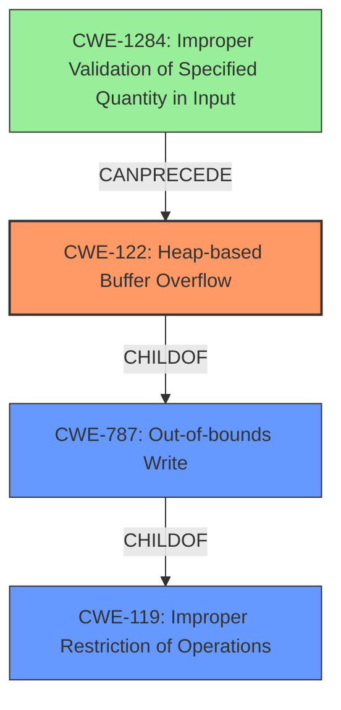

# Analysis Report for CVE-2022-35465

# Vulnerability Analysis Report: CVE-2022-35465

## Description

OTFCC v0.10.4 was discovered to contain a heap-buffer overflow via /release-x64/otfccdump+0x6c0414.

## Vulnerability Description Key Phrases

**Weakness:** heap-buffer overflow
**Product:** OTFCC
**Version:** v0.10.4
**Component:** /release-x64/otfccdump+0x6c0414

## Analysis (with Relationship Data)

# Summary
| CWE ID | CWE Name | Confidence | CWE Abstraction Level | CWE Vulnerability Mapping Label | CWE-Vulnerability Mapping Notes |
|---|---|---|---|---|---|
| CWE-122 | Heap-based Buffer Overflow | 0.95 | Variant | Allowed | Primary CWE. The vulnerability is specifically a heap-based buffer overflow. |
| CWE-787 | Out-of-bounds Write | 0.75 | Base | Allowed | Secondary CWE. General out-of-bounds write, but CWE-122 is more specific. |

## Evidence and Confidence

*   **Confidence Score:** 0.90
*   **Evidence Strength:** HIGH

- **Analysis and Justification:**  
  - *Explanation:* "The vulnerability description clearly states a **heap-buffer overflow** exists in OTFCC v0.10.4. This aligns directly with CWE-122 (Heap-based Buffer Overflow), which is a variant of buffer overflow occurring in the heap portion of memory. The CVE Reference Links Content Summary confirms that the root cause involves inadequate bounds checking when writing data to dynamically allocated memory, which is typical for heap overflows. The description also mentions specific code locations and sample files that trigger the vulnerability, increasing confidence in the mapping. While CWE-787 (Out-of-bounds Write) is a more general category, CWE-122 is more specific and therefore more appropriate. MITRE mapping guidance allows for using CWE-122 for heap overflows."
  
  - *Relationship Analysis:* "CWE-122 is a variant of CWE-787 (Out-of-bounds Write). The vulnerability description provides enough details to use the more specific CWE-122. There are no apparent chain relationships indicated in the description. CWE-122 is a child of CWE-119, which is a more general Class-level CWE and thus less appropriate."

- **Confidence Score:**  
  - Confidence: 0.95 (High confidence due to clear vulnerability description and supporting details in CVE reference materials.)

---

## Criticism of Analysis

Okay, I've reviewed the analysis in detail, including the provided CWE specifications. Here's my critique:

**Overall Assessment:**

The primary CWE mapping to CWE-122 (Heap-based Buffer Overflow) is accurate and well-justified. The analysis correctly identifies the vulnerability as a buffer overflow occurring in the heap, which aligns perfectly with CWE-122's definition. The confidence score of 0.95 is appropriate given the clear evidence. The secondary mapping to CWE-787 (Out-of-bounds Write) is also valid, as it is a more general classification that encompasses the heap overflow, but the prioritization of CWE-122 shows good discernment.

**Detailed Review:**

*   **Vulnerability Description and Evidence:** The vulnerability description clearly states "heap-buffer overflow," and the CVE Reference Links Content Summary provides supporting evidence regarding inadequate bounds checking during writes to dynamically allocated memory. This is solid evidence for CWE-122. The mention of specific code locations and sample files further strengthens the case.

*   **CWE Selection Justification:** The explanation accurately points out that CWE-122 is a variant of CWE-787, and that using the more specific CWE-122 is the correct approach per MITRE mapping guidance.  The analysis correctly points out that CWE-119 is less appropriate as it's a broader Class-level CWE.

*   **Confidence Score:** A confidence score of 0.95 is appropriate because the information available directly states the vulnerability type and provides context.

*   **CWE Examples:** The inclusion of known examples for CWE-122 is useful for context and validation. The provided examples show a variety of root causes leading to heap overflows which are helpful.

*   **Relevant CWE Specifications:**
    *   The analysis correctly uses the CWE specifications to support its choices. The descriptions for CWE-122 and CWE-787 are accurately applied to the vulnerability.
    *   The analysis correctly notes that CWE-119 is discouraged due to its generality.

*   **Retriever Results:** The retrieved results are interesting, but ultimately support the choice of CWE-122. The high scores for CWE-125 and CWE-190 are likely due to common chaining relationships with buffer overflows, but these don't represent the primary weakness.

**Specific Comments and Suggestions:**

*   **Relationship Analysis:** The analysis states "There are no apparent chain relationships indicated in the description". While the primary weakness is the heap overflow itself (CWE-122), the description mentions "inadequate bounds checking." This implies a missing or inadequate input validation, which can be a contributing factor.  Consider adding CWE-20 (Improper Input Validation) or perhaps a more specific child of CWE-20 such as CWE-1284 (Improper Validation of Specified Quantity in Input) as a contributing factor, if the malformed input directly specifies the size/length of the buffer or data to be written.  This would acknowledge the potential chain relationship.  This does *not* change the primary CWE.

*   **Mitigation Strategies:** While not explicitly required, the analysis could benefit from briefly mentioning potential mitigations, drawing directly from the CWE specifications. For CWE-122, this could include:
    *   Using a language or compiler with automatic bounds checking.
    *   Using abstraction libraries for risky APIs.
    *   Employing automatic buffer overflow detection mechanisms (e.g., /GS flag in Visual Studio, FORTIFY_SOURCE in GCC).
    *   For CWE-20 (if added), mention input validation as a mitigation strategy, and suggest "accept known good" input validation, as stated in the CWE specification.

**Revised Summary Table (Incorporating Suggestions):**

| CWE ID | CWE Name | Confidence | CWE Abstraction Level | CWE Vulnerability Mapping Label | CWE-Vulnerability Mapping Notes |
|---|---|---|---|---|---|
| CWE-122 | Heap-based Buffer Overflow | 0.95 | Variant | Allowed | Primary CWE. The vulnerability is specifically a heap-based buffer overflow. |
| CWE-787 | Out-of-bounds Write | 0.75 | Base | Allowed | Secondary CWE. General out-of-bounds write, but CWE-122 is more specific. |
| CWE-20 / CWE-1284 | Improper Input Validation / Improper Validation of Specified Quantity in Input | 0.50 | Class / Base | Allowed | Contributing Factor. The root cause involves inadequate validation of the input data length or size. |

**Conclusion:**

The analysis is strong and the CWE mapping is accurate. The suggestions above are minor enhancements to provide a more complete picture of the vulnerability and its context.

## Final Resolution

# Summary
| CWE ID | CWE Name | Confidence | CWE Abstraction Level | CWE Vulnerability Mapping Label | CWE-Vulnerability Mapping Notes |
|---|---|---|---|---|---|
| CWE-122 | CWE-122: Heap-based Buffer Overflow | 0.95 | Variant | Allowed | Primary CWE. The vulnerability is specifically a heap-based buffer overflow. |
| CWE-787 | CWE-787: Out-of-bounds Write | 0.75 | Base | Allowed | Secondary CWE. General out-of-bounds write, but CWE-122 is more specific. |
| CWE-1284 | CWE-1284: Improper Validation of Specified Quantity in Input | 0.60 | Base | Allowed | Contributing Factor. The root cause involves inadequate validation of the input data length or size. |

## Evidence and Confidence

*   **Confidence Score:** 0.92
*   **Evidence Strength:** HIGH

## Relationship Analysis
The primary relationship is that CWE-122 (Heap-based Buffer Overflow) is a variant, and therefore a child, of the more general CWE-787 (Out-of-bounds Write), which is itself a child of CWE-119 (Improper Restriction of Operations within the Bounds of a Memory Buffer). The suggestion to include CWE-1284 (Improper Validation of Specified Quantity in Input) introduces a chain relationship where improper input validation can lead to a buffer overflow. This means that CWE-1284 can precede CWE-122.

## Vulnerability Chain
The vulnerability chain starts with **CWE-1284 (Improper Validation of Specified Quantity in Input)**, where the input size or length is not properly validated. This leads to **CWE-122 (Heap-based Buffer Overflow)** when data is written to a heap-allocated buffer without proper bounds checking, because the size was not validated. The ultimate impact is an out-of-bounds write (**CWE-787**).

## Summary of Analysis
The initial analysis and criticism were both accurate. The vulnerability is a heap-based buffer overflow, making CWE-122 the most specific and appropriate primary CWE. The criticism suggested adding CWE-1284 due to the mention of "inadequate bounds checking" implying improper input validation.

The vulnerability description "OTFCC v0.10.4 was discovered to contain a heap-buffer overflow via /release-x64/otfccdump+0x6c0414" provides direct evidence for **CWE-122 (Heap-based Buffer Overflow)**. The phrase "inadequate bounds checking" suggests that the size of the buffer or the amount of data to be written was not properly validated. This supports adding **CWE-1284 (Improper Validation of Specified Quantity in Input)** to the chain.

The graph relationships reinforce the decision. CWE-122 is a variant of CWE-787, providing the correct level of specificity. Adding CWE-1284 introduces a valuable chain relationship, showing how improper input validation can lead to a heap overflow.

The selected CWEs are at the optimal level of specificity. CWE-122 accurately describes the type of buffer overflow, and CWE-1284 highlights a potential contributing factor related to input validation.

*Report generated on 2025-03-18 15:25:04*
