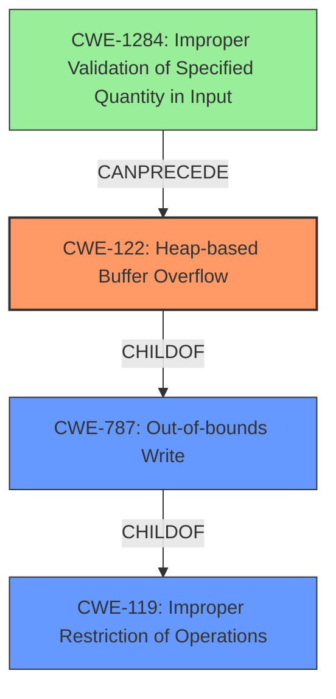

# Final Resolution for CVE-2022-35465

# Summary
| CWE ID | CWE Name | Confidence | CWE Abstraction Level | CWE Vulnerability Mapping Label | CWE-Vulnerability Mapping Notes |
|---|---|---|---|---|---|
| CWE-122 | CWE-122: Heap-based Buffer Overflow | 0.95 | Variant | Allowed | Primary CWE. The vulnerability is specifically a heap-based buffer overflow. |
| CWE-787 | CWE-787: Out-of-bounds Write | 0.75 | Base | Allowed | Secondary CWE. General out-of-bounds write, but CWE-122 is more specific. |
| CWE-1284 | CWE-1284: Improper Validation of Specified Quantity in Input | 0.60 | Base | Allowed | Contributing Factor. The root cause involves inadequate validation of the input data length or size. |

## Evidence and Confidence

*   **Confidence Score:** 0.92
*   **Evidence Strength:** HIGH

## Relationship Analysis
The primary relationship is that CWE-122 (Heap-based Buffer Overflow) is a variant, and therefore a child, of the more general CWE-787 (Out-of-bounds Write), which is itself a child of CWE-119 (Improper Restriction of Operations within the Bounds of a Memory Buffer). The suggestion to include CWE-1284 (Improper Validation of Specified Quantity in Input) introduces a chain relationship where improper input validation can lead to a buffer overflow. This means that CWE-1284 can precede CWE-122.

## Vulnerability Chain
The vulnerability chain starts with **CWE-1284 (Improper Validation of Specified Quantity in Input)**, where the input size or length is not properly validated. This leads to **CWE-122 (Heap-based Buffer Overflow)** when data is written to a heap-allocated buffer without proper bounds checking, because the size was not validated. The ultimate impact is an out-of-bounds write (**CWE-787**).

## Summary of Analysis
The initial analysis and criticism were both accurate. The vulnerability is a heap-based buffer overflow, making CWE-122 the most specific and appropriate primary CWE. The criticism suggested adding CWE-1284 due to the mention of "inadequate bounds checking" implying improper input validation.

The vulnerability description "OTFCC v0.10.4 was discovered to contain a heap-buffer overflow via /release-x64/otfccdump+0x6c0414" provides direct evidence for **CWE-122 (Heap-based Buffer Overflow)**. The phrase "inadequate bounds checking" suggests that the size of the buffer or the amount of data to be written was not properly validated. This supports adding **CWE-1284 (Improper Validation of Specified Quantity in Input)** to the chain.

The graph relationships reinforce the decision. CWE-122 is a variant of CWE-787, providing the correct level of specificity. Adding CWE-1284 introduces a valuable chain relationship, showing how improper input validation can lead to a heap overflow.

The selected CWEs are at the optimal level of specificity. CWE-122 accurately describes the type of buffer overflow, and CWE-1284 highlights a potential contributing factor related to input validation.