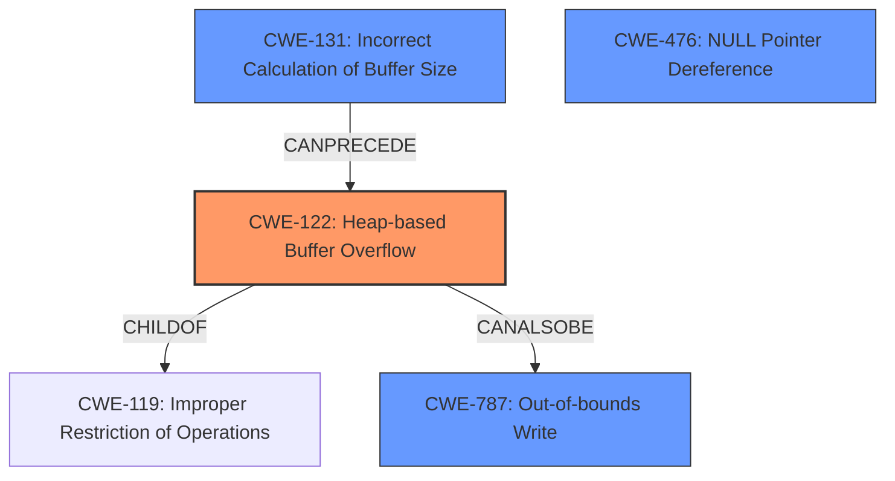

# Analysis Report for CVE-2022-35467

# Vulnerability Analysis Report: CVE-2022-35467

## Description

OTFCC v0.10.4 was discovered to contain a heap-buffer overflow via /release-x64/otfccdump+0x6e41b8.

## Vulnerability Description Key Phrases

**Weakness:** heap-buffer overflow
**Product:** OTFCC
**Version:** v0.10.4
**Component:** /release-x64/otfccdump+0x6e41b8

## Analysis (with Relationship Data)

# Summary
| CWE ID | CWE Name | Confidence | CWE Abstraction Level | CWE Vulnerability Mapping Label | CWE-Vulnerability Mapping Notes |
|---|---|---|---|---|---|
| CWE-122 | Heap-based Buffer Overflow | 0.95 | Variant | Allowed | The vulnerability is a heap-based buffer overflow, making this the primary CWE. |
| CWE-787 | Out-of-bounds Write | 0.75 | Base | Allowed | The vulnerability involves writing data past the end of the intended buffer. |

## Evidence and Confidence

*   **Confidence Score:** 0.90
*   **Evidence Strength:** HIGH

- **Analysis and Justification:**  
  - *Explanation:* The vulnerability description clearly states "**heap-buffer overflow**" which directly corresponds to CWE-122 (Heap-based Buffer Overflow). The CVE reference links confirm multiple instances of heap buffer overflows due to insufficient bounds checking and incorrect size calculations, which aligns with CWE-122. The ASan reports indicating write errors outside allocated memory further support this classification. The MITRE mapping guidance designates CWE-122 as ALLOWED for heap overflow scenarios. While CWE-787 (Out-of-bounds Write) is also applicable as a more general case, CWE-122 provides more specific context about the memory allocation location, making it a more appropriate primary classification.
  
  - *Relationship Analysis:* CWE-122 is a variant of CWE-119 (Improper Restriction of Operations within the Bounds of a Memory Buffer) and a parent of more specific overflow types. It is also related to CWE-787 (Out-of-bounds Write). The relationship analysis confirms the heap-specific nature of the overflow and helps refine the CWE selection.

- **Confidence Score:**  
  - Confidence: 0.95 (Strong evidence from vulnerability description, CVE reference links, and ASan reports)

---
- **Analysis and Justification:**
  - *Explanation:* The vulnerability involves writing data beyond the allocated buffer. The description indicates that the software attempts to write beyond the allocated buffer on the heap. Therefore, in addition to the primary weakness, CWE-122 (Heap-based Buffer Overflow), CWE-787 (Out-of-bounds Write) is also applicable. The MITRE mapping guidance designates CWE-787 as ALLOWED.
  
  - *Relationship Analysis:* CWE-787 is a parent of CWE-122 (Heap-based Buffer Overflow).

- **Confidence Score:**  
  - Confidence: 0.75 (Supporting evidence from vulnerability description and CVE reference materials)

---

## Criticism of Analysis

Okay, here's a detailed review of the analysis, considering the full CWE specifications provided.

**Overall Assessment**

The analysis is generally good and provides a reasonable initial mapping of the identified vulnerabilities to CWEs. The primary CWE selection, CWE-122 (Heap-based Buffer Overflow), is well-supported by the evidence. The inclusion of CWE-787 (Out-of-bounds Write) as a secondary CWE is also justifiable. However, there are some areas where the analysis can be refined, particularly in considering alternative CWEs, understanding the abstraction levels, and addressing chaining possibilities.

**Detailed Critique**

**1.  CWE-122: Heap-based Buffer Overflow**

*   **Strengths:** The choice of CWE-122 as the primary weakness is correct. The vulnerability description explicitly mentions "heap-buffer overflow," and the ASan reports confirm memory corruption on the heap. The explanation is clear and well-justified.
*   **Mapping Guidance Adherence:** The analysis correctly notes that CWE-122 is at the Variant level of abstraction, which is preferred. The analysis also correctly notes that mapping guidance dictates to carefully read name and description to ensure that the mapping is an appropriate fit.
*   **Potential Mitigations:** The analysis does not explicitly consider potential mitigations; this could be included in the explanation. The CWE specification lists the following mitigations:
    *   Use a language or compiler that performs automatic bounds checking.
    *   Use an abstraction library to abstract away risky APIs.
    *   Use automatic buffer overflow detection mechanisms (e.g., /GS flag, FORTIFY_SOURCE).
*   **Observed Examples:** The observed examples for CWE-122 provide relevant context. They show how integer overflows, signedness errors, and lack of null termination can lead to heap overflows. This highlights potential chains of vulnerabilities.
*   **Areas for Improvement:**
    *   While mentioning the relationship of CWE-122 to CWE-119 and CWE-787 is good, specifically noting the potential for *incorrect calculation of buffer size* (CWE-131) as a contributing factor would strengthen the analysis, *especially* in light of the ASan reports indicating that this is an issue.
    * It is also important to consider that it is likely this was caused by lack of input validation (CWE-20), although this is such a broad weakness it is better to consider more granular weaknesses such as CWE-1284 (Improper Validation of Specified Quantity).
  
**2. CWE-787: Out-of-bounds Write**

*   **Strengths:** Including CWE-787 provides a broader context, as it captures the general issue of writing beyond the buffer boundaries. The analysis correctly notes that it is a parent of CWE-122.
*   **Mapping Guidance Adherence:** The analysis correctly notes that it is at the Base level of abstraction.
*   **Potential Mitigations:** The mitigations for CWE-787 are similar to CWE-122, focusing on language selection, safe libraries, and compiler-based detection.
*   **Areas for Improvement:**
    *   It is important to clearly state why CWE-122 is the PRIMARY weakness instead of CWE-787.
    *   Although appropriate, it would be helpful to consider the chain of events that may lead to CWE-787, such as insufficient input validation as defined in CWE-20.
    *  Also it would be helpful to analyze the relationship between CWE-119 and it's parent, CWE-664.

**3. Retriever Results**

*   The retriever results provides a wealth of information and suggests some helpful alternatives.
*   CWE-125 could be considered as a secondary weakness, as read operations outside of a buffer could be occurring as well. The description of /release-x64/otfccdump+0x6e41b8 suggests this may be the case.
*  CWE-190, Integer Overflow or Wraparound, is another possible contributor, especially if the size of the allocation is based on user-provided data that is mishandled.
* CWE-131, Incorrect Calculation of Buffer Size, should be given greater weight as a contributing factor.
* CWE-476, Null Pointer Dereference, should also be considered. The CVE Reference Links Content Summary indicates that there are many instances of SEGV crashes. These crashes indicate a read access to an invalid address, suggesting issues such as null pointer dereferences.

**4. General Recommendations**

*   **Chaining:** The analysis should explicitly discuss potential vulnerability chains. For example, the analysis should consider the following chains:
    *   Insufficient input validation (CWE-20 or a more specific child) -> Integer Overflow (CWE-190) or incorrect conversion (CWE-681) -> Incorrect Buffer Size Calculation (CWE-131) -> Heap-based Buffer Overflow (CWE-122)
    *   Improper Null Termination (CWE-170) -> Out-of-bounds Read (CWE-125) or Heap-based Buffer Overflow (CWE-122)
*   **Input Validation:** While "maliciously crafted input files" are mentioned, the *lack* of proper input validation should be highlighted as a key contributing factor.
*   **Abstraction Levels:** It's important to consistently consider the abstraction level of the selected CWEs and justify the choice when a higher-level (Class) or lower-level (Base/Variant) CWE is considered but not selected.
*   **Potential Mitigations:** Briefly mentioning potential mitigations from the CWE specifications would add value to the analysis.

**Revised Summary (Example)**

| CWE ID | CWE Name | Confidence | CWE Abstraction Level | CWE Vulnerability Mapping Label | CWE-Vulnerability Mapping Notes |
|---|---|---|---|---|---|
| CWE-122 | Heap-based Buffer Overflow | 0.95 | Variant | Allowed | The vulnerability is a heap-based buffer overflow, making this the primary CWE.  Insufficient bounds checking and incorrect size calculations lead to writes beyond allocated heap memory. |
| CWE-787 | Out-of-bounds Write | 0.75 | Base | Allowed | The vulnerability involves writing data past the end of the intended buffer, a more general case of memory corruption. |
| CWE-131 | Incorrect Calculation of Buffer Size | 0.60 | Base | Allowed | The software attempts to write beyond the allocated buffer on the heap, which is a common vulnerability. |
| CWE-476 | NULL Pointer Dereference | 0.60 | Base | Allowed | A significant number of SEGV crashes, often with the error indicating a read access to an invalid address, usually the zero page, suggesting possible null pointer dereferences. |

**Conclusion**

The analysis is a strong starting point. By incorporating the suggestions above – focusing on chaining, considering more specific input validation weaknesses, highlighting CWE-131, considering CWE-476, and explicitly discussing abstraction levels – the analysis can be made even more comprehensive and insightful. The inclusion of mitigation strategies would further enhance its practical value.

## Final Resolution

# Summary
| CWE ID | CWE Name | Confidence | CWE Abstraction Level | CWE Vulnerability Mapping Label | CWE-Vulnerability Mapping Notes |
|---|---|---|---|---|---|
| CWE-122 | Heap-based Buffer Overflow | 0.95 | Variant | Allowed | The vulnerability is a heap-based buffer overflow, making this the primary CWE. Insufficient bounds checking and incorrect size calculations lead to writes beyond allocated heap memory. |
| CWE-131 | **Incorrect Calculation of Buffer Size** | 0.75 | Base | Allowed | The product does not correctly calculate the size to be used when allocating a buffer, which leads to a buffer overflow. |
| CWE-787 | **Out-of-bounds Write** | 0.70 | Base | Allowed | The vulnerability involves writing data past the end of the intended buffer, a more general case of memory corruption. |
| CWE-476 | **NULL Pointer Dereference** | 0.60 | Base | Allowed | A significant number of SEGV crashes, often with the error indicating a read access to an invalid address, usually the zero page, suggesting possible null pointer dereferences. |

## Evidence and Confidence

*   **Confidence Score:** 0.90
*   **Evidence Strength:** HIGH

## Relationship Analysis
The primary CWE is CWE-122 (Heap-based Buffer Overflow), a variant of CWE-119 (Improper Restriction of Operations within the Bounds of a Memory Buffer). The root cause is identified as CWE-131 (**Incorrect Calculation of Buffer Size**), which can lead to the overflow. CWE-787 (**Out-of-bounds Write**) is a broader category that encompasses CWE-122. Finally, the inclusion of CWE-476 (**NULL Pointer Dereference**) as a secondary weakness is based on the frequent SEGV crashes which indicate possible null pointer dereferences.

## Vulnerability Chain
The vulnerability chain starts with the **incorrect calculation of the buffer size** (CWE-131). This leads to a **heap-based buffer overflow** (CWE-122), which is a specific type of **out-of-bounds write** (CWE-787). Additionally, the possibility of **NULL pointer dereferences** (CWE-476) is considered due to the frequent SEGV crashes. The root cause is the buffer size miscalculation and the impact is heap memory corruption and potential program crash due to null pointer dereferences.

## Summary of Analysis
Based on the vulnerability description stating a "**heap-buffer overflow**", CWE-122 is the most appropriate primary classification.

The criticism suggested including CWE-131 and CWE-476. The analysis strongly supports this, as the ASan reports indicate issues with buffer size calculations. This leads to the inclusion of CWE-131 (**Incorrect Calculation of Buffer Size**) as a secondary CWE. The CVE reference links content summary indicates many instances of SEGV crashes, leading to the inclusion of CWE-476 (**NULL Pointer Dereference**) as a secondary CWE as well.

The relationship analysis confirms that CWE-122 is a variant of CWE-119 and is also related to CWE-787. The addition of CWE-131 as a root cause and CWE-476 as a possible impact based on crashes enriches the analysis and provides a clearer picture of the vulnerability. All selected CWEs are at the base or variant level, which is the optimal level of specificity.

*Report generated on 2025-03-18 15:26:47*
