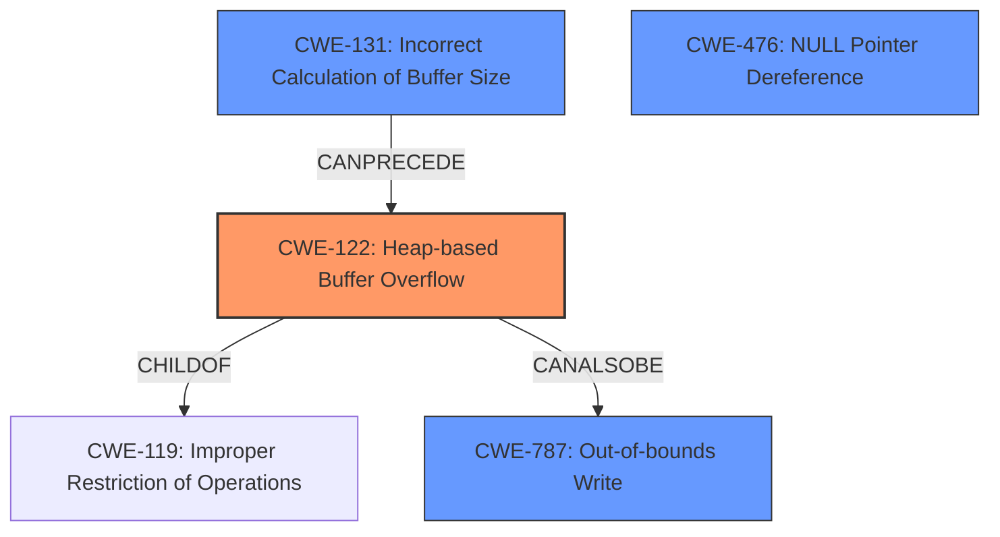

# Final Resolution for CVE-2022-35467

# Summary
| CWE ID | CWE Name | Confidence | CWE Abstraction Level | CWE Vulnerability Mapping Label | CWE-Vulnerability Mapping Notes |
|---|---|---|---|---|---|
| CWE-122 | Heap-based Buffer Overflow | 0.95 | Variant | Allowed | The vulnerability is a heap-based buffer overflow, making this the primary CWE. Insufficient bounds checking and incorrect size calculations lead to writes beyond allocated heap memory. |
| CWE-131 | **Incorrect Calculation of Buffer Size** | 0.75 | Base | Allowed | The product does not correctly calculate the size to be used when allocating a buffer, which leads to a buffer overflow. |
| CWE-787 | **Out-of-bounds Write** | 0.70 | Base | Allowed | The vulnerability involves writing data past the end of the intended buffer, a more general case of memory corruption. |
| CWE-476 | **NULL Pointer Dereference** | 0.60 | Base | Allowed | A significant number of SEGV crashes, often with the error indicating a read access to an invalid address, usually the zero page, suggesting possible null pointer dereferences. |

## Evidence and Confidence

*   **Confidence Score:** 0.90
*   **Evidence Strength:** HIGH

## Relationship Analysis
The primary CWE is CWE-122 (Heap-based Buffer Overflow), a variant of CWE-119 (Improper Restriction of Operations within the Bounds of a Memory Buffer). The root cause is identified as CWE-131 (**Incorrect Calculation of Buffer Size**), which can lead to the overflow. CWE-787 (**Out-of-bounds Write**) is a broader category that encompasses CWE-122. Finally, the inclusion of CWE-476 (**NULL Pointer Dereference**) as a secondary weakness is based on the frequent SEGV crashes which indicate possible null pointer dereferences.

## Vulnerability Chain
The vulnerability chain starts with the **incorrect calculation of the buffer size** (CWE-131). This leads to a **heap-based buffer overflow** (CWE-122), which is a specific type of **out-of-bounds write** (CWE-787). Additionally, the possibility of **NULL pointer dereferences** (CWE-476) is considered due to the frequent SEGV crashes. The root cause is the buffer size miscalculation and the impact is heap memory corruption and potential program crash due to null pointer dereferences.

## Summary of Analysis
Based on the vulnerability description stating a "**heap-buffer overflow**", CWE-122 is the most appropriate primary classification.

The criticism suggested including CWE-131 and CWE-476. The analysis strongly supports this, as the ASan reports indicate issues with buffer size calculations. This leads to the inclusion of CWE-131 (**Incorrect Calculation of Buffer Size**) as a secondary CWE. The CVE reference links content summary indicates many instances of SEGV crashes, leading to the inclusion of CWE-476 (**NULL Pointer Dereference**) as a secondary CWE as well.

The relationship analysis confirms that CWE-122 is a variant of CWE-119 and is also related to CWE-787. The addition of CWE-131 as a root cause and CWE-476 as a possible impact based on crashes enriches the analysis and provides a clearer picture of the vulnerability. All selected CWEs are at the base or variant level, which is the optimal level of specificity.