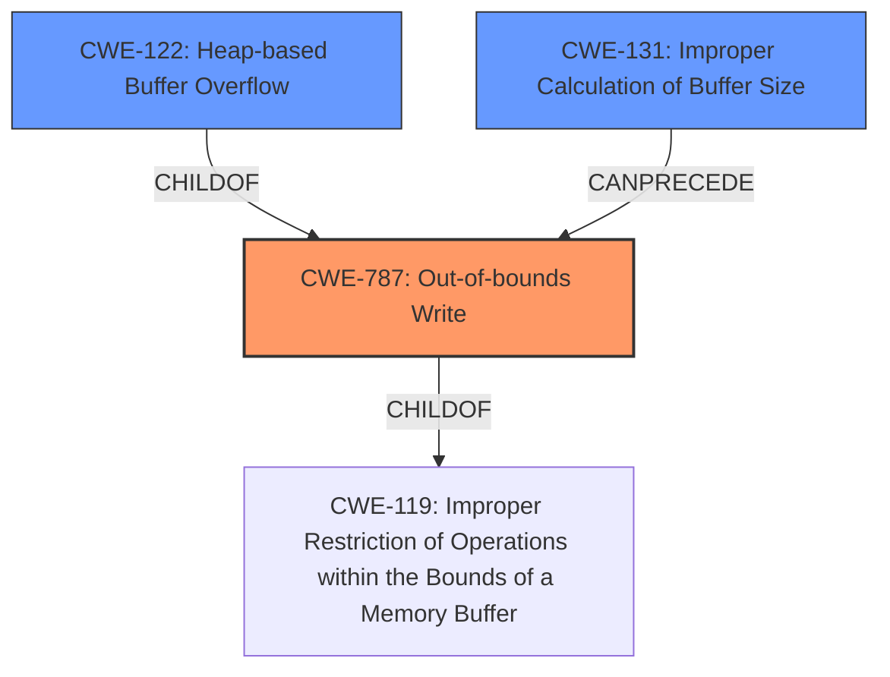

# Final Resolution for CVE-2022-35468

# Summary
| CWE ID | CWE Name | Confidence | CWE Abstraction Level | CWE Vulnerability Mapping Label | CWE-Vulnerability Mapping Notes |
|---|---|---|---|---|---|
| CWE-787 | Out-of-bounds Write | 1.0 | Base | Allowed | Primary CWE |
| CWE-122 | Heap-based Buffer Overflow | 0.6 | Variant | Allowed | Secondary Candidate |
| CWE-131 | Improper Calculation of Buffer Size | 0.5 | Base | Allowed | Secondary Candidate |
  

## Evidence and Confidence

*   **Confidence Score:** 0.8
*   **Evidence Strength:** MEDIUM

## Relationship Analysis
The primary CWE is CWE-787 (**Out-of-bounds Write**), which is supported by the vulnerability description indicating a "heap-buffer overflow." This is a base-level CWE and a child of CWE-119 (**Improper Restriction of Operations within the Bounds of a Memory Buffer**). The more specific nature of the overflow (heap) and the write operation justifies the selection of CWE-787 over its parent.

The secondary CWE candidates are CWE-122 (**Heap-based Buffer Overflow**) which is a child of CWE-787 and CWE-131 (**Improper Calculation of Buffer Size**). CWE-122 specifies the location of the buffer overflow. CWE-131 can precede CWE-787 if the size calculation is performed improperly and results in a buffer overflow due to the write operation. These relationships help define the vulnerability chain, showing how an improper calculation can lead to an out-of-bounds write, especially on the heap.

## Vulnerability Chain
The vulnerability chain starts with a potential **ROOTCAUSE** of CWE-131 (**Improper Calculation of Buffer Size**), if the size of the buffer is calculated incorrectly. This can lead to the primary **WEAKNESS** of CWE-787 (**Out-of-bounds Write**), specifically CWE-122 (**Heap-based Buffer Overflow**), where data is written past the end of the allocated buffer on the heap. The impact is a heap-buffer overflow, which can lead to arbitrary code execution or a denial-of-service (DOS) condition. This chain highlights the sequence of weaknesses and the potential consequences of the initial improper calculation and subsequent out-of-bounds write.

## Summary of Analysis
The initial analysis correctly identified CWE-787 (**Out-of-bounds Write**) as the primary CWE, which is well-supported by the vulnerability description. The addition of CWE-122 (**Heap-based Buffer Overflow**) provides more specific information about the location of the overflow.

The relationship analysis and the retriever results influenced the addition of CWE-131 (**Improper Calculation of Buffer Size**). If the size calculation is involved, this would be a reasonable addition to the vulnerability chain.

The selected CWEs are at the optimal level of specificity based on the available evidence. CWE-787 captures the fundamental issue of writing beyond buffer boundaries, while CWE-122 specifies that the overflow occurs on the heap, and CWE-131, if applicable, identifies an improper size calculation as the root cause.

The vulnerability description says: "OTFCC v0.10.4 was discovered to contain a heap-buffer overflow via /release-x64/otfccdump+0x6e420d."

The evidence for CWE-131 is not explicitly mentioned, so the confidence score is lower for this CWE.