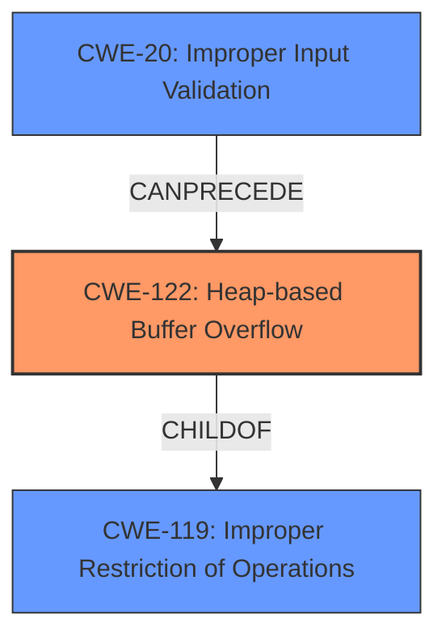

# Final Resolution for CVE-2022-35470

# Summary
| CWE ID | CWE Name | Confidence | CWE Abstraction Level | CWE Vulnerability Mapping Label | CWE-Vulnerability Mapping Notes |
|---|---|---|---|---|---|
| CWE-122 | Heap-based Buffer Overflow | 0.9 | Variant | Allowed | Primary CWE: The vulnerability is explicitly described as a heap-based buffer overflow. |
| CWE-20 | Improper Input Validation | 0.5 | Class | Allowed-with-Review | Secondary CWE: The input of a "specially crafted font file" suggests the possibility of missing input validation. |

## Evidence and Confidence

*   **Confidence Score:** 0.7
*   **Evidence Strength:** MEDIUM

## Relationship Analysis
The primary CWE is CWE-122 (**Heap-based Buffer Overflow**), which is a variant of CWE-119 (**Improper Restriction of Operations within the Bounds of a Memory Buffer**). CWE-122 is more specific due to the heap allocation context. CWE-20 (**Improper Input Validation**) is included as a secondary CWE as the "specially crafted font file" suggests that missing input validation could be a contributing factor. The relationship between CWE-20 and CWE-122 is that improper input validation (CWE-20) could lead to incorrect buffer size calculations and subsequent heap overflow (CWE-122).

## Vulnerability Chain
The vulnerability chain starts with a "specially crafted font file" (potential **ROOTCAUSE**: CWE-20). If the input validation is missing or insufficient, this could lead to an incorrect buffer size calculation. This incorrect size then results in a heap-based buffer overflow (**WEAKNESS**: CWE-122) when the data is written, leading to potential code execution or denial of service.

## Summary of Analysis
The initial analysis correctly identified CWE-122 (**Heap-based Buffer Overflow**) as the primary **WEAKNESS**, based on the explicit mention of "heap-buffer overflow" in the vulnerability description. The criticism suggests considering other related CWEs.

The inclusion of CWE-20 (**Improper Input Validation**) is based on the "specially crafted font file" input, which implies a lack of proper input validation. The confidence in CWE-20 is lower because there is no explicit evidence of missing input validation, only the implication from the vulnerability description.

The selection of CWE-122 is at the optimal level of specificity because the description clearly indicates a heap-based buffer overflow. While CWE-787 (**Out-of-bounds Write**) could also apply, CWE-122 provides more context about the location of the overflow on the heap, aligning with the vulnerability description. CWE-119 (**Improper Restriction of Operations within the Bounds of a Memory Buffer**) is too general and discouraged.