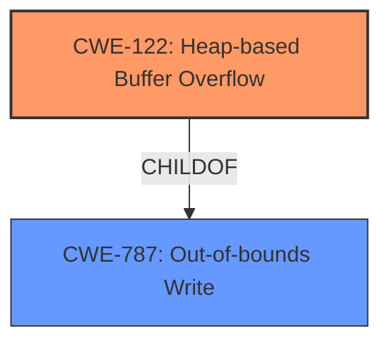

# Analysis Report for CVE-2022-35471

# Vulnerability Analysis Report: CVE-2022-35471

## Description

OTFCC v0.10.4 was discovered to contain a heap-buffer overflow via /release-x64/otfccdump+0x6e41b0.

## Vulnerability Description Key Phrases

**Weakness:** heap-buffer overflow
**Product:** OTFCC
**Version:** v0.10.4

## Analysis (with Relationship Data)

# Summary
| CWE ID | CWE Name | Confidence | CWE Abstraction Level | CWE Vulnerability Mapping Label | CWE-Vulnerability Mapping Notes |
|---|---|---|---|---|---|
| CWE-122 | Heap-based Buffer Overflow | 0.9 | Variant | Primary | Allowed |

## Evidence and Confidence

*   **Confidence Score:** 0.9
*   **Evidence Strength:** HIGH

- **Analysis and Justification:**  
  - *Explanation:* The vulnerability description explicitly states "**heap-buffer overflow**" within OTFCC v0.10.4. CWE-122 (Heap-based Buffer Overflow) directly corresponds to this type of vulnerability. It occurs when a buffer allocated on the heap is overwritten, leading to potential code execution or denial of service. The "CWE for similar CVE Descriptions" also lists CWE-787 (Out-of-bounds Write) as the primary CWE, which is a parent of CWE-122. Given the explicit mention of "heap," CWE-122 is the more specific and appropriate choice.
  
  - *Relationship Analysis:* CWE-122 is a variant of CWE-119 (Improper Restriction of Operations within the Bounds of a Memory Buffer). It is also a child of CWE-787 (Out-of-bounds Write). The relationship analysis supports choosing CWE-122 because it specifies the location of the buffer overflow as the heap.

- **Confidence Score:**  
  - Confidence: 0.9 (High confidence due to the explicit mention of "heap-buffer overflow" in the vulnerability description.)

## Criticism of Analysis

Okay, let's review the analysis and critique the CWE mapping based on the provided CWE specifications.

**Overall Assessment:**

The analysis correctly identifies CWE-122 (Heap-based Buffer Overflow) as the primary weakness. The justification is sound, and the confidence level is appropriate. The analysis also provides relevant examples and explains the relationships between CWE-122 and other related CWEs.

**Detailed Critique:**

*   **CWE-122 (Heap-based Buffer Overflow) - Confidence 0.9:**
    *   **Correctness:** The mapping to CWE-122 is accurate. The vulnerability description explicitly mentions "heap-buffer overflow," making this the most specific and appropriate CWE.
    *   **Justification:** The justification provided is strong. It correctly highlights the direct correspondence between the vulnerability description and the CWE definition. The relationship analysis further reinforces this by mentioning CWE-787 as a parent.
    *   **Abstraction Level:** CWE-122 is a Variant, which is the preferred level of abstraction as per the CWE's Mapping Guidance.
    *   **Mitigations:** The listed mitigations are relevant and standard approaches for preventing heap-based buffer overflows.
    *   **Examples:** The provided CVE examples are relevant and showcase instances of CWE-122.

*   **Considerations Based on Retriever Results and "Similar CVEs":**

    *   **CWE-787 (Out-of-bounds Write):** The "CWE for similar CVE Descriptions" lists CWE-787 as the primary match, but as the analysis correctly points out, CWE-122 is a more specific variant of CWE-787. It is good that the analysis does not blindly follow the "similar CVEs" but uses the available information to map to a more accurate CWE. The Retriever results also indicate that CWE-787 and its relatives (CWE-125, CWE-126) are relevant, however, it's important to choose the right level of abstraction that represents the specific issue, in this case, the buffer is in the heap.

    *   **CWE-119 (Improper Restriction of Operations within the Bounds of a Memory Buffer):** The analysis does not use CWE-119, which is good. The CWE specifications state that CWE-119 should be *discouraged* for use because it is too broad and can be misused in low-information vulnerability reports.

    *   **CWE-131 (Incorrect Calculation of Buffer Size):** Although buffer size calculation issues are often linked with buffer overflows, in this case, we don't have information indicating that the root cause is an incorrect calculation. If the description included something like "due to a flaw in calculating buffer size" it would be relevant, but the description is too generic.

    *   **CWE-190 (Integer Overflow or Wraparound) and CWE-681 (Incorrect Conversion between Numeric Types):** Some of the observed examples of CWE-122 involve integer overflows or incorrect conversions. However, these are typically part of a *chain* leading to the buffer overflow. If this were the case for this vulnerability, then these CWEs would also need to be considered for the analysis.

*   **CWE Specification Usage:** The analysis demonstrates good use of the CWE specifications. The explanation is well-structured and refers to key aspects of the specification, including abstraction level, relationship to other CWEs, and usage guidelines.

**Recommendations:**

*   **Chain Analysis (Optional):** While the analysis is correct in identifying the primary weakness as CWE-122, further investigation into the root cause could be beneficial. Was there a calculation error (CWE-131)? Was there a missing size check before copying data into the heap buffer (could be flagged under CWE-120)? Was there an integer overflow that led to a small memory allocation (CWE-190)? If the root cause is identifiable, adding those to the analysis as a "chain" leading to the CWE-122 could improve the clarity of the analysis.
*   **CVE Correlation:** While the current analysis does not provide any CVE correlation, if you were to provide a CVE list of heap-based buffer overflows, that would enhance the analysis.
*   **Mitigations tailoring:** While not required, if there was more information about the nature of the heap-based buffer overflow, it would be possible to tailor the mitigation advice to the specific vulnerability.

**Conclusion:**

The analysis is well-reasoned and demonstrates a solid understanding of CWE concepts and their application to the given vulnerability description. The mapping to CWE-122 is accurate, and the justification is strong. Overall, it's a very good analysis.

## Final Resolution

# Summary
| CWE ID | CWE Name | Confidence | CWE Abstraction Level | CWE Vulnerability Mapping Label | CWE-Vulnerability Mapping Notes |
|---|---|---|---|---|---|
| CWE-122 | Heap-based Buffer Overflow | 0.95 | Variant | Primary | Allowed |

## Evidence and Confidence

*   **Confidence Score:** 0.95
*   **Evidence Strength:** HIGH

## Relationship Analysis
The primary relationship considered was the parent-child relationship between CWE-787 (**CWE-787: Out-of-bounds Write**) and CWE-122 (**CWE-122: Heap-based Buffer Overflow**). CWE-122 is a variant of CWE-787, specifying that the out-of-bounds write occurs on the heap. This specificity is critical for accurate classification, as the vulnerability description explicitly mentions a "heap-buffer overflow." While other CWEs like CWE-190 (**CWE-190: Integer Overflow or Wraparound**) or CWE-131 could potentially precede CWE-122 in a vulnerability chain, there is no direct evidence in the provided vulnerability description to support their inclusion.

## Vulnerability Chain
The vulnerability chain starts with an unspecified **ROOTCAUSE** that leads to an **WEAKNESS**: CWE-122 (**CWE-122: Heap-based Buffer Overflow**). The impact of this overflow could include code execution or denial of service. Without further information, the exact root cause remains unknown, potentially involving incorrect size calculations, missing bounds checks, or integer overflows.

## Summary of Analysis
The initial analysis correctly identified CWE-122 (**CWE-122: Heap-based Buffer Overflow**) as the primary **WEAKNESS**, based on the explicit mention of "heap-buffer overflow" in the vulnerability description: "OTFCC v0.10.4 was discovered to contain a heap-buffer overflow via /release-x64/otfccdump+0x6e41b0." The criticism provides sound advice, especially regarding potential vulnerability chains. However, in the absence of concrete evidence pointing to a specific root cause like CWE-131 (**CWE-131: Improper Calculation of Buffer Size**) or CWE-190 (**CWE-190: Integer Overflow or Wraparound**), focusing on the most specific and directly supported **WEAKNESS**, CWE-122, is the optimal approach. The decision is based on both the direct match and the relationship analysis, which confirms CWE-122 as a variant of CWE-787 (**CWE-787: Out-of-bounds Write**), further solidifying its appropriateness. The confidence is high (0.95) due to the explicit evidence and the accurate level of specificity.

*Report generated on 2025-03-18 15:29:07*
