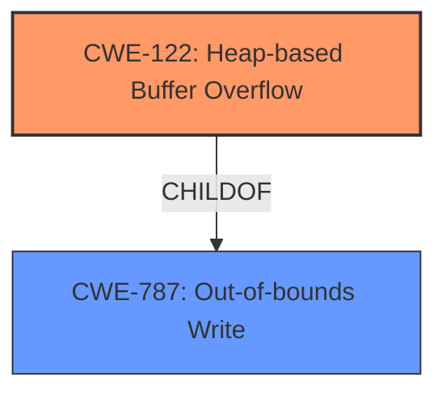

# Final Resolution for CVE-2022-35471

# Summary
| CWE ID | CWE Name | Confidence | CWE Abstraction Level | CWE Vulnerability Mapping Label | CWE-Vulnerability Mapping Notes |
|---|---|---|---|---|---|
| CWE-122 | Heap-based Buffer Overflow | 0.95 | Variant | Primary | Allowed |

## Evidence and Confidence

*   **Confidence Score:** 0.95
*   **Evidence Strength:** HIGH

## Relationship Analysis
The primary relationship considered was the parent-child relationship between CWE-787 (**CWE-787: Out-of-bounds Write**) and CWE-122 (**CWE-122: Heap-based Buffer Overflow**). CWE-122 is a variant of CWE-787, specifying that the out-of-bounds write occurs on the heap. This specificity is critical for accurate classification, as the vulnerability description explicitly mentions a "heap-buffer overflow." While other CWEs like CWE-190 (**CWE-190: Integer Overflow or Wraparound**) or CWE-131 could potentially precede CWE-122 in a vulnerability chain, there is no direct evidence in the provided vulnerability description to support their inclusion.

## Vulnerability Chain
The vulnerability chain starts with an unspecified **ROOTCAUSE** that leads to an **WEAKNESS**: CWE-122 (**CWE-122: Heap-based Buffer Overflow**). The impact of this overflow could include code execution or denial of service. Without further information, the exact root cause remains unknown, potentially involving incorrect size calculations, missing bounds checks, or integer overflows.

## Summary of Analysis
The initial analysis correctly identified CWE-122 (**CWE-122: Heap-based Buffer Overflow**) as the primary **WEAKNESS**, based on the explicit mention of "heap-buffer overflow" in the vulnerability description: "OTFCC v0.10.4 was discovered to contain a heap-buffer overflow via /release-x64/otfccdump+0x6e41b0." The criticism provides sound advice, especially regarding potential vulnerability chains. However, in the absence of concrete evidence pointing to a specific root cause like CWE-131 (**CWE-131: Improper Calculation of Buffer Size**) or CWE-190 (**CWE-190: Integer Overflow or Wraparound**), focusing on the most specific and directly supported **WEAKNESS**, CWE-122, is the optimal approach. The decision is based on both the direct match and the relationship analysis, which confirms CWE-122 as a variant of CWE-787 (**CWE-787: Out-of-bounds Write**), further solidifying its appropriateness. The confidence is high (0.95) due to the explicit evidence and the accurate level of specificity.