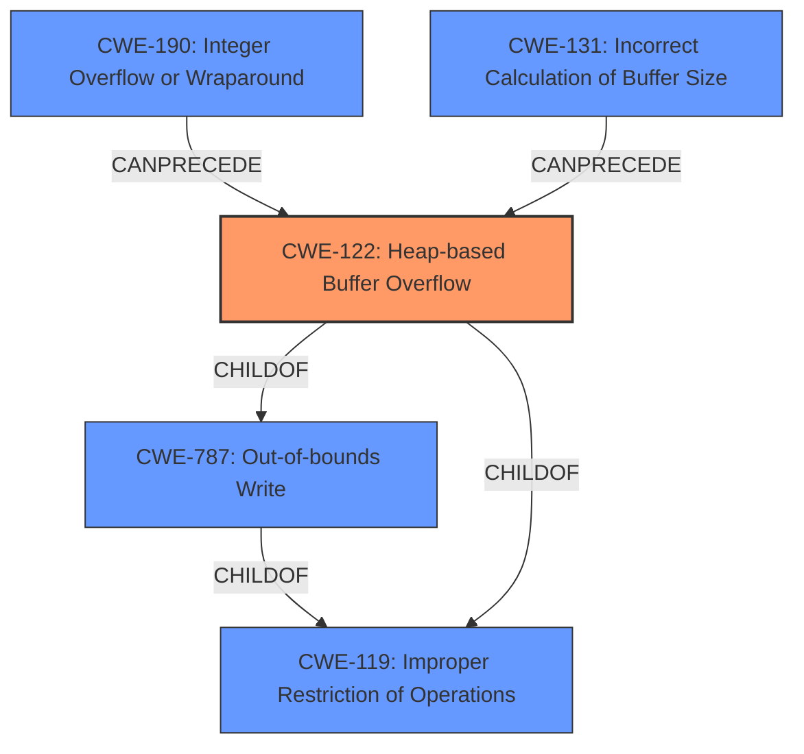

# Final Resolution for CVE-2022-35474

# Summary
| CWE ID | CWE Name | Confidence | CWE Abstraction Level | CWE Vulnerability Mapping Label | CWE-Vulnerability Mapping Notes |
|---|---|---|---|---|---|
| CWE-122 | Heap-based Buffer Overflow | 0.95 | Variant | Allowed | Primary CWE. Directly addresses the **heap-based overflow**. |
| CWE-787 | Out-of-bounds Write | 0.70 | Base | Allowed | Secondary Candidate. Captures the general write beyond buffer boundaries, but less specific than CWE-122. |

## Evidence and Confidence

*   **Confidence Score:** 0.95
*   **Evidence Strength:** HIGH

## Relationship Analysis
The primary CWE, CWE-122 (Heap-based Buffer Overflow), is a variant of the base CWE, CWE-787 (Out-of-bounds Write), indicating a hierarchical relationship where CWE-122 is a more specific instance of CWE-787. Both CWE-122 and CWE-787 are children of CWE-119 (Improper Restriction of Operations within the Bounds of a Memory Buffer). The criticism suggested that integer overflows (CWE-190) or incorrect buffer size calculations (CWE-131) could lead to the heap-based buffer overflow, indicating potential chain relationships where these CWEs can precede CWE-122. The analysis also correctly notes that CWE-122 is a *child* of CWE-787 to further illustrate the relationship between the chosen primary and secondary CWE.

## Vulnerability Chain
The vulnerability chain starts with a potential **root cause** like an integer overflow (**CWE-190**) or incorrect buffer size calculation (**CWE-131**). This leads to a **weakness** where an insufficient buffer is allocated. The primary **weakness** is then a **heap-based buffer overflow** (**CWE-122**), which is a specific type of **out-of-bounds write** (**CWE-787**). The final **impact** could be arbitrary code execution and privilege escalation.

## Summary of Analysis
The initial analysis, as well as the criticism, both support classifying the vulnerability as **CWE-122 (Heap-based Buffer Overflow)** as the primary CWE, due to the explicit mention of "heap-buffer overflow" in the vulnerability description. As stated in the initial analysis: "The vulnerability description explicitly mentions a **heap-buffer overflow** in OTFCC v0.10.4. The CVE Reference Links Content Summary also confirms multiple heap-based buffer overflow vulnerabilities due to insufficient bounds checking. CWE-122 (Heap-based Buffer Overflow) is a Variant-level CWE that directly addresses this type of overflow, making it the most appropriate primary mapping."

The secondary CWE, **CWE-787 (Out-of-bounds Write)**, is appropriate because it captures the general **weakness** of writing beyond allocated memory, even though CWE-122 is more specific. As stated in the initial analysis, "*Explanation:* CWE-787 (Out-of-bounds Write) is considered a secondary candidate because it represents a more general class of the **weakness**. Although the description specifies a heap-buffer overflow, the underlying issue is writing data past the allocated buffer."

The relationship analysis reinforces this decision, as CWE-122 is a child of CWE-787, indicating that it is a more specific type of out-of-bounds write. The chain relationships, where CWE-190 or CWE-131 can precede CWE-122, provide further context.

The selected CWEs are at the optimal level of specificity because CWE-122 directly addresses the heap-based nature of the overflow, while CWE-787 provides a broader characterization. Alternative CWEs, such as CWE-120 (Classic Buffer Overflow), were considered but rejected because they are less specific than CWE-122. CWE-119 was considered and not chosen since it is a discouraged Class level CWE.