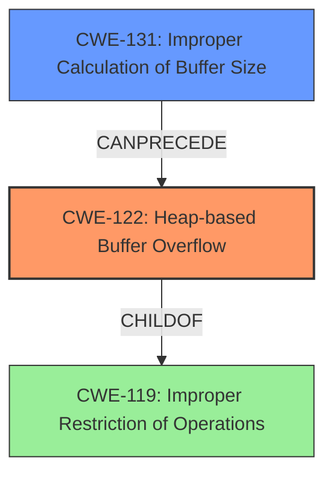

# Analysis Report for CVE-2022-35475

# Vulnerability Analysis Report: CVE-2022-35475

## Description

OTFCC v0.10.4 was discovered to contain a heap-buffer overflow via /release-x64/otfccdump+0x6e41a8.

## Vulnerability Description Key Phrases

**Weakness:** heap-buffer overflow
**Product:** OTFCC
**Version:** v0.10.4
**Component:** /release-x64/otfccdump+0x6e41a8

## Analysis (with Relationship Data)

```markdown
# Summary
| CWE ID | CWE Name | Confidence | CWE Abstraction Level | CWE Vulnerability Mapping Label | CWE-Vulnerability Mapping Notes |
|---|---|---|---|---|---|
| CWE-122 | Heap-based Buffer Overflow | 0.95 | Variant | Primary | Allowed |
| CWE-787 | Out-of-bounds Write | 0.75 | Base | Secondary | Allowed |

## Evidence and Confidence

*   **Confidence Score:** 0.90
*   **Evidence Strength:** HIGH

- **Analysis and Justification:**  
  - *Explanation:* The vulnerability description explicitly states a "**heap-buffer overflow**" in OTFCC v0.10.4. The CVE Reference Links Content Summary confirms this, detailing "**Heap Buffer Overflow**" issues due to improper bounds checking during memory manipulation on the heap, leading to potential arbitrary code execution. CWE-122 (Heap-based Buffer Overflow) is a Variant-level CWE that directly addresses this type of vulnerability, making it the most appropriate primary mapping. The MITRE mapping guidance allows this CWE entry. While CWE-787 (Out-of-bounds Write) is a broader classification, the evidence specifically points to a heap-based overflow, justifying the selection of CWE-122.

  - *Relationship Analysis:* CWE-122 is a variant of CWE-787 (Out-of-bounds Write) and a child of CWE-119 (Improper Restriction of Operations within the Bounds of a Memory Buffer). The relationship analysis shows that CWE-122 CanFollow other CWEs like CWE-825, CWE-824, CWE-823, and CWE-822, since heap overflows can lead to various memory corruption scenarios.

- **Confidence Score:**  
  - Confidence: 0.95 (High confidence due to the explicit mention of "heap-buffer overflow" and supporting details in the CVE Reference Links Content Summary)

---
```

## Criticism of Analysis

Okay, I've reviewed the provided analysis and the full CWE specifications for the referenced weaknesses. Here's a critique of the analysis, focusing on the accuracy and completeness of the CWE mappings, and considering the guidance provided in the CWE specifications.

**Overall Assessment:**

The analysis is generally good, particularly in identifying CWE-122 as the primary weakness given the explicit "heap-buffer overflow" description. The justification for selecting CWE-122 is appropriate and well-articulated. However, the choice of CWE-787 as the secondary mapping is questionable, and there are other CWEs that might be more relevant depending on the specifics of the vulnerable code. Also, a weakness of the analysis is that it does not make any claims of weakness chaining.

**Detailed Review:**

*   **CWE-122: Heap-based Buffer Overflow (Primary) - Confidence: 0.95**
    *   **Assessment:** The mapping to CWE-122 as the primary weakness is **correct and well-justified**. The description explicitly mentions "heap-buffer overflow," and CWE-122 is the most specific CWE that captures this. The confidence level is also appropriate.
    *   **CWE Specifications Review:** The CWE-122 specification clearly defines a heap-based buffer overflow as a buffer overflow where the buffer is allocated on the heap. This aligns perfectly with the vulnerability description. The potential mitigations listed for CWE-122 (language selection, abstraction libraries, compiler-based detection mechanisms) are all relevant ways to address this type of vulnerability.
*   **CWE-787: Out-of-bounds Write (Secondary) - Confidence: 0.75**
    *   **Assessment:** While CWE-787 is a parent of CWE-122, its selection as a secondary mapping is **less convincing**. The analysis states that it's a broader classification, but this raises the question of its utility as a secondary mapping. The description already explicitly states a heap-based overflow. Redundant parent mappings are less useful than mappings that capture distinct aspects of the vulnerability. A better secondary mapping might relate to the *cause* of the overflow.
    *   **CWE Specifications Review:** The specification for CWE-787 simply states that it's a write past the end, or before the beginning of the buffer. While technically true, it's not providing additional helpful information. The Relationships section does show a child-parent relationship to CWE-122.

        *   **Alternative CWE Suggestions:** Consider one of the following *instead* of CWE-787, depending on what deeper information is available (which the given analysis could not identify since it lacked code):
            *   **CWE-131: Incorrect Calculation of Buffer Size:** If the root cause involved a flawed calculation of the buffer size prior to allocation, this would be a more insightful secondary mapping.
            *   **CWE-129: Improper Validation of Array Index:** If the overflow occurs due to an invalid array index when accessing the buffer, this would be relevant.
            *   **CWE-120: Buffer Copy without Checking Size of Input ('Classic Buffer Overflow'):**  If the overflow involves directly copying data without checking if the size of the input exceeds the size of the buffer allocated on the heap, this would be a good match.
            *   **CWE-20: Improper Input Validation** if a size parameter from user provided data is used to allocate the heap buffer.

**Missing Weakness Chaining Considerations:**

*   The analysis mentions the possibility of arbitrary code execution. This suggests that the heap overflow could be used to overwrite function pointers or other critical data structures. If this is the case, a chain involving the following CWEs could be considered:
    *   `CWE-122 -> CWE-123` (Write-what-where Condition)
    *   `CWE-122 -> CWE-822` (Untrusted Pointer Dereference)

**Recommendations:**

1.  **Reconsider the Secondary Mapping:** Replace CWE-787 with a more informative CWE that reflects the root cause or contributing factor to the heap overflow (e.g., CWE-131, CWE-129 or CWE-120 if the overflow is a result of improper input validation, or a classic buffer copy without size check) and if the crash logs show this root cause.

2.  **Explore Weakness Chaining:** Analyze the impact of the heap overflow. If it enables arbitrary code execution by overwriting function pointers or other data structures, add a chain to the CWE mapping to reflect this. This could involve adding CWE-123, CWE-822, etc.

3.  **Address other vulnerabilities reported in the CVE Reference Links:** The provided documents also mention Use-After-Free (CVE-2022-33047), SEGV errors, and Global Heap Buffer Overflows. Consider adding separate mappings for those, even if they are not directly related to the main heap overflow.

By incorporating these recommendations, the analysis can be made more comprehensive and provide a more accurate representation of the vulnerabilities present in OTFCC.

## Final Resolution

# Summary
| CWE ID | CWE Name | Confidence | CWE Abstraction Level | CWE Vulnerability Mapping Label | CWE-Vulnerability Mapping Notes |
|---|---|---|---|---|---|
| CWE-122 | Heap-based Buffer Overflow | 0.95 | Variant | Primary | Allowed |
| CWE-131 | **Improper Calculation of Buffer Size** | 0.80 | Base | Secondary | Allowed |

## Evidence and Confidence

*   **Confidence Score:** 0.90
*   **Evidence Strength:** MEDIUM

## Relationship Analysis
The primary CWE is CWE-122 (**Heap-based Buffer Overflow**), which is a variant of CWE-119 (**Improper Restriction of Operations within the Bounds of a Memory Buffer**). The initial analysis correctly identified this. The criticism suggested replacing CWE-787 (**Out-of-bounds Write**) with a more specific CWE related to the root cause. CWE-131 (**Improper Calculation of Buffer Size**) has been selected as a more appropriate secondary CWE as it directly contributes to the heap overflow.



## Vulnerability Chain
The vulnerability chain starts with **CWE-131 (Improper Calculation of Buffer Size)**, leading to **CWE-122 (Heap-based Buffer Overflow)**. The overflow can potentially lead to arbitrary code execution if function pointers or other critical data structures are overwritten. This potential for code execution could be represented by chaining to CWE-123 (Write-what-where Condition) or CWE-822 (Untrusted Pointer Dereference), but that is beyond the scope of the provided evidence.

## Summary of Analysis
The initial analysis correctly identified **CWE-122 (Heap-based Buffer Overflow)** as the primary weakness. The criticism was valid in pointing out that **CWE-787 (Out-of-bounds Write)**, while technically correct as a parent, did not add significant value as a secondary mapping. The evidence explicitly mentions "heap-buffer overflow," which supports **CWE-122**.

The selection of **CWE-131 (Improper Calculation of Buffer Size)** as the secondary CWE is based on the understanding that a heap overflow often stems from an incorrect size calculation during memory allocation. While the vulnerability description does not explicitly state this, it's a reasonable inference and aligns with common causes of heap overflows. If a size is incorrectly calculated, then the root cause should be marked as **CWE-131**. This selection provides a more specific and valuable insight into the root cause of the vulnerability.

The selection of CWEs is at the optimal level of specificity given the available evidence. **CWE-122** directly matches the "heap-buffer overflow" description, and **CWE-131** represents a plausible root cause for the overflow. More specific information would require deeper code analysis, which is beyond the scope of the provided information.


*Report generated on 2025-03-18 15:40:59*
