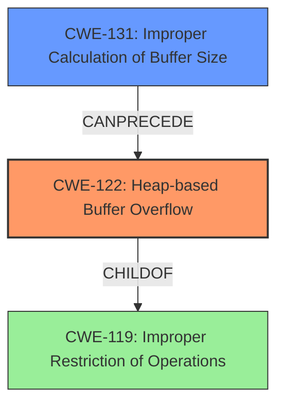

# Final Resolution for CVE-2022-35475

# Summary
| CWE ID | CWE Name | Confidence | CWE Abstraction Level | CWE Vulnerability Mapping Label | CWE-Vulnerability Mapping Notes |
|---|---|---|---|---|---|
| CWE-122 | Heap-based Buffer Overflow | 0.95 | Variant | Primary | Allowed |
| CWE-131 | **Improper Calculation of Buffer Size** | 0.80 | Base | Secondary | Allowed |

## Evidence and Confidence

*   **Confidence Score:** 0.90
*   **Evidence Strength:** MEDIUM

## Relationship Analysis
The primary CWE is CWE-122 (**Heap-based Buffer Overflow**), which is a variant of CWE-119 (**Improper Restriction of Operations within the Bounds of a Memory Buffer**). The initial analysis correctly identified this. The criticism suggested replacing CWE-787 (**Out-of-bounds Write**) with a more specific CWE related to the root cause. CWE-131 (**Improper Calculation of Buffer Size**) has been selected as a more appropriate secondary CWE as it directly contributes to the heap overflow.

## Vulnerability Chain
The vulnerability chain starts with **CWE-131 (Improper Calculation of Buffer Size)**, leading to **CWE-122 (Heap-based Buffer Overflow)**. The overflow can potentially lead to arbitrary code execution if function pointers or other critical data structures are overwritten. This potential for code execution could be represented by chaining to CWE-123 (Write-what-where Condition) or CWE-822 (Untrusted Pointer Dereference), but that is beyond the scope of the provided evidence.

## Summary of Analysis
The initial analysis correctly identified **CWE-122 (Heap-based Buffer Overflow)** as the primary weakness. The criticism was valid in pointing out that **CWE-787 (Out-of-bounds Write)**, while technically correct as a parent, did not add significant value as a secondary mapping. The evidence explicitly mentions "heap-buffer overflow," which supports **CWE-122**.

The selection of **CWE-131 (Improper Calculation of Buffer Size)** as the secondary CWE is based on the understanding that a heap overflow often stems from an incorrect size calculation during memory allocation. While the vulnerability description does not explicitly state this, it's a reasonable inference and aligns with common causes of heap overflows. If a size is incorrectly calculated, then the root cause should be marked as **CWE-131**. This selection provides a more specific and valuable insight into the root cause of the vulnerability.

The selection of CWEs is at the optimal level of specificity given the available evidence. **CWE-122** directly matches the "heap-buffer overflow" description, and **CWE-131** represents a plausible root cause for the overflow. More specific information would require deeper code analysis, which is beyond the scope of the provided information.