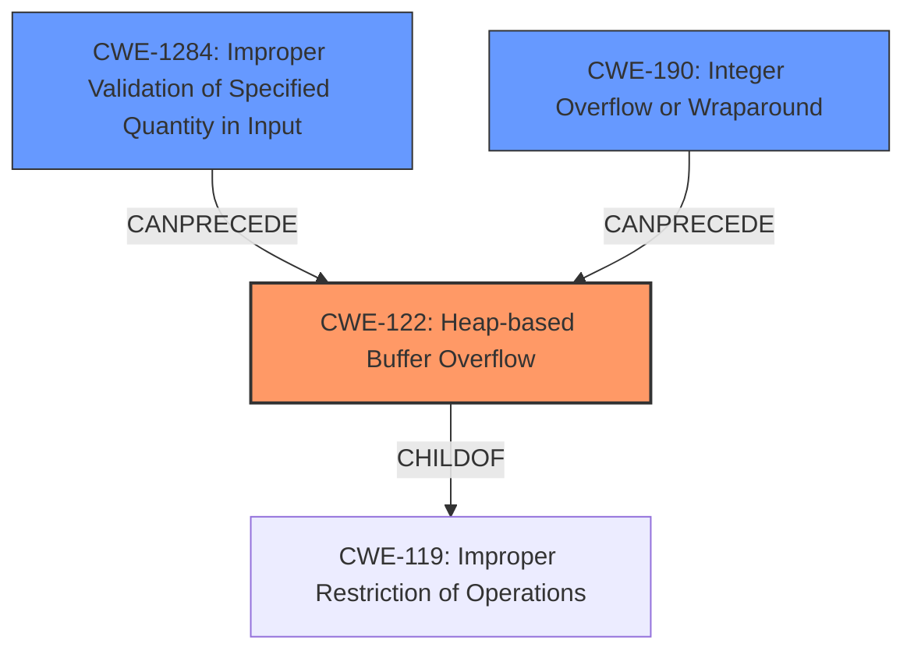

# Final Resolution for CVE-2022-35623

# Summary
| CWE ID | CWE Name | Confidence | CWE Abstraction Level | CWE Vulnerability Mapping Label | CWE-Vulnerability Mapping Notes |
|---|---|---|---|---|---|
| CWE-122 | Heap-based Buffer Overflow | 0.95 | Variant | Allowed | Primary CWE |
| CWE-1284 | Improper Validation of Specified Quantity in Input | 0.70 | Base | Allowed | Secondary Candidate |
| CWE-190 | Integer Overflow or Wraparound | 0.65 | Base | Allowed | Secondary Candidate |

## Evidence and Confidence

*   **Confidence Score:** 0.90
*   **Evidence Strength:** HIGH

## Relationship Analysis
The primary weakness is a **heap overflow** (**CWE-122**). This is influenced by potential **improper validation of input** (**CWE-1284**) related to size, and a potential **integer overflow** (**CWE-190**) when calculating the buffer size. **CWE-122** is a variant of **CWE-119**, providing specificity. **CWE-1284** can precede **CWE-789** which in turn can lead to **CWE-122** if the allocated memory is subsequently overflowed. **CWE-190** can also precede **CWE-122** if the overflow results from an incorrectly calculated size.

## Vulnerability Chain
The vulnerability chain starts with either **CWE-1284** or **CWE-190**.

1.  **CWE-1284** (Improper Validation of Specified Quantity in Input): The product receives input specifying a quantity (size) but fails to validate it properly.
2.  **CWE-190** (Integer Overflow or Wraparound): An integer overflow occurs during the calculation of the buffer size.
3.  This leads to a heap allocation where the allocated buffer is smaller than expected.
4.  During the reassembly of transport layer packets, data is written beyond the boundaries of the allocated buffer on the heap, resulting in **CWE-122** (Heap-based Buffer Overflow).

The impact is a **heap overflow** which can lead to code execution or denial of service.

## Summary of Analysis
The initial analysis correctly identified **CWE-122** (Heap-based Buffer Overflow) as the primary weakness due to the explicit mention of a "**heap overflow**" in the vulnerability description. The suggestion to consider **CWE-130** or **CWE-1284** is valid. Given that **CWE-1284 (Improper Validation of Specified Quantity in Input)** has a higher retriever score than **CWE-130** and aligns with the description, it is more appropriate as a secondary weakness. The re-evaluation of confidence scores is incorporated, with a focus on the speculative nature of the secondary weaknesses. The graph relationships support the chain of events leading to the **heap overflow**. The chosen CWEs are at an optimal level of specificity, with **CWE-122** being a Variant and **CWE-1284** and **CWE-190** being at the Base level of abstraction. The final determination is based on evidence from the vulnerability description and consideration of CWE relationships and mapping guidance. The final confidence score is high due to the explicit evidence of the heap overflow.