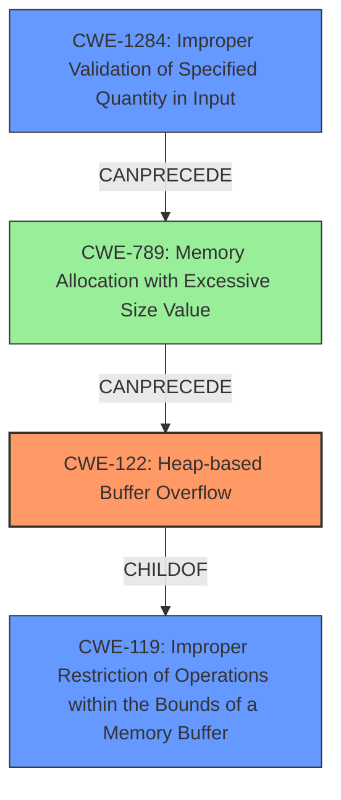

# Final Resolution for CVE-2022-35624

# Summary
| CWE ID | CWE Name | Confidence | CWE Abstraction Level | CWE Vulnerability Mapping Label | CWE-Vulnerability Mapping Notes |
|---|---|---|---|---|---|
| CWE-122 | Heap-based Buffer Overflow | 0.95 | Variant | Allowed | Primary CWE |
| CWE-1284 | Improper Validation of Specified Quantity in Input | 0.75 | Base | Allowed | Secondary Candidate |
| CWE-789 | Memory Allocation with Excessive Size Value | 0.60 | Variant | Allowed | Tertiary Candidate|

## Evidence and Confidence

*   **Confidence Score:** 0.90
*   **Evidence Strength:** HIGH

## Relationship Analysis
The primary relationship is that the **improper validation of input (CWE-1284)** can lead to **excessive memory allocation (CWE-789)**, which then results in a **heap-based buffer overflow (CWE-122)**. CWE-122 is a child of CWE-119 (**Improper Restriction of Operations within the Bounds of a Memory Buffer**), providing a hierarchical context. The chain relationship highlights how the initial validation failure progresses to a critical memory corruption issue.

## Vulnerability Chain
The vulnerability chain starts with the **ROOTCAUSE** of **CWE-1284 (Improper Validation of Specified Quantity in Input)**. This leads to **CWE-789 (Memory Allocation with Excessive Size Value)**, where an excessive amount of memory is allocated based on the unvalidated input. Finally, this excessive memory allocation results in **CWE-122 (Heap-based Buffer Overflow)** when the data is written into the heap buffer.

The sequence is:
1.  **CWE-1284**: Input with `SegO > SegN` is not validated.
2.  **CWE-789**: Memory is allocated based on the invalid `SegO` and `SegN` values.
3.  **CWE-122**: A heap buffer overflow occurs when writing data into the allocated memory.

## Summary of Analysis
The initial analysis and criticism both accurately identify **CWE-122 (Heap-based Buffer Overflow)** as the primary issue, supported by the vulnerability description stating "heap overflow." The condition `SegO > SegN` strongly suggests **CWE-1284 (Improper Validation of Specified Quantity in Input)** as a contributing factor. The addition of **CWE-789 (Memory Allocation with Excessive Size Value)** as a tertiary candidate further clarifies the vulnerability chain, as the improper validation directly leads to an excessive memory allocation that triggers the overflow.

The graph relationships influenced the selection by highlighting the progression from input validation failure to memory allocation issues and finally to the heap overflow. This chain of events provides a more complete picture of the vulnerability.

The selected CWEs are at the optimal level of specificity. **CWE-122 (Heap-based Buffer Overflow)** is a variant, providing more specific information than its parent **CWE-119 (Improper Restriction of Operations within the Bounds of a Memory Buffer)**. **CWE-1284 (Improper Validation of Specified Quantity in Input)** is a base CWE, representing the **ROOTCAUSE** of the validation failure. **CWE-789 (Memory Allocation with Excessive Size Value)** further clarifies the issue related to the amount of memory allocation.

Confidence in the analysis is high (0.90) due to the clear evidence from the vulnerability description and the logical progression of the vulnerability chain. The use of MITRE mapping guidance further supports the selection of these CWEs.