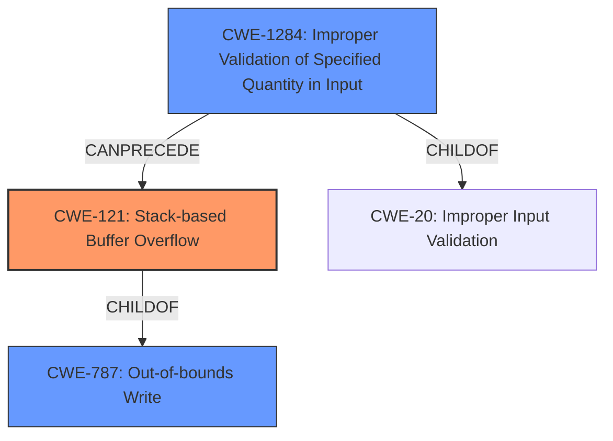

# Analysis Report for CVE-2022-35690

# Vulnerability Analysis Report: CVE-2022-35690

## Description

Adobe ColdFusion versions Update 14 (and earlier) and Update 4 (and earlier) are affected by a Stack-based Buffer Overflow vulnerability that could result in arbitrary code execution in the context of the current user. Exploitation of this issue does not require user interaction, the vulnerability is triggered when a crafted network packet is sent to the server.

## Vulnerability Description Key Phrases

**Weakness:** Stack-based Buffer Overflow
**Impact:** arbitrary code execution
**Vector:** crafted network packet
**Product:** Adobe ColdFusion
**Version:** Update 14 (and earlier) and Update 4 (and earlier)

## Analysis (with Relationship Data)

# Summary
| CWE ID | CWE Name | Confidence | CWE Abstraction Level | CWE Vulnerability Mapping Label | CWE-Vulnerability Mapping Notes |
|---|---|---|---|---|---|
| CWE-121 | Stack-based Buffer Overflow | 1.0 | Variant | Primary | Allowed |
| CWE-787 | Out-of-bounds Write | 0.75 | Base | Secondary Candidate | Allowed |
| CWE-1284 | Improper Validation of Specified Quantity in Input | 0.5 | Base | Secondary Candidate | Allowed |

## Evidence and Confidence

*   **Confidence Score:** 0.9
*   **Evidence Strength:** HIGH

- **Analysis and Justification:**  
  - *Explanation:* The vulnerability description explicitly states a "**Stack-based Buffer Overflow**" vulnerability exists. This directly corresponds to CWE-121 (Stack-based Buffer Overflow), a Variant of CWE-119 (Improper Restriction of Operations within the Bounds of a Memory Buffer). The CVE Reference Links Content Summary confirms the presence of a stack-based buffer overflow. Given the explicit mention of "stack-based," CWE-121 is a more precise match than its parent, CWE-119, or the more general CWE-787 (Out-of-bounds Write). MITRE mapping guidance allows the use of CWE-121. The attack vector being a crafted network packet further supports the likelihood of a buffer overflow on the stack during packet processing.
  
  - *Relationship Analysis:* CWE-121 is a Variant of CWE-119, and a child of CWE-787. The explicit "stack-based" nature of the overflow makes CWE-121 the most appropriate choice. CWE-121 can be a result of various causes, including **Improper Validation of Specified Quantity in Input** (CWE-1284).

- **Confidence Score:**
  - Confidence: 1.0 (Direct evidence from the vulnerability description)

---

- **Analysis and Justification:**
  - *Explanation:* CWE-787 (Out-of-bounds Write) is a general case of writing data past the end or before the beginning of an intended buffer. While the primary weakness is CWE-121 (Stack-based Buffer Overflow), CWE-787 is still relevant. The description indicates that a buffer overflow occurs, which is essentially an out-of-bounds write. The "Top CWEs" section also lists CWE-787 as the most frequent match for similar CVE descriptions. The Retriever Results also list CWE-787 with a high score.
  - *Relationship Analysis:* CWE-787 is a parent of CWE-121. While CWE-121 is more specific, CWE-787 provides a broader context. The graph relationships show CWE-787 can follow CWE-824 (Access of Uninitialized Pointer) or CWE-825 (Expired Pointer Dereference), hinting at possible prerequisite conditions, although there's no explicit evidence for these in the provided description.

- **Confidence Score:**
  - Confidence: 0.75 (Supporting evidence from description and retriever results, but less specific than CWE-121)

---

- **Analysis and Justification:**
  - *Explanation:* CWE-1284 (Improper Validation of Specified Quantity in Input) could be a contributing factor. The vulnerability is triggered when a crafted network packet is sent to the server, suggesting the possibility that the size or length parameters within the packet are not properly validated, leading to the overflow. If the software doesn't correctly validate the size of data being read from the network packet before copying it to a stack buffer, it could lead to the overflow.
  - *Relationship Analysis:* CWE-1284 is a child of CWE-20 (Improper Input Validation) and can precede CWE-789 (Memory Allocation with Excessive Size Value), implying a potential chain of vulnerabilities. However, without more specific details about the code's input validation process, the connection is speculative.

- **Confidence Score:**
  - Confidence: 0.5 (Possible contributing factor, but lacking direct evidence)

## Criticism of Analysis

Okay, I've reviewed the provided analysis and the full CWE specifications. Here's my critique:

**Overall Assessment:**

The analysis is generally well-reasoned and provides good justification for the chosen CWE mappings. The confidence scoring is appropriate, and the relationship analysis between CWEs is helpful. However, there are a few areas where the analysis could be strengthened or refined.

**Specific Feedback:**

*   **CWE-121: Stack-based Buffer Overflow (Primary)**
    *   **Strengths:** The justification for CWE-121 as the primary weakness is strong. The vulnerability description explicitly states "Stack-based Buffer Overflow," making this the most direct and accurate mapping. The high confidence score (1.0) is warranted.
    *   **Potential Improvement:** While the analysis mentions the attack vector (crafted network packet) further supports the likelihood of a buffer overflow on the stack, it might be beneficial to briefly explain *why* network packet processing is often associated with stack allocation (e.g., local variables used to parse the packet data).
*   **CWE-787: Out-of-bounds Write (Secondary Candidate)**
    *   **Strengths:** The rationale for including CWE-787 as a secondary candidate is sound. A stack-based buffer overflow is, by definition, an out-of-bounds write. The inclusion of this CWE provides a broader context. The confidence score of 0.75 is reasonable.
    *   **Potential Improvement:** It's worth noting that the description *specifically* mentions the stack. If there was no other information to specify stack based or not, then CWE-787 would be more appropriate. Since it's specifically stack based this makes CWE-121 the better fit.
*   **CWE-1284: Improper Validation of Specified Quantity in Input (Secondary Candidate)**
    *   **Strengths:** Identifying CWE-1284 as a *potential* contributing factor is a good observation. The connection to a crafted network packet and the possibility of improper size/length validation is logical.
    *   **Potential Improvements:**
        *   The analysis relies heavily on speculation ("possibility," "could be," "suggesting the possibility"). While it's important to consider contributing factors, the confidence score (0.5) reflects the lack of direct evidence.
        *   To strengthen this point, consider mentioning that network protocols often include length fields in their headers, and a failure to validate these fields *before* copying data into a buffer could directly lead to a stack-based buffer overflow.
        *   Given the discouragement of using CWE-20, it might be better to focus on a more specific child of CWE-20, even if the evidence is still circumstantial.

**General Comments and Suggestions:**

*   **Level of Abstraction:** The analysis adheres well to the CWE's recommendations for preferred levels of abstraction. CWE-121 (Variant) and CWE-787 (Base) are appropriate choices.
*   **Mitigation Considerations:** The analysis could be enhanced by briefly mentioning relevant mitigations related to each CWE. For example:
    *   **CWE-121:** Use compiler-based buffer overflow detection mechanisms (e.g., /GS flag in Visual Studio, StackGuard, ProPolice).
    *   **CWE-787:** Employ memory-safe languages or libraries (SafeStr, Strsafe.h).
    *   **CWE-1284:** Implement strict input validation, using an "accept known good" strategy.
*   **Retriever Results:** The analysis mentions the Retriever Results, but it doesn't explicitly use those results to justify the CWE selections. It would be more compelling if the analysis integrated the Retriever scores more directly into the justification.
*   **Chain Analysis:** While the analysis mentions the relationships between CWEs, it could be further strengthened by exploring potential *chains* of weaknesses. For example: "Improper Validation of Specified Quantity in Input (CWE-1284) *could lead to* a Stack-based Buffer Overflow (CWE-121) because the unvalidated length is used to copy data onto the stack."

**Revised Summary Table (Incorporating Suggestions):**

| CWE ID  | CWE Name                                      | Confidence | CWE Abstraction Level | CWE Vulnerability Mapping Label | CWE-Vulnerability Mapping Notes                                                                                                                                                                                                                                                                                                 |
| ------- | --------------------------------------------- | ---------- | --------------------- | ------------------------------- | --------------------------------------------------------------------------------------------------------------------------------------------------------------------------------------------------------------------------------------------------------------------------------------------------------------------------------------- |
| CWE-121 | Stack-based Buffer Overflow                   | 1.0        | Variant               | Primary                         | Direct evidence from the vulnerability description. The attack vector (network packet) often involves stack allocation. Mitigations include compiler-based overflow detection.                                                                                                                                                              |
| CWE-787 | Out-of-bounds Write                             | 0.75       | Base                  | Secondary Candidate           | A stack-based buffer overflow is an out-of-bounds write by definition. Broader context. Mitigations include memory-safe languages/libraries.                                                                                                                                                                                               |
| CWE-1284 | Improper Validation of Specified Quantity in Input | 0.5        | Base                  | Contributing Factor          | A crafted network packet suggests potential for improper size/length validation *before* copying data to a stack buffer. This could *lead to* the CWE-121.  Mitigations include "accept known good" input validation.                                                                                                                 |

**In summary, the analysis is good, but it can be improved by:**

*   Adding a brief explanation of why network packet processing is often associated with stack allocation.
*   Being more concrete when describing how CWE-1284 *could* contribute to the overflow (e.g. describing header size validation).
*   Integrating the Retriever Results more explicitly.
*   Briefly mentioning relevant mitigations for each CWE.
*   Phrasing the explanation for CWE-787, pointing out that this would be the better fit in the absence of stack based information.

By incorporating these suggestions, the analysis would be even more robust and compelling.

## Final Resolution

# Summary
| CWE ID | CWE Name | Confidence | CWE Abstraction Level | CWE Vulnerability Mapping Label | CWE-Vulnerability Mapping Notes |
|---|---|---|---|---|---|
| CWE-121 | CWE-121: Stack-based Buffer Overflow | 1.0 | Variant | Primary CWE | Allowed |
| CWE-787 | CWE-787: Out-of-bounds Write | 0.75 | Base | Secondary Candidate | Allowed |
| CWE-1284 | CWE-1284: Improper Validation of Specified Quantity in Input | 0.5 | Base | Secondary Candidate | Allowed |

## Evidence and Confidence

*   **Confidence Score:** 0.9
*   **Evidence Strength:** HIGH

## Relationship Analysis
The primary relationship is that CWE-121 is a variant of the base CWE-787, indicating a specific type of out-of-bounds write. CWE-1284 can precede buffer overflows by not validating input sizes correctly. This shows a potential chain where improper input validation leads to a buffer overflow. Abstraction levels guided the selection; CWE-121 being more specific (Variant) was chosen as primary over the more general CWE-787 (Base) due to the stack-based nature of the overflow described.

## Vulnerability Chain
The vulnerability chain starts with potentially **CWE-1284 (Improper Validation of Specified Quantity in Input)** when a crafted network packet with invalid size parameters is received. This leads to **CWE-121 (Stack-based Buffer Overflow)** because the code copies data from the packet onto the stack without proper size validation. The impact is arbitrary code execution due to the overflow, as stated in the vulnerability description. A missing link is the explicit code that handles the network packet and performs the copy operation.

## Summary of Analysis
The initial analysis and criticism are well-aligned with the vulnerability description. The primary **WEAKNESS** is clearly a **CWE-121 (Stack-based Buffer Overflow)**, given the explicit mention in the description: "Adobe ColdFusion versions Update 14 (and earlier) and Update 4 (and earlier) are affected by a **Stack-based Buffer Overflow** vulnerability." This direct evidence supports the high confidence score. The selection is further justified because network packet processing often involves allocating local variables on the stack, making it susceptible to stack-based overflows when handling untrusted packet data.

The graph relationships reinforce the decision, with CWE-121 being a specific variant of CWE-787. Had the description not mentioned "stack-based", **CWE-787 (Out-of-bounds Write)** would have been a more appropriate choice.

The inclusion of **CWE-1284 (Improper Validation of Specified Quantity in Input)** is based on the understanding that network protocols include length fields, and failing to validate those before copying data could lead to **CWE-121 (Stack-based Buffer Overflow)**. This is a likely scenario given the attack vector (crafted network packet).

The selected CWEs are at the optimal level of specificity. **CWE-121 (Stack-based Buffer Overflow)** is more specific than **CWE-787 (Out-of-bounds Write)**, and **CWE-1284 (Improper Validation of Specified Quantity in Input)** provides a potential root cause for the buffer overflow. The final determination aligns with the provided evidence and the relationships between the CWEs.

*Report generated on 2025-03-18 15:43:58*
