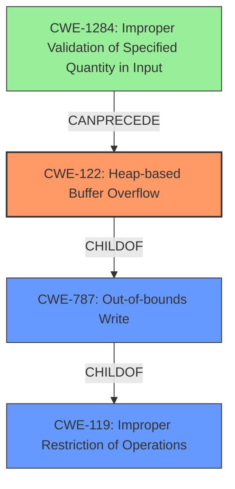

# Final Resolution for CVE-2022-3570

# Summary
| CWE ID | CWE Name | Confidence | CWE Abstraction Level | CWE Vulnerability Mapping Label | CWE-Vulnerability Mapping Notes |
|---|---|---|---|---|---|
| CWE-122 | Heap-based Buffer Overflow | 0.95 | Variant | Allowed | Primary CWE |
| CWE-787 | Out-of-bounds Write | 0.70 | Base | Allowed | Secondary Candidate |
| CWE-1284 | Improper Validation of Specified Quantity in Input | 0.60 | Base | Allowed | Contributing Factor |

## Evidence and Confidence

*   **Confidence Score:** 0.92
*   **Evidence Strength:** HIGH

## Relationship Analysis
The primary **WEAKNESS** is a **CWE-122 (Heap-based Buffer Overflow)**, a variant of **CWE-119 (Improper Restriction of Operations within the Bounds of a Memory Buffer)**. **CWE-787 (Out-of-bounds Write)** is a parent of **CWE-122** and also a child of **CWE-119**, representing the actual mechanism of writing beyond the allocated buffer. **CWE-1284 (Improper Validation of Specified Quantity in Input)** can precede **CWE-122** in a vulnerability chain if the input size isn't validated correctly, leading to an incorrect buffer allocation. The abstraction levels influenced the decision, favoring the variant **CWE-122** for its specificity to heap overflows.

## Vulnerability Chain
The vulnerability chain starts with potentially **CWE-1284 (Improper Validation of Specified Quantity in Input)**, where the TIFF image file contains a malformed field, and the program fails to validate it. This leads to an incorrect buffer size calculation, resulting in **CWE-122 (Heap-based Buffer Overflow)**, causing an **out-of-bounds write (CWE-787)**. The impact is application crashes and potential information disclosure. A missing link, if any, would be the specific code details of the invalid input leading to incorrect buffer size calculation.

## Summary of Analysis
The initial analysis correctly identifies **CWE-122 (Heap-based Buffer Overflow)** as the primary **WEAKNESS**, supported by the vulnerability description stating "multiple **heap buffer overflows** in tiffcrop.c utility". The criticism points out other potentially relevant CWEs, such as **CWE-193 (Off-by-one Error)**, **CWE-190 (Integer Overflow or Wraparound)**, **CWE-789 (Memory Allocation with Excessive Size Value)**, and **CWE-131 (Incorrect Calculation of Buffer Size)**. While these could contribute to the overflow, the core issue is the heap buffer overflow itself. Additionally, **CWE-1284 (Improper Validation of Specified Quantity in Input)** has been added to reflect that improper input validation can lead to the overflow. The graph relationships highlight that **CWE-122** is a specific case of a more general **CWE-787**, while **CWE-1284** can precede **CWE-122** in a vulnerability chain. **CWE-122** is at the optimal level of specificity because it pinpoints the location of the overflow (heap). Mitigation strategies, such as automatic bounds checking, safe memory allocation libraries, and runtime detection mechanisms, would address this vulnerability.