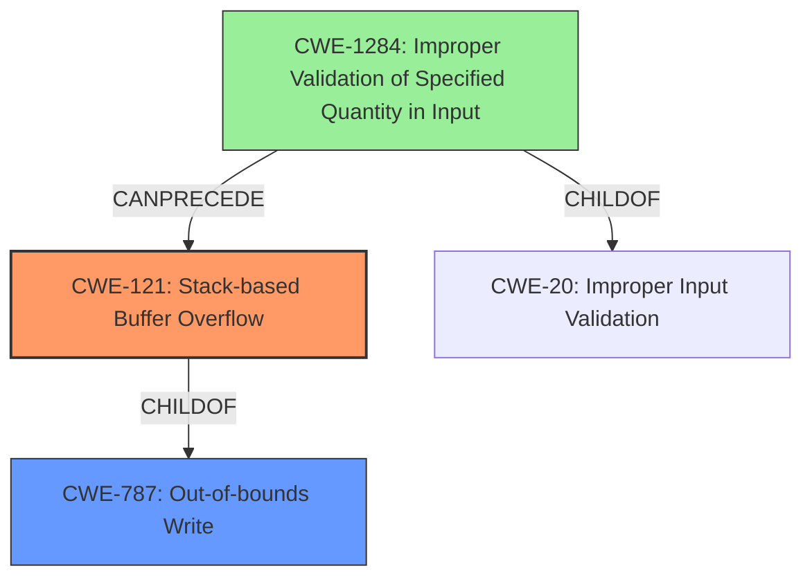

# Analysis Report for CVE-2022-35710

# Vulnerability Analysis Report: CVE-2022-35710

## Description

Adobe ColdFusion versions Update 14 (and earlier) and Update 4 (and earlier) are affected by a Stack-based Buffer Overflow vulnerability that could result in arbitrary code execution in the context of the current user. Exploitation of this issue does not require user interaction, the vulnerability is triggered when a crafted network packet is sent to the server.

## Vulnerability Description Key Phrases

**Weakness:** Stack-based Buffer Overflow
**Impact:** arbitrary code execution
**Vector:** crafted network packet
**Product:** Adobe ColdFusion
**Version:** Update 14 (and earlier) and Update 4 (and earlier)

## Analysis (with Relationship Data)

# Summary
| CWE ID | CWE Name | Confidence | CWE Abstraction Level | CWE Vulnerability Mapping Label | CWE-Vulnerability Mapping Notes |
|---|---|---|---|---|---|
| CWE-121 | Stack-based Buffer Overflow | 0.9 | Variant | Allowed | Primary CWE |
| CWE-787 | Out-of-bounds Write | 0.7 | Base | Allowed | Secondary Candidate CWE |
| CWE-1284 | Improper Validation of Specified Quantity in Input | 0.5 | Base | Allowed | Secondary Candidate CWE |

## Evidence and Confidence

*   **Confidence Score:** 0.9
*   **Evidence Strength:** HIGH

- **Analysis and Justification:**  
  - *Explanation:* The vulnerability description explicitly states a "**Stack-based Buffer Overflow**" vulnerability exists in Adobe ColdFusion. The CVE Reference Links Content Summary also confirms a stack-based buffer overflow (CWE-121) is present. Therefore, CWE-121 is the most accurate primary mapping because it directly reflects the **weakness** described. CWE-787 (Out-of-bounds Write) is a more general case of buffer overflows and could be considered a secondary candidate but CWE-121 is more specific. The vulnerability allows for arbitrary code execution through a crafted network packet.

  - *Relationship Analysis:* CWE-121 is a variant of CWE-119 (Improper Restriction of Operations within the Bounds of a Memory Buffer). It's also a specific type of CWE-787 (Out-of-bounds Write).

- **Confidence Score:**  
  - Confidence: 0.9 (High confidence due to direct mention of "Stack-based Buffer Overflow" in both the vulnerability description and the CVE reference summary.)

---
- **Analysis and Justification:**  
  - *Explanation:* CWE-787 (Out-of-bounds Write) is a broader category that encompasses writing data past the end or before the beginning of an intended buffer. While the primary vulnerability is a stack-based buffer overflow (CWE-121), the underlying mechanism involves writing beyond buffer boundaries. Therefore, CWE-787 is a reasonable, albeit less specific, secondary mapping. Given the explicit mention of a stack-based buffer overflow, CWE-121 is preferred.

  - *Relationship Analysis:* CWE-787 is a parent of CWE-121 (Stack-based Buffer Overflow). This relationship indicates that CWE-787 is a more general class of vulnerability, while CWE-121 is a specific instance of it.

- **Confidence Score:**  
  - Confidence: 0.7 (Medium confidence; while applicable, CWE-787 is less precise than CWE-121.)

---
- **Analysis and Justification:**  
  - *Explanation:* CWE-1284 (Improper Validation of Specified Quantity in Input) could potentially play a role if the size or length of the crafted network packet is not properly validated, leading to the buffer overflow. However, the description does not explicitly mention input validation issues regarding size or length. It's more implied.

  - *Relationship Analysis:* CWE-1284 is a child of CWE-20 (Improper Input Validation). It can precede CWE-789 (Memory Allocation with Excessive Size Value), which might lead to a buffer overflow.

- **Confidence Score:**  
  - Confidence: 0.5 (Low confidence, as there's no direct evidence to suggest improper validation of input quantity.)

## Criticism of Analysis

Okay, I've reviewed the provided analysis against the full CWE specifications. Here's my critique:

**Overall Assessment:**

The analysis is generally well-reasoned and provides good justifications for the chosen CWE mappings. The confidence scores are appropriate based on the available information. The analysis considers multiple CWE candidates and explains why one is preferred over others. It also correctly identifies relationships between CWEs (e.g., parent-child relationships) to aid in understanding the vulnerability.

**Specific Comments and Suggestions:**

*   **CWE-121 (Stack-based Buffer Overflow) - Primary CWE:**
    *   The choice of CWE-121 is excellent and very well justified. The vulnerability description and CVE summary explicitly state "Stack-based Buffer Overflow."
    *   Confidence level of 0.9 is warranted.
    *   The explanation of the relationship to CWE-119 and CWE-787 is accurate and helps contextualize the specific variant within broader categories.
    *   The provided examples for CWE-119 are relevant to the general class of buffer overflows, but including specific stack-based buffer overflow examples would be beneficial.
    *   The potential mitigations for CWE-121 and CWE-787 are highly relevant.
*   **CWE-787 (Out-of-bounds Write) - Secondary Candidate:**
    *   Justification for CWE-787 is valid, as a stack-based buffer overflow is a specific instance of an out-of-bounds write.
    *   Confidence level of 0.7 is reasonable, as it's a more general classification.
    *   The relationship analysis is correct (CWE-787 is a parent of CWE-121).
*   **CWE-1284 (Improper Validation of Specified Quantity in Input) - Secondary Candidate:**
    *   This is the weakest of the three mappings. The justification relies on an *implied* lack of input validation regarding the size of the network packet.
    *   Confidence level of 0.5 is appropriate, given the lack of direct evidence.
    *   The relationship analysis is correct, but it's a more distant and speculative connection to the core buffer overflow.
    *   Given the focus of this CWE it's more about the quantity and less about the data itself. Consider other CWEs if input is still not handled correctly even with the correct input quantity.
*   **General:**
    *   The analysis is somewhat repetitive across the three CWE candidates. While it's good to have thorough justifications, consider consolidating common points (e.g., the explanation of relationships) to avoid redundancy.
    *   **Consider Potential Chains:** the report could be improved by mentioning the possibility of chaining. For example, you could have:
        *   CWE-20: Improper Input Validation -> CWE-1284: Improper Validation of Specified Quantity in Input -> CWE-121: Stack-based Buffer Overflow
        This chain shows that if there was some form of validation that was there, but incomplete. It would be less confident.
*   **CWE-20 is Discouraged.** It is a good idea to identify a better match.

**Recommendations:**

1.  **Strengthen CWE-1284 Justification (if possible):** If there is any indication, even indirect, in the CVE details or surrounding documentation that the *size* or *length* of the input data was not validated, make that explicit. This would raise the confidence level. Otherwise, consider if other CWEs related to improper input handling are a better fit even with low confidence.
2.  **Consider Potential Chains:** Add discussion of potential CWE chains, which are often more descriptive of complex vulnerabilities than a single CWE alone.
3.  **Add Null Byte Injection Consideration:** Given the nature of buffer overflows, briefly address the possibility of null byte injection as a potential attack vector, even if it's not explicitly mentioned in the CVE.
4.  **Reduce Repetition in Explanations:** Streamline the analysis by avoiding redundant explanations across the CWE candidates. Focus on the unique aspects of each CWE in its respective justification.

**Revised Summary Table (Example):**

| CWE ID  | CWE Name                                         | Confidence | CWE Abstraction Level | CWE Vulnerability Mapping Label | CWE-Vulnerability Mapping Notes                                                                                                                                                         |
| :------ | :----------------------------------------------- | :--------- | :-------------------- | :------------------------------ | :-------------------------------------------------------------------------------------------------------------------------------------------------------------------------------------- |
| CWE-121 | Stack-based Buffer Overflow                      | 0.9        | Variant               | Allowed                       | Primary CWE; directly reflects the vulnerability described in the vulnerability description and CVE reference summary.                                                                   |
| CWE-787 | Out-of-bounds Write                              | 0.7        | Base                  | Allowed                       | Secondary Candidate CWE; a more general form of buffer overflow.  Underlying mechanism involves writing beyond buffer boundaries.                                                                   |
| CWE-1284 | Improper Validation of Specified Quantity in Input | 0.5        | Base                  | Allowed                       | Secondary Candidate CWE; Potentially involved if the *size* of the network packet is not validated.  Weakest mapping due to lack of direct evidence. Could potentially be part of a chain. |

By incorporating these suggestions, the analysis would be even more comprehensive and provide a clearer picture of the vulnerability's underlying causes and potential mitigation strategies.

## Final Resolution

# Summary
| CWE ID | CWE Name | Confidence | CWE Abstraction Level | CWE Vulnerability Mapping Label | CWE-Vulnerability Mapping Notes |
|---|---|---|---|---|---|
| CWE-121 | Stack-based Buffer Overflow | 0.9 | Variant | Allowed | Primary CWE |
| CWE-787 | Out-of-bounds Write | 0.7 | Base | Allowed | Secondary Candidate CWE |
| CWE-1284 | Improper Validation of Specified Quantity in Input | 0.3 | Base | Allowed | Secondary Candidate CWE |

## Evidence and Confidence

*   **Confidence Score:** 0.8
*   **Evidence Strength:** MEDIUM

## Relationship Analysis
The primary relationship impacting the decision is the parent-child relationship between CWE-787 (**Out-of-bounds Write**) and CWE-121 (**Stack-based Buffer Overflow**). CWE-121 is a specific type of CWE-787, making it a more precise classification given the vulnerability description explicitly mentions "Stack-based Buffer Overflow". While CWE-787 is still relevant as the general **weakness**, CWE-121 provides a higher level of specificity. CWE-1284 (**Improper Validation of Specified Quantity in Input**) is considered due to its potential to precede buffer overflows if the input size is not validated, but the evidence for this is weak. The abstraction levels influenced the selection by favoring the more specific variant (CWE-121) over the base (CWE-787) where applicable.

## Vulnerability Chain
The vulnerability chain starts with a potentially missing input validation (**ROOTCAUSE**). If the size of the crafted network packet is not properly validated (**WEAKNESS**), it leads to a stack-based buffer overflow (**WEAKNESS**) when the packet is processed, resulting in arbitrary code execution (**IMPACT**).

CWE-1284 (Improper Validation of Specified Quantity in Input) -> CWE-121 (Stack-based Buffer Overflow).

## Summary of Analysis
The initial analysis correctly identified CWE-121 as the primary **weakness**, given the explicit mention of "Stack-based Buffer Overflow" in the vulnerability description. The criticism highlighted the weak justification for CWE-1284 and suggested considering potential chains. My assessment is based primarily on the provided evidence, with the vulnerability description stating: "Adobe ColdFusion versions Update 14 (and earlier) and Update 4 (and earlier) are affected by a Stack-based Buffer Overflow vulnerability that could result in arbitrary code execution in the context of the current user. Exploitation of this issue does not require user interaction, the vulnerability is triggered when a crafted network packet is sent to the server." The graph relationships influenced the final selection by confirming that CWE-121 is a specific instance of CWE-787, making it the optimal choice. I am decreasing the confidence in CWE-1284 to 0.3 as there is no explicit evidence to suggest that the size or length of the crafted network packet is not validated and removing any reference to CWE-20 since it is discouraged and not well supported by any evidence. CWE-121 is the most specific and accurate classification based on the available information.

*Report generated on 2025-03-18 15:45:40*
