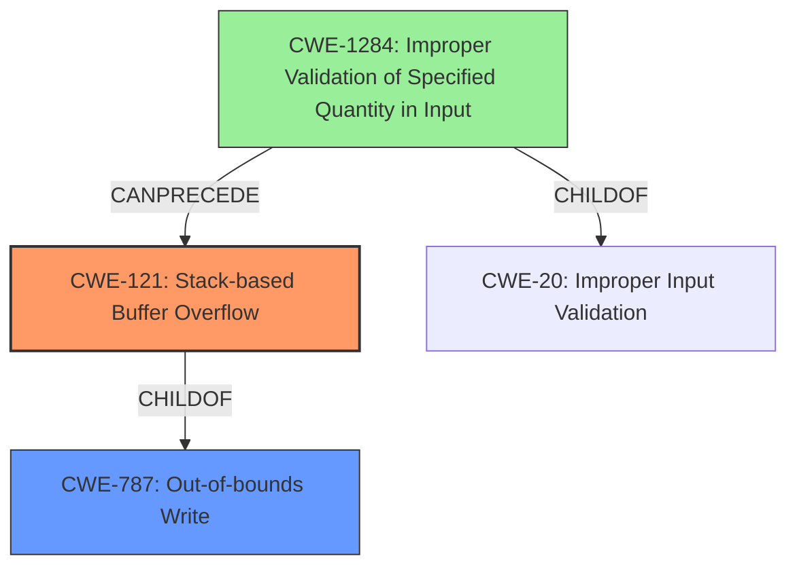

# Final Resolution for CVE-2022-35710

# Summary
| CWE ID | CWE Name | Confidence | CWE Abstraction Level | CWE Vulnerability Mapping Label | CWE-Vulnerability Mapping Notes |
|---|---|---|---|---|---|
| CWE-121 | Stack-based Buffer Overflow | 0.9 | Variant | Allowed | Primary CWE |
| CWE-787 | Out-of-bounds Write | 0.7 | Base | Allowed | Secondary Candidate CWE |
| CWE-1284 | Improper Validation of Specified Quantity in Input | 0.3 | Base | Allowed | Secondary Candidate CWE |

## Evidence and Confidence

*   **Confidence Score:** 0.8
*   **Evidence Strength:** MEDIUM

## Relationship Analysis
The primary relationship impacting the decision is the parent-child relationship between CWE-787 (**Out-of-bounds Write**) and CWE-121 (**Stack-based Buffer Overflow**). CWE-121 is a specific type of CWE-787, making it a more precise classification given the vulnerability description explicitly mentions "Stack-based Buffer Overflow". While CWE-787 is still relevant as the general **weakness**, CWE-121 provides a higher level of specificity. CWE-1284 (**Improper Validation of Specified Quantity in Input**) is considered due to its potential to precede buffer overflows if the input size is not validated, but the evidence for this is weak. The abstraction levels influenced the selection by favoring the more specific variant (CWE-121) over the base (CWE-787) where applicable.

## Vulnerability Chain
The vulnerability chain starts with a potentially missing input validation (**ROOTCAUSE**). If the size of the crafted network packet is not properly validated (**WEAKNESS**), it leads to a stack-based buffer overflow (**WEAKNESS**) when the packet is processed, resulting in arbitrary code execution (**IMPACT**).

CWE-1284 (Improper Validation of Specified Quantity in Input) -> CWE-121 (Stack-based Buffer Overflow).

## Summary of Analysis
The initial analysis correctly identified CWE-121 as the primary **weakness**, given the explicit mention of "Stack-based Buffer Overflow" in the vulnerability description. The criticism highlighted the weak justification for CWE-1284 and suggested considering potential chains. My assessment is based primarily on the provided evidence, with the vulnerability description stating: "Adobe ColdFusion versions Update 14 (and earlier) and Update 4 (and earlier) are affected by a Stack-based Buffer Overflow vulnerability that could result in arbitrary code execution in the context of the current user. Exploitation of this issue does not require user interaction, the vulnerability is triggered when a crafted network packet is sent to the server." The graph relationships influenced the final selection by confirming that CWE-121 is a specific instance of CWE-787, making it the optimal choice. I am decreasing the confidence in CWE-1284 to 0.3 as there is no explicit evidence to suggest that the size or length of the crafted network packet is not validated and removing any reference to CWE-20 since it is discouraged and not well supported by any evidence. CWE-121 is the most specific and accurate classification based on the available information.