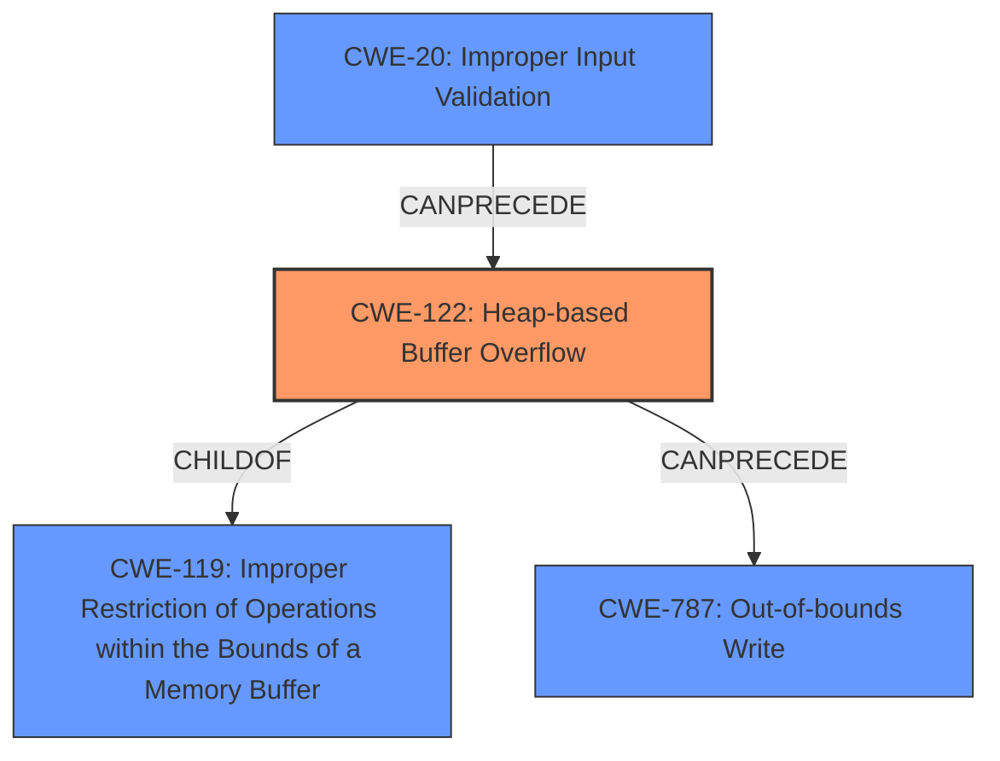

# Final Resolution for CVE-2022-35712

# Summary

| CWE ID | CWE Name | Confidence | CWE Abstraction Level | CWE Vulnerability Mapping Label | CWE-Vulnerability Mapping Notes |
|---|---|---|---|---|---|
| CWE-122 | Heap-based Buffer Overflow | 0.95 | Variant | Allowed | Primary CWE |
| CWE-787 | Out-of-bounds Write | 0.70 | Base | Allowed | Secondary Candidate. A heap-based buffer overflow is a specific case of an out-of-bounds write. |
| CWE-20 | Improper Input Validation | 0.30 | Class | Discouraged | Potential Contributing factor to the attack vector. A crafted network packet implies that input validation is either missing or insufficient. Without further information this is only a potential factor. |

## Evidence and Confidence

*   **Confidence Score:** 0.92
*   **Evidence Strength:** HIGH

## Relationship Analysis
The primary CWE is CWE-122 (**Heap-based Buffer Overflow**), which is a variant of CWE-119 (**Improper Restriction of Operations within the Bounds of a Memory Buffer**). CWE-787 (**Out-of-bounds Write**) is a broader, base-level CWE that describes the underlying technical issue of writing past the end of a buffer. CWE-20 (**Improper Input Validation**) is included as a potential contributing factor because a "crafted network packet" suggests that input validation might be missing or insufficient, allowing the overflow to occur.

## Vulnerability Chain
The vulnerability chain starts with a potential lack of input validation (CWE-20), which allows a crafted network packet to be processed. This leads to a **heap-based buffer overflow** (CWE-122), which is a specific instance of an **out-of-bounds write** (CWE-787). The impact is arbitrary code execution, which is a typical consequence of successful buffer overflow exploitation.

*   CWE-20 (Potential): Missing or insufficient input validation allows a crafted network packet.
*   CWE-122: The crafted packet triggers a **heap-based buffer overflow**.
*   CWE-787: The overflow results in writing data beyond the allocated buffer in the heap.
*   Impact: Arbitrary code execution in the context of the current user.

## Summary of Analysis
The initial analysis correctly identified CWE-122 (**Heap-based Buffer Overflow**) as the primary **weakness**. The vulnerability description explicitly mentions this, providing strong evidence: "Adobe ColdFusion versions Update 14 (and earlier) and Update 4 (and earlier) are affected by a Heap-based Buffer Overflow vulnerability...".

The criticism suggested adding CWE-20 (**Improper Input Validation**) as a potential contributing factor, which I agree with. The fact that the vulnerability is triggered by a "crafted network packet" suggests that input validation may be lacking. However, without more explicit information, it remains a potential factor and is classified accordingly with a lower confidence score.

The graph relationships influenced the selection by highlighting the hierarchical relationship between CWE-122 and CWE-119, as well as the potential chain relationship with CWE-20. CWE-122 is the most specific CWE that accurately describes the **root cause** of the vulnerability.

The selected CWEs are at the optimal level of specificity. CWE-122 is a Variant, which is a preferred level of abstraction. CWE-787 is a Base CWE, providing a broader perspective on the **out-of-bounds write**. CWE-20, while less certain, acknowledges the potential role of input validation in the vulnerability chain.