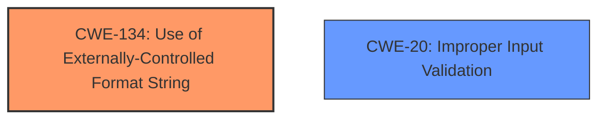

# Final Resolution for CVE-2022-35874

# Summary
| CWE ID  | CWE Name  | Confidence | CWE Abstraction Level | CWE Vulnerability Mapping Label | CWE-Vulnerability Mapping Notes |
|---|---|---|---|---|---|
| CWE-134 | Use of Externally-Controlled Format String | 1.00 | Base | Allowed | Primary CWE |
| CWE-20  | Improper Input Validation           | 0.40       | Class  | Discouraged   | Secondary Consideration (Contributing Factor) |

## Evidence and Confidence

*   **Confidence Score:** 0.9
*   **Evidence Strength:** MEDIUM

## Relationship Analysis
The primary relationship considered is the conceptual one where **Improper Input Validation (CWE-20)** can **precede** **Use of Externally-Controlled Format String (CWE-134)**. Although there isn't a direct CWE relationship, the lack of input validation allows the attacker-controlled string to be passed to the format string function. **CWE-134** remains the primary because it directly describes the vulnerability. The abstraction levels also influenced the selection: **CWE-134** is a Base level CWE, which is preferred, while **CWE-20** is a Class level CWE, making it less specific.

## Vulnerability Chain
The vulnerability chain starts with the **ROOTCAUSE** which is the **Improper Input Validation (CWE-20)**, leading to the **WEAKNESS** which is the **Use of Externally-Controlled Format String (CWE-134)**. This allows an attacker to inject format string specifiers into the `ssid` and `ssid_hex` parameters, leading to memory corruption, information disclosure, and denial of service.

## Summary of Analysis
The initial analysis correctly identified **CWE-134 (Use of Externally-Controlled Format String)** as the primary **WEAKNESS**. The criticism suggested considering **CWE-20 (Improper Input Validation)** as a contributing factor.

The vulnerability description states: "Four format string injection vulnerabilities exist in the XCMD testWifiAP functionality of Abode Systems, Inc. iota All-In-One Security Kit 6.9X and 6.9Z. Specially-crafted configuration values can lead to memory corruption, information disclosure and denial of service. An attacker can modify a configuration value and then execute an XCMD to trigger these vulnerabilities. This vulnerability arises from format string injection via the `ssid` and `ssid_hex` configuration parameters, as used within the `testWifiAP` XCMD handler."

Based on the evidence, **CWE-134** is the more direct cause. While the input isn't validated, leading to the vulnerability, **CWE-134** more accurately describes the specific flaw. The retriever results and the criticism were useful in considering **CWE-20**, but it's included with a lower confidence score because **CWE-134** is the more specific and appropriate mapping. My assessment is based heavily on the provided evidence, and the relationships helped consider alternative classifications. **CWE-134** is at the optimal level of specificity because it describes exactly how the attacker is able to cause the vulnerability.