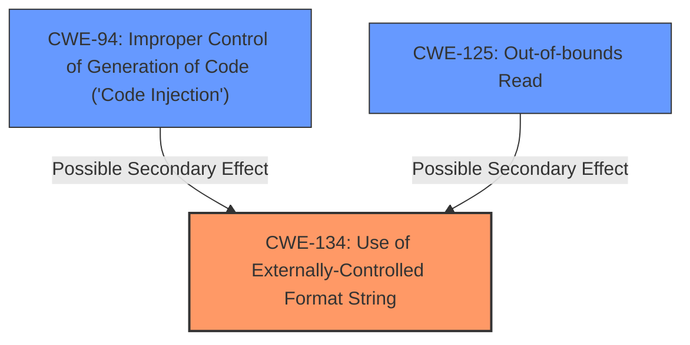

# Final Resolution for CVE-2022-35875

# Summary
| CWE ID | CWE Name | Confidence | CWE Abstraction Level | CWE Vulnerability Mapping Label | CWE-Vulnerability Mapping Notes |
|---|---|---|---|---|---|
| **CWE-134** | Use of Externally-Controlled Format String | 0.95 | Base | Primary | Allowed |
| **CWE-125** | Out-of-bounds Read | 0.30 | Base | Secondary | Allowed | (Possible secondary effect if format string is exploited to read beyond memory boundaries. Justification Required.) |
| **CWE-94** | Improper Control of Generation of Code ('Code Injection') | 0.30 | Base | Secondary | Allowed-with-Review | (Possible secondary effect if format string is exploited to overwrite function pointers. Justification Required.) |

## Evidence and Confidence

*   **Confidence Score:** 0.85
*   **Evidence Strength:** MEDIUM

## Relationship Analysis
The primary relationship that influenced the decision was the direct match of the vulnerability description to **CWE-134 (Use of Externally-Controlled Format String)**. While **CWE-94 (Improper Control of Generation of Code ('Code Injection'))** and **CWE-125 (Out-of-bounds Read)** are potential secondary effects, their inclusion depends on specific exploitation details not explicitly provided in the vulnerability description.

## Vulnerability Chain
The vulnerability chain starts with the `wpapsk` configuration parameter being controllable by an attacker. This leads to the use of this attacker-controlled string as a **format string** in the `vsnprintf` function (**CWE-134**). This **format string** vulnerability can potentially lead to memory corruption, information disclosure, and denial of service. Depending on the specific exploitation, it *could* lead to out-of-bounds reads (**CWE-125**) or code injection (**CWE-94**) if function pointers are overwritten.

## Summary of Analysis
The initial analysis correctly identified **CWE-134** as the primary **weakness**. The criticism provided valuable insights, particularly regarding the potential for over-classification with **CWE-94** and **CWE-125**.

The evidence supporting **CWE-134** is strong: "This vulnerability arises from **format string injection** via the `wpapsk` configuration parameter, as used within the `testWifiAP` XCMD handler." This directly aligns with the description of **CWE-134**: "The product uses a function that accepts a **format string** as an argument, but the **format string** originates from an external source."

The inclusion of **CWE-94** and **CWE-125** is conditional and depends on the specific exploitation techniques used. They are included as secondary candidates with lower confidence. The justification for their inclusion is that format string vulnerabilities *can* lead to these outcomes, but it's not guaranteed.

The selected CWEs are at the optimal level of specificity. **CWE-134** directly addresses the root cause (**format string injection**), while **CWE-94** and **CWE-125** represent potential consequences of the primary weakness.