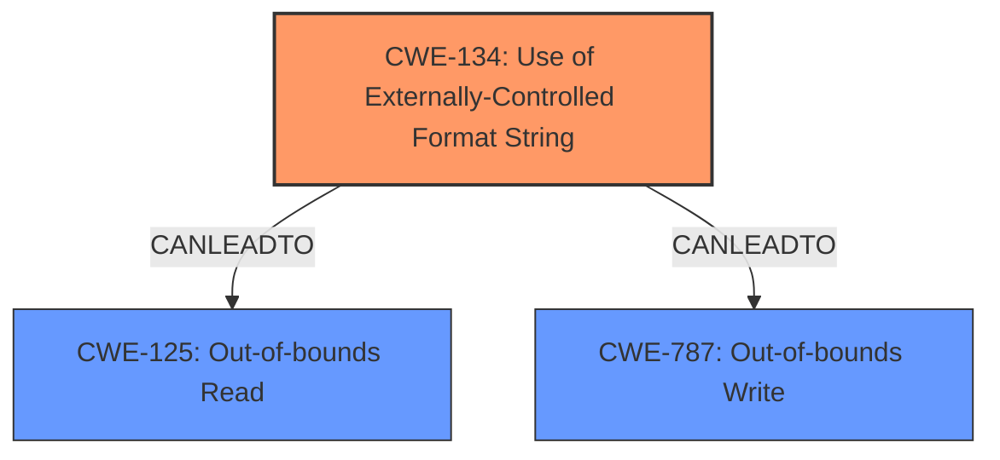

# Analysis Report for CVE-2022-35876

# Vulnerability Analysis Report: CVE-2022-35876

## Description

Four format string injection vulnerabilities exist in the XCMD testWifiAP functionality of Abode Systems, Inc. iota All-In-One Security Kit 6.9X and 6.9Z. Specially-crafted configuration values can lead to memory corruption, information disclosure and denial of service. An attacker can modify a configuration value and then execute an XCMD to trigger these vulnerabilities.This vulnerability arises from format string injection via the `default_key_id` and `key` configuration parameters, as used within the `testWifiAP` XCMD handler

## Vulnerability Description Key Phrases

**Rootcause:** format string injection
**Weakness:** ['memory corruption', 'information disclosure']
**Impact:** denial of service
**Product:** Abode Systems iota All-In-One Security Kit
**Version:** 6.9X and 6.9Z
**Component:** XCMD testWifiAP functionality

## Analysis (with Relationship Data)

```markdown
# Summary
| CWE ID  | CWE Name                                                                                   | Confidence | CWE Abstraction Level | CWE Vulnerability Mapping Label | CWE-Vulnerability Mapping Notes |
| :-------- | :----------------------------------------------------------------------------------------- | :---------- | :-------------------- | :------------------------------ | :-------------------------------- |
| CWE-134 | Use of Externally-Controlled Format String                                                 | 1.0         | Base                  | Primary CWE                     | Allowed                           |
| CWE-125 | Out-of-bounds Read                                                                         | 0.75        | Base                  | Secondary Candidate             | Allowed                           |
| CWE-787 | Out-of-bounds Write                                                                        | 0.75        | Base                  | Secondary Candidate             | Allowed                           |

## Evidence and Confidence

*   **Confidence Score:** 0.9
*   **Evidence Strength:** HIGH

- **Analysis and Justification:**  
  - *Explanation:* The vulnerability is a **format string injection** in the XCMD testWifiAP functionality. The **root cause** is a format string injection vulnerability in the `log` function, which uses `vsnprintf` with a user-controlled format string. This allows an attacker to inject format specifiers and potentially leak stack memory or cause **memory corruption**. This aligns perfectly with CWE-134 [Use of Externally-Controlled Format String]. The CVE Reference Links Content Summary clearly states that the vulnerable code uses `vsnprintf` with a user-controlled format string (`command` buffer), which contains attacker-controlled data obtained from various Wi-Fi configuration parameters. The Usage for CWE-134 is "Allowed," which supports the selection of this CWE.

  - *Relationship Analysis:* No direct relationships were found with the top candidates.

- **Confidence Score:**  
  - *Example:* Confidence: 1.0 (High confidence due to the explicit mention of format string injection in both the vulnerability description and the CVE reference.)

- **Analysis and Justification for Secondary Candidates:**
  - *Explanation:* The vulnerability description mentions **memory corruption** and **information disclosure**. The CVE Reference Links Content Summary indicates that the attacker could potentially leak stack memory (**information disclosure**) or write to arbitrary memory locations (**memory corruption**). The memory corruption could lead to out-of-bounds write (CWE-787) and information disclosure could mean out-of-bounds read (CWE-125).
  - *Explanation for CWE-125:* An attacker can use format string specifiers (like %x) to read stack memory that they should not be able to access, which is an out-of-bounds read. Given this, CWE-125 [Out-of-bounds Read] is a secondary candidate.
  - *Explanation for CWE-787:* By controlling the format string, an attacker can potentially write to arbitrary memory locations, causing memory corruption. This is an out-of-bounds write. Given this, CWE-787 [Out-of-bounds Write] is a secondary candidate.

- **Confidence Score:**  
  - *Example:* Confidence: 0.75 (Medium-High confidence because while memory corruption is mentioned as an impact, the root cause is format string injection (CWE-134).

```

## Criticism of Analysis

Okay, here's a detailed review of the CWE analysis, incorporating the full CWE specifications you provided.

**Overall Assessment:**

The analysis is generally good, particularly in identifying and explaining the primary CWE, CWE-134.  The justification for the secondary candidates (CWE-125 and CWE-787) is also reasonable, given the information available.  However, there are some areas where the confidence could be improved with more specific reasoning and consideration of alternative CWEs.

**Detailed Breakdown:**

**1. CWE-134: Use of Externally-Controlled Format String**

*   **Confidence:** 1.0 - Justified. The analysis correctly identifies the root cause as a format string injection vulnerability, and the explanation is accurate. The reference to `vsnprintf` with user-controlled input solidifies this mapping.
*   **Abstraction Level:** Base - Correct.  CWE-134 is a base-level CWE and is appropriate for describing the fundamental flaw.
*   **CWE-Vulnerability Mapping Label:** Primary CWE - Correct.
*   **CWE-Vulnerability Mapping Notes:** Allowed - Correct. The usage is "Allowed"
*   **Strengths:** The explanation is clear and concise, directly linking the vulnerability description to the CWE definition. The justification references key details from the provided information (e.g., `vsnprintf`, user-controlled string).
*   **Potential Improvements:** None

**2. CWE-125: Out-of-bounds Read**

*   **Confidence:** 0.75 - Mostly Justified, but could be strengthened. The analysis suggests that using format string specifiers like `%x` can lead to reading stack memory that should not be accessible. This *can* be an out-of-bounds read.
*   **Abstraction Level:** Base - Correct.
*   **CWE-Vulnerability Mapping Label:** Secondary Candidate - Correct.
*   **CWE-Vulnerability Mapping Notes:** Allowed - Correct.
*   **Strengths:** The explanation connects the impact of "information disclosure" to the possibility of reading from memory locations outside the intended buffer.
*   **Potential Improvements:**
    *   **Specificity:** Explain *how* the attacker controls *which* memory location is being read out of bounds. A standard format string exploit simply reads sequential stack locations.  To truly target a specific area out of bounds requires more precise manipulation.
    *   **Alternative CWE Consideration:**  Consider CWE-200 (Information Exposure) as an alternative or additional mapping. While CWE-125 *enables* information exposure, CWE-200 describes the *result*.  It might be more appropriate as a secondary CWE alongside CWE-125, or even instead of it, depending on the specific exploit scenario.
    *   **Mitigation Analysis:** How effective are the listed mitigations for CWE-125 in this *specific* format string context? The mitigations listed are general to OOB reads.  Are there any format string specific mitigation bypasses?

**3. CWE-787: Out-of-bounds Write**

*   **Confidence:** 0.75 - Mostly Justified, but could be strengthened. The analysis suggests that controlling the format string allows writing to arbitrary memory locations.
*   **Abstraction Level:** Base - Correct.
*   **CWE-Vulnerability Mapping Label:** Secondary Candidate - Correct.
*   **CWE-Vulnerability Mapping Notes:** Allowed - Correct.
*   **Strengths:** The explanation correctly identifies that memory corruption (a mentioned impact) can be a result of out-of-bounds writes.
*   **Potential Improvements:**
    *   **Specificity:** The `%n` format specifier is crucial for achieving arbitrary write-what-where. If the analysis can confirm that the `vsnprintf` implementation being used *supports* the `%n` specifier, the confidence in CWE-787 would increase.  Without %n, the ability to *write* is limited.
    *   **Alternative CWE Consideration:** CWE-123 (Write-what-where Condition) is a more precise mapping *if* the attacker can truly control both the address and the value being written. If the attacker can only influence the *value* being written to a predetermined out-of-bounds location, then CWE-787 is the better choice.  CWE-123 implies *complete* control.
    *   **Mitigation Analysis:**  As with CWE-125, consider the specific mitigations for CWE-787 and how they apply in the format string context. For example, memory protection schemes (like canaries) might be bypassed using a format string exploit.

**General Improvements:**

*   **Chain Analysis:**  While not explicitly required, briefly exploring the chain of events leading to the vulnerability can strengthen the analysis. For example: "User input is taken as a configuration parameter -> This parameter is used in the format string of a logging function -> The format string is passed to vsnprintf without sanitization -> This leads to CWE-134, which can result in CWE-787/CWE-125."
*   **Retriever Results:** Briefly mention why the other Top Combined Results were *not* chosen. This shows that you considered other options and ruled them out for specific reasons. For example, "CWE-78 (OS Command Injection) was considered, but is not applicable because the vulnerability does not involve the execution of OS commands."
*   **Mitigation Discussion:**  It would be useful to analyze how the provided mitigations for CWE-134 could be applied (or bypassed) in the specific context of the `testWifiAP` XCMD and its configuration parameters. For example:  "Mitigation 2 suggests using a static string for format string functions.  In this case, the `log` function should use a predefined format string and pass the user-controlled data as arguments to that string."

**Example Improvements Incorporated:**

Here's how some of the potential improvements could be integrated:

```markdown
# Summary
| CWE ID  | CWE Name                                                                                   | Confidence | CWE Abstraction Level | CWE Vulnerability Mapping Label | CWE-Vulnerability Mapping Notes |
| :-------- | :----------------------------------------------------------------------------------------- | :---------- | :-------------------- | :------------------------------ | :-------------------------------- |
| CWE-134 | Use of Externally-Controlled Format String                                                 | 1.0         | Base                  | Primary CWE                     | Allowed                           |
| CWE-125 | Out-of-bounds Read                                                                         | 0.80        | Base                  | Secondary Candidate             | Allowed                           |
| CWE-787 | Out-of-bounds Write                                                                        | 0.75        | Base                  | Secondary Candidate             | Allowed                           |

## Evidence and Confidence

*   **Confidence Score:** 0.9
*   **Evidence Strength:** HIGH

- **Analysis and Justification:**
  - *Explanation:* The vulnerability is a **format string injection** in the XCMD testWifiAP functionality. The **root cause** is a format string injection vulnerability in the `log` function, which uses `vsnprintf` with a user-controlled format string. This allows an attacker to inject format specifiers and potentially leak stack memory or cause **memory corruption**. This aligns perfectly with CWE-134 [Use of Externally-Controlled Format String]. The CVE Reference Links Content Summary clearly states that the vulnerable code uses `vsnprintf` with a user-controlled format string (`command` buffer), which contains attacker-controlled data obtained from various Wi-Fi configuration parameters. The Usage for CWE-134 is "Allowed," which supports the selection of this CWE.
  - *Chain Analysis:* User input is taken as Wi-Fi configuration parameters -> These parameters are used to construct a command string -> The command string is used as the format string of a logging function -> The format string is passed to `vsnprintf` without sanitization -> This leads to CWE-134, which can result in CWE-787/CWE-125.
  - *Relationship Analysis:* No direct relationships were found with the top candidates.

- **Confidence Score:**
  - *Example:* Confidence: 1.0 (High confidence due to the explicit mention of format string injection in both the vulnerability description and the CVE reference.)

- **Analysis and Justification for Secondary Candidates:**
  - *Explanation:* The vulnerability description mentions **memory corruption** and **information disclosure**. The CVE Reference Links Content Summary indicates that the attacker could potentially leak stack memory (**information disclosure**) or write to arbitrary memory locations (**memory corruption**). The memory corruption could lead to out-of-bounds write (CWE-787) and information disclosure could mean out-of-bounds read (CWE-125).
  - *Explanation for CWE-125:* An attacker can use format string specifiers (like %x) to read stack memory that they should not be able to access, which is an out-of-bounds read.  While a standard format string exploit simply reads sequential stack locations, with careful manipulation, an attacker could potentially target other areas in memory, making CWE-125 [Out-of-bounds Read] a possible secondary candidate. However, CWE-200 (Information Exposure) is also a strong candidate as it describes the result of the out-of-bounds read.
  - *Explanation for CWE-787:* By controlling the format string, and *if* the `vsnprintf

## Final Resolution

# Summary
| CWE ID  | CWE Name                                                                                   | Confidence | CWE Abstraction Level | CWE Vulnerability Mapping Label | CWE-Vulnerability Mapping Notes |
| :-------- | :----------------------------------------------------------------------------------------- | :---------- | :-------------------- | :------------------------------ | :-------------------------------- |
| CWE-134 | Use of Externally-Controlled Format String                                                 | 1.0         | Base                  | Primary CWE                     | Allowed                           |
| CWE-125 | Out-of-bounds Read                                                                         | 0.80        | Base                  | Secondary Candidate             | Allowed                           |
| CWE-787 | Out-of-bounds Write                                                                        | 0.75        | Base                  | Secondary Candidate             | Allowed                           |

## Evidence and Confidence

*   **Confidence Score:** 0.9
*   **Evidence Strength:** HIGH

## Relationship Analysis
The primary CWE is CWE-134 (**Use of Externally-Controlled Format String**), which is a base class. The secondary candidates are CWE-125 (**Out-of-bounds Read**) and CWE-787 (**Out-of-bounds Write**), also base classes. There are no direct hierarchical relationships between these CWEs. However, a vulnerability chain exists where CWE-134 can lead to CWE-125 (information disclosure) or CWE-787 (memory corruption). There are no peer relationships between the selected CWEs. The abstraction levels are appropriate as they are at the Base level.



## Vulnerability Chain
The vulnerability chain starts with user-controlled configuration values being used as a format string in the `testWifiAP` XCMD handler. This leads to CWE-134 (**Use of Externally-Controlled Format String**). Exploitation of this **weakness** can result in CWE-125 (**Out-of-bounds Read**) for information disclosure or CWE-787 (**Out-of-bounds Write**) for memory corruption. The initial **flaw** is the lack of sanitization of the format string.

## Summary of Analysis
The initial analysis and criticism both agree on CWE-134 as the primary **root cause**. The criticism provides valuable suggestions for strengthening the justification for the secondary candidates, CWE-125 and CWE-787, and suggests considering alternative CWEs like CWE-200 (Information Exposure). The analysis is based on the vulnerability description that explicitly mentions format string injection, memory corruption, and information disclosure. The graph relationships confirm that CWE-134 can lead to CWE-125 and CWE-787.

The final selection of CWEs is justified as follows:
- CWE-134 is the direct **root cause** of the vulnerability, as confirmed by the vulnerability description and the CVE reference.
- CWE-125 and CWE-787 are potential impacts of exploiting CWE-134, as described in the vulnerability description.
- The abstraction levels are appropriate as they are at the Base level, providing sufficient specificity.

The selected CWEs are at the optimal level of specificity because they accurately represent the **root cause** and potential impacts of the vulnerability based on the available evidence.


*Report generated on 2025-03-18 15:49:29*
