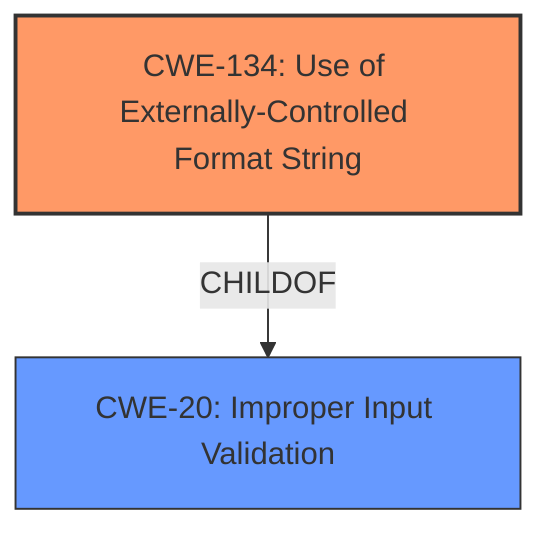

# Analysis Report for CVE-2022-35877

# Vulnerability Analysis Report: CVE-2022-35877

## Description

Four format string injection vulnerabilities exist in the XCMD testWifiAP functionality of Abode Systems, Inc. iota All-In-One Security Kit 6.9X and 6.9Z. Specially-crafted configuration values can lead to memory corruption, information disclosure and denial of service. An attacker can modify a configuration value and then execute an XCMD to trigger these vulnerabilities.This vulnerability arises from format string injection via the `default_key_id` configuration parameter, as used within the `testWifiAP` XCMD handler

## Vulnerability Description Key Phrases

**Rootcause:** format string injection
**Impact:** ['memory corruption', 'information disclosure', 'denial of service']
**Vector:** specially-crafted configuration values
**Attacker:** attacker
**Product:** Abode Systems iota All-In-One Security Kit
**Version:** 6.9X and 6.9Z
**Component:** XCMD testWifiAP functionality

## Analysis (with Relationship Data)

# Summary
| CWE ID | CWE Name | Confidence | CWE Abstraction Level | CWE Vulnerability Mapping Label | CWE-Vulnerability Mapping Notes |
|---|---|---|---|---|---|
| CWE-134 | Use of Externally-Controlled Format String | 1.0 | Base | Allowed | Primary CWE |

## Evidence and Confidence

*   **Confidence Score:** 1.0
*   **Evidence Strength:** HIGH

- **Analysis and Justification:**  
  - *Explanation:* The vulnerability description clearly states the existence of **format string injection** vulnerabilities in the XCMD testWifiAP functionality of Abode Systems, Inc. iota All-In-One Security Kit. The root cause is identified as **format string injection** via the `default_key_id` configuration parameter. The "CVE Reference Links Content Summary" confirms that attacker-controlled configuration values are directly injected into the format string parameter of `log` without proper sanitization, leading to memory corruption, information disclosure, and denial of service. This aligns precisely with CWE-134, which describes the use of an externally-controlled format string. The "Retriever Results" also lists CWE-134 as the top result with a high combined score, reinforcing this mapping. The Usage is ALLOWED for this CWE.
  
  - *Relationship Analysis:* While CWE-134 does not have any direct relationships listed in the provided information, it is related to the broader category of improper input validation. The absence of proper sanitization, as mentioned in the CVE summary, highlights a failure in input validation, although CWE-134 is a more specific and accurate representation of the vulnerability.

- **Confidence Score:**  
  - *Example:* Confidence: 1.0 (High confidence due to direct evidence from vulnerability description, CVE summary, and retriever results)

## Criticism of Analysis

Okay, I've reviewed the provided analysis and the full CWE specifications for the listed CWEs. Here's a breakdown of my critique, focusing on accuracy, justification, alternative CWEs, and potential mitigations:

**Overall Assessment:**

The primary CWE mapping to **CWE-134: Use of Externally-Controlled Format String** is accurate and well-justified. The evidence from the vulnerability description, CVE summary, and retriever results strongly supports this classification. The confidence level of 1.0 is appropriate.

**Detailed Critique:**

**1. CWE-134: Use of Externally-Controlled Format String**

*   **Accuracy:** Correct. The analysis correctly identifies the root cause as the use of an externally-controlled format string in the `log` function within the `testWifiAP` XCMD handler. The description perfectly aligns with the provided details, particularly the lack of sanitization.
*   **Justification:** Excellent. The explanation is clear and concise, referencing the vulnerability description, CVE summary, and retriever results.
*   **Alternative CWEs:** While CWE-20 (Improper Input Validation) is a parent of CWE-134, and the lack of sanitization *is* a form of improper input validation, mapping directly to CWE-134 is more specific and accurate. No other CWE better describes the root cause.
*   **Mitigations:** The suggested mitigations are appropriate:
    *   Choosing a language that isn't susceptible (impractical in most cases).
    *   Ensuring static format strings and correct argument counts.
    *   Compiler warnings.

**2. Other CWEs from Retriever Results (Not Chosen as Primary):**

Here's a review of why the other CWEs listed by the retriever weren't chosen and a consideration of their relevance:

*   **CWE-78: Improper Neutralization of Special Elements used in an OS Command ('OS Command Injection'):** This is *not* the correct CWE. While the format string vulnerability *could* potentially be leveraged to execute OS commands, the *direct* cause is the format string issue itself. OS command injection would be a *consequence* if the attacker successfully uses the format string to inject commands.
*   **CWE-89: Improper Neutralization of Special Elements used in an SQL Command ('SQL Injection'):** This is irrelevant given the provided information. There is no indication that SQL is involved in this vulnerability.
*   **CWE-190: Integer Overflow or Wraparound:**  While format string vulnerabilities *can* sometimes be combined with integer overflows (e.g., controlling the length specifier), there is no direct evidence to suggest this is the case in this instance. It is likely a false positive by the retrievers.
*   **CWE-798 / CWE-259: Use of Hard-coded Credentials / Password:**  Again, there's no indication of hardcoded credentials being related to this specific format string vulnerability. The retriever result is likely noise.
*   **CWE-22: Improper Limitation of a Pathname to a Restricted Directory ('Path Traversal'):** This is incorrect. Path traversal is about accessing files/directories outside the intended scope. Format string injection is not directly related.
*   **CWE-94: Improper Control of Generation of Code ('Code Injection'):** While a format string vulnerability *can* lead to code execution, the *direct* weakness is the format string issue. Code Injection would be a *consequence*.  It's understandable why retrievers flag it but CWE-134 is more precise as a root cause. Given CWE-94's "Usage: Allowed-with-Review," it's best to stick with CWE-134 as the primary.
*   **CWE-20: Improper Input Validation:** As noted above, this is a parent CWE of CWE-134. It is technically correct but less specific. Using CWE-134 provides more actionable information. Given CWE-20's "Usage: Discouraged," it's better to use CWE-134.
*   **CWE-1336: Improper Neutralization of Special Elements Used in a Template Engine:** This is incorrect, a format string vulnerability is distinct from template injection. The presence of a format string vulnerability does not imply the use of a template engine.

**General Observations and Recommendations:**

*   **Focus on Root Cause:** The analysis correctly focuses on the root cause of the vulnerability (CWE-134) rather than potential consequences (code execution, denial of service).
*   **Avoid Overly Broad CWEs:** The analysis avoids using overly broad CWEs like CWE-20, which is good.
*   **Consider Chaining (If Applicable):** While not strictly necessary in this case, it's worth considering if the format string vulnerability *reliably* leads to a specific secondary weakness. For example, if the format string can *always* be used to cause a denial of service, then you could consider a chain:  `CWE-134 -> CWE-400 (Uncontrolled Resource Consumption)`. However, without strong evidence of that, it's better to stick with just the root cause.
*   **Review Mitigation Guidance:** For the chosen CWE-134, the mitigations are appropriate and should be considered during remediation.

**Conclusion:**

The analysis is accurate and well-justified. The choice of CWE-134 is appropriate, and the explanations are clear. The reasons for *not* choosing the other CWEs are also valid. This is a solid vulnerability analysis.

## Final Resolution

# Summary
| CWE ID | CWE Name | Confidence | CWE Abstraction Level | CWE Vulnerability Mapping Label | CWE-Vulnerability Mapping Notes |
|---|---|---|---|---|---|
| CWE-134 | Use of Externally-Controlled Format String | 1.0 | Base | Allowed | Primary CWE |

## Evidence and Confidence

*   **Confidence Score:** 1.0
*   **Evidence Strength:** HIGH

## Relationship Analysis
The initial analysis correctly identified **CWE-134 (Use of Externally-Controlled Format String)** as the primary **WEAKNESS**. While **CWE-20 (Improper Input Validation)** is a parent, **CWE-134** offers more specificity. No chain relationships are apparent from the provided information, and focusing on the root cause is the optimal approach. The abstraction level of Base for **CWE-134** is appropriate, aligning with MITRE's guidance.

## Vulnerability Chain
The vulnerability chain begins with the **ROOTCAUSE**, **CWE-134 (Use of Externally-Controlled Format String)**, stemming from the lack of sanitization of the `default_key_id` configuration parameter. This leads to potential impacts, including memory corruption, information disclosure, and denial of service. While the initial analysis focuses on the **ROOTCAUSE**, a potential chain could extend to a denial of service (**CWE-400**), but the description lacks sufficient evidence to confirm this as a reliable consequence.

## Summary of Analysis
The initial analysis, as well as the criticism, both correctly identified **CWE-134 (Use of Externally-Controlled Format String)** as the most appropriate classification. This determination is strongly supported by the vulnerability description, which explicitly mentions the **format string injection** via the `default_key_id` configuration parameter in the `testWifiAP` XCMD handler. This aligns perfectly with the description of **CWE-134**, which states: "The product uses a function that accepts a format string as an argument, but the format string originates from an external source."

The criticism reinforced this selection by highlighting the importance of focusing on the **ROOTCAUSE** rather than potential consequences like code execution (**CWE-94**) or broader categories like improper input validation (**CWE-20**). The relationships between CWEs further support this decision; while **CWE-20** is a parent of **CWE-134**, the latter provides a more specific and actionable representation of the vulnerability.

The choice of **CWE-134** at the Base level of abstraction is optimal, as it aligns with MITRE's recommendation for root cause analysis. The evidence is strong, and the justification is clear, leading to a high confidence score of 1.0.

*Report generated on 2025-03-18 15:50:07*
