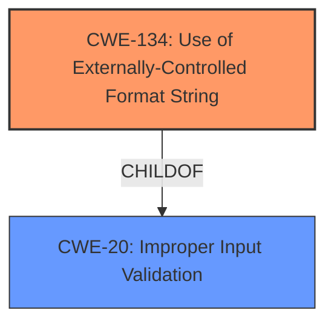

# Final Resolution for CVE-2022-35877

# Summary
| CWE ID | CWE Name | Confidence | CWE Abstraction Level | CWE Vulnerability Mapping Label | CWE-Vulnerability Mapping Notes |
|---|---|---|---|---|---|
| CWE-134 | Use of Externally-Controlled Format String | 1.0 | Base | Allowed | Primary CWE |

## Evidence and Confidence

*   **Confidence Score:** 1.0
*   **Evidence Strength:** HIGH

## Relationship Analysis
The initial analysis correctly identified **CWE-134 (Use of Externally-Controlled Format String)** as the primary **WEAKNESS**. While **CWE-20 (Improper Input Validation)** is a parent, **CWE-134** offers more specificity. No chain relationships are apparent from the provided information, and focusing on the root cause is the optimal approach. The abstraction level of Base for **CWE-134** is appropriate, aligning with MITRE's guidance.

## Vulnerability Chain
The vulnerability chain begins with the **ROOTCAUSE**, **CWE-134 (Use of Externally-Controlled Format String)**, stemming from the lack of sanitization of the `default_key_id` configuration parameter. This leads to potential impacts, including memory corruption, information disclosure, and denial of service. While the initial analysis focuses on the **ROOTCAUSE**, a potential chain could extend to a denial of service (**CWE-400**), but the description lacks sufficient evidence to confirm this as a reliable consequence.

## Summary of Analysis
The initial analysis, as well as the criticism, both correctly identified **CWE-134 (Use of Externally-Controlled Format String)** as the most appropriate classification. This determination is strongly supported by the vulnerability description, which explicitly mentions the **format string injection** via the `default_key_id` configuration parameter in the `testWifiAP` XCMD handler. This aligns perfectly with the description of **CWE-134**, which states: "The product uses a function that accepts a format string as an argument, but the format string originates from an external source."

The criticism reinforced this selection by highlighting the importance of focusing on the **ROOTCAUSE** rather than potential consequences like code execution (**CWE-94**) or broader categories like improper input validation (**CWE-20**). The relationships between CWEs further support this decision; while **CWE-20** is a parent of **CWE-134**, the latter provides a more specific and actionable representation of the vulnerability.

The choice of **CWE-134** at the Base level of abstraction is optimal, as it aligns with MITRE's recommendation for root cause analysis. The evidence is strong, and the justification is clear, leading to a high confidence score of 1.0.